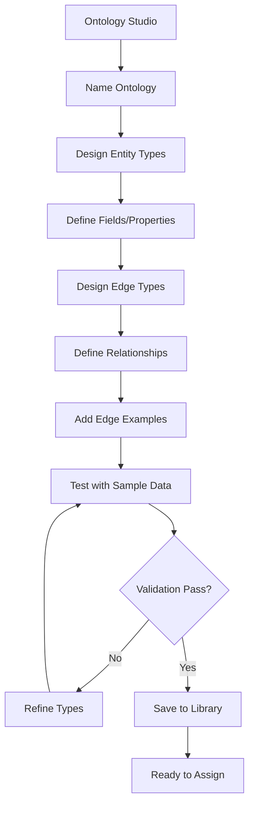
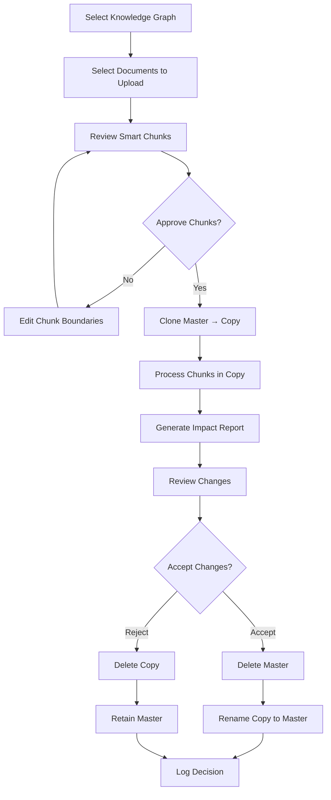
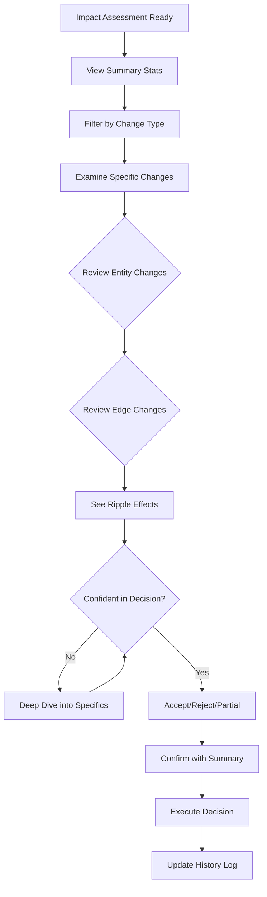

# Krypton Graph UI/UX Specification

## Introduction

This document defines the user experience goals, information architecture, user flows, and visual design specifications for Krypton Graph's user interface. It serves as the foundation for visual design and frontend development, ensuring a cohesive and user-centered experience.

### Overall UX Goals & Principles

#### Target User Personas

**Admin User**
- Deep technical system knowledge
- Responsible for system setup, authentication, and API key management
- Monitors system health and manages user access
- Primary goals: System stability, security, and user enablement

**Advanced User**
- Understands ontologies and their role in knowledge graph structure
- Creates and manages custom entity and edge types
- Designs reusable ontology templates for different domains
- Primary goals: Build robust, flexible knowledge structures

**Standard User**
- Understands document categorization and appropriate knowledge graph selection
- Validates entity and edge extraction from imported documents
- Reviews impact assessments and makes accept/reject decisions
- Primary goals: Accurate data import and quality control

#### Usability Goals

- **Ease of learning:** New users can import and verify their first document within 10 minutes
- **Efficiency of use:** Advanced users can create complete ontologies with minimal friction
- **Error prevention:** Clone-before-modify pattern ensures zero data loss risk
- **Transparency:** Every change is stored, tracked, reported, and reversible (roll-back with clone image or re-play past transactions to rebuild graph)
- **Confidence building:** Impact assessments provide clear visibility before committing changes

#### Design Principles

1. **Progressive Disclosure** - Show complexity only when needed, basic users see simple interfaces
2. **Visual Clarity** - Make processes immediately understandable and the relationship between source/example text the ontology rules/filters and the resulting entities/edges immediately understandable
3. **Safety First** - All destructive actions require confirmation and provide rollback options
4. **Consistent Patterns** - Similar operations use similar UI patterns across all modules
5. **Data Transparency** - Users always know what data exists, what changed, and why

### Change Log

| Date | Version | Description | Author |
|------|---------|-------------|---------|
| 2025-01-03 | 1.0 | Initial specification created | UX Expert |

## User Journey Maps

### Admin User Journey - System Setup & Maintenance

**Goal:** Configure and maintain the Krypton Graph system for organizational use

**Journey Stages:**
```
INITIAL SETUP → CONFIGURATION → MONITORING → MAINTENANCE
      ↓             ↓              ↓            ↓
[First Access] [API Setup]   [User Mgmt]  [System Health]
```

**Key Touchpoints:**
1. Login → Admin Dashboard
2. Environment Variables Setup (ZEP, OpenAI, Database)
3. API Key Management with secure storage
4. User Role Assignment and permissions
5. System Monitoring Dashboard with real-time metrics
6. Troubleshooting tools and support access

**Emotional Journey:** 😰 Overwhelmed → 😤 Focused → 😌 Confident → 😊 Satisfied

### Advanced User Journey - Ontology Design & Graph Creation

**Goal:** Design ontologies and create knowledge graphs for different data domains

**Journey Stages:**
```
LEARN → DESIGN → CREATE → TEST → DEPLOY → MANAGE
   ↓       ↓        ↓       ↓       ↓        ↓
[Explore] [Define] [Build] [Validate] [Use] [Evolve]
```

**Key Touchpoints:**
1. Ontology Designer Interface with visual builder
2. Entity Type Builder (Pydantic wrapper UI)
3. Edge Type Builder with relationship examples
4. Grouping & Naming Ontologies for reusability
5. Knowledge Graph Creation with ontology assignment
6. Clone/Test/Delete Operations
7. Ontology Version Management and evolution

**Emotional Journey:** 🤔 Curious → 💡 Inspired → 🔨 Building → ✅ Validated → 😎 Expert

### Standard User Journey - Document Import & Verification

**Goal:** Import documents and verify correct entity/edge extraction

**Journey Stages:**
```
PREPARE → IMPORT → PROCESS → REVIEW → DECIDE → TRACK
    ↓        ↓         ↓        ↓        ↓       ↓
[Select KG] [Upload] [Chunk] [Assess] [Accept] [History]
```

**Key Touchpoints:**
1. Selection interface of active Knowledge Graphs as target for USER's document upload 
2. Selection interface of file(s) to upload. File(s) processed into mark down format using Docling. Markdown stored in krypton-graph's relational DB.
3. Review chunks of mark down that an LLM created and enriched with meta data, these 'smart chunks' provide an option for review and course correction by the USER before step 4.  
4. Impact Assessment Report generation created after SYSTEM clones KG before  importing all approved smart chunks. SYSTEM compares the differences between the two KGs. The impact report UI lists all changes to entity/edges in the KG. The USER can Accept/Reject the new KG.
5. History & Audit Trail lists all previous Accept/Reject decisions with links to past Impact Assessment Report. 

**Emotional Journey:** 📄 Ready → ⏳ Waiting → 🔍 Analyzing → 🤓 Evaluating → ✅ Decided → 📊 Informed

### Critical User Flows

#### Ontology Creation Flow (Advanced User)
```
Dashboard → Ontology Manager → Create New →
Define Entities → Define Edges → Add Examples →
Group Types → Save as Named Ontology → Test
```

#### Document Import Flow (Standard User)
```
Select KG → Import Document → Docling Processes →
Review Markdown → Approve Chunks → 
Master Cloned → Process Chunks → 
Review Impact → Accept/Reject → Update History
```

#### Impact Assessment Review Flow
```
View Report → Compare Master vs Copy →
Review Added Entities/Edges → 
Review Impacted Relationships →
Make Decision → Execute (Keep/Reject) →
Log Decision
```

### Cross-Journey Touchpoints

1. **Knowledge Graph Dashboard** - Central hub showing all active graphs with statistics
2. **Ontology Library** - Reusable ontology templates and versions
3. **Processing Queue** - Real-time status of document imports and chunking operations
4. **History & Audit** - Complete trail of all changes, decisions, and system events
5. **Help & Documentation** - Context-sensitive guidance and tooltips

## Information Architecture (IA)

### Site Map / Screen Inventory

```mermaid
graph TD
    A[Krypton Graph] --> B[Dashboard]
    A --> C[Active Graph]
    A --> D[Ontology Studio]
    A --> E[Impact Center]
    A --> F[System]
    
    B --> B1[Graph Selector]
    B --> B2[Activity Feed]
    B --> B3[Quick Actions]
    B --> B4[Processing Queue]
    
    C --> C1[Overview]
    C --> C2[Import & Process]
    C --> C3[Ontology]
    C --> C4[Graph Settings]
    
    C2 --> C2a[Import Documents]
    C2 --> C2b[Review Chunks]
    C2 --> C2c[Impact Assessment]
    
    C3 --> C3a[Entities]
    C3 --> C3b[Edges]
    
    D --> D1[Quick Access Toolbar]
    D --> D2[Design Center]
    D --> D3[Library]
    D --> D4[Test Workspace]
    
    D2 --> D2a[Entity Designer]
    D2 --> D2b[Edge Designer]
    D2 --> D2c[Ontology Builder]
    
    E --> E1[Active Assessments]
    E --> E2[Review & Decide]
    E --> E3[History]
    
    F --> F1[Reports & Analytics]
    F --> F2[Admin Settings]
    F --> F3[User Management]
    
    F2 --> F2a[Environment Variables]
    F2 --> F2b[API Keys]
    F2 --> F2c[Database Config]
```



### Navigation Structure

**Primary Navigation:** 
- Horizontal top bar with Graph Selector (persistent context)
- Main sections: Dashboard | Active Graph | Ontology Studio | Impact Center | System
- Role-based visibility (Admin features only shown to Admin users)

**Secondary Navigation:**
- Left sidebar within each main section
- Contextual based on selected graph
- Collapsible for more screen real estate

**Breadcrumb Strategy:**
- Always show: App Name > Main Section > Subsection > Current Page
- Include graph name when in context: "Krypton Graph > [Graph: Legal Contracts] > Import & Process > Review Chunks"
- Clickable breadcrumbs for quick navigation up the hierarchy

## User Flows

### Flow 1: Ontology Creation (Advanced User)

**User Goal:** Create a reusable ontology for legal document processing

**Entry Points:** 
- Dashboard > Quick Actions > "Create Ontology"
- Ontology Studio > Design Center

**Success Criteria:** 
- Ontology saved with custom entity and edge types
- Ontology tested and validated
- Ready for assignment to knowledge graphs

#### Flow Diagram



**Edge Cases & Error Handling:**
- Duplicate ontology names → Show error, suggest alternatives
- Invalid Pydantic type definitions → Real-time validation with helpful error messages
- Test failures → Detailed error report with specific issues highlighted

**Notes:** Advanced users need powerful tools but with guardrails to prevent invalid configurations

### Flow 2: Document Import with Impact Assessment (Standard User)

**User Goal:** Import financial documents into the accounting knowledge graph

**Entry Points:**
- Active Graph > Import & Process > Import Documents
- Dashboard > Quick Actions > "Import to Current Graph"

**Success Criteria:**
- Document successfully converted to markdown
- Smart chunks reviewed and approved
- Impact assessed and changes accepted/rejected

#### Flow Diagram



**Edge Cases & Error Handling:**
- Unsupported file format → Show supported formats, offer conversion help
- Docling conversion failure → Retry with different settings, manual markdown option
- LLM chunking timeout → Show progress, allow manual chunking
- Massive impact (>1000 changes) → Pagination, filtering, summary view
- Connection loss during processing → Auto-save state, resume capability

**Notes:** The clone-compare pattern ensures zero data loss risk, building user confidence

### Flow 3: Impact Assessment Review and Decision

**User Goal:** Understand and decide on proposed knowledge graph changes

**Entry Points:**
- Impact Center > Active Assessments
- Notification > "New Impact Assessment Ready"

**Success Criteria:**
- User understands all proposed changes
- Confident decision made
- Changes tracked in history

#### Flow Diagram



**Edge Cases & Error Handling:**
- Conflicting changes → Highlight conflicts, provide resolution options
- Partial acceptance needed → Cherry-pick interface for selective changes
- Timeout on large assessments → Extend session, background processing
- Multiple pending assessments → Queue management, priority settings

**Notes:** Visual comparison tools are critical for user confidence in decision-making

## Wireframes & Mockups

**Primary Design Files:** [To be created in Figma/Sketch - Link TBD]

### Key Screen Layouts

#### Dashboard Screen

**Purpose:** Central hub for all users to see system status and navigate to key functions

**Key Elements:**
- Graph selector dropdown (persistent in header)
- Active graphs grid with real-time statistics
- Processing queue status widget
- Recent activity feed
- Quick action cards based on user role
- System health indicators (Admin only)

**Interaction Notes:** 
- Graph cards are clickable for direct access
- Drag-and-drop to reorder dashboard widgets
- Real-time updates via WebSocket for processing status

**Design File Reference:** Dashboard_Main_v1

#### Ontology Designer Screen

**Purpose:** Advanced users create and modify entity/edge type definitions

**Key Elements:**
- Left panel: Entity/Edge type list with search
- Center canvas: Visual type designer with Pydantic field builder
- Right panel: Properties inspector with validation rules
- Bottom panel: Example data entry and testing console
- Top toolbar: Save, Test, Export, Version controls

**Interaction Notes:**
- Drag-drop to create relationships between types
- Real-time validation feedback
- Collapsible panels for maximum workspace
- Keyboard shortcuts for power users

**Design File Reference:** Ontology_Designer_v1

#### Document Import Screen

**Purpose:** Upload and process documents through the Docling conversion pipeline

**Key Elements:**
- Drop zone for file upload (supports multiple files)
- File type indicator and compatibility checker
- Conversion progress tracker with stages
- Markdown preview panel with syntax highlighting
- Smart chunking review interface with adjustable boundaries
- Metadata editor for document properties

**Interaction Notes:**
- Drag boundaries to adjust chunk sizes
- Side-by-side view of original vs markdown
- Inline editing of markdown before processing
- Batch operations for multiple documents

**Design File Reference:** Document_Import_v1

#### Impact Assessment Screen

**Purpose:** Review and decide on proposed knowledge graph changes

**Key Elements:**
- Split-screen graph visualization (Master | Copy)
- Change summary statistics header
- Filterable change list (Added/Modified/Removed)
- Entity/Edge detail inspector
- Ripple effect visualization
- Decision toolbar (Accept All/Reject All/Cherry Pick)

**Interaction Notes:**
- Synchronized scrolling/zooming between graphs
- Click entity to see all related changes
- Hover to preview change details
- Multi-select for partial acceptance

**Design File Reference:** Impact_Assessment_v1

#### Knowledge Graph Viewer

**Purpose:** Explore and navigate the knowledge graph structure

**Key Elements:**
- Force-directed graph visualization canvas
- Node type legend and filters
- Search bar with autocomplete
- Detail panel for selected entity/edge
- Zoom controls and minimap
- Export/Share toolbar

**Interaction Notes:**
- Click and drag to pan
- Scroll to zoom
- Double-click node to expand connections
- Right-click for context menu
- Keyboard navigation support

**Design File Reference:** Graph_Viewer_v1

## Component Library / Design System

**Design System Approach:** Custom component library built on top of a modern foundation (e.g., Radix UI, Arco Design) with specialized components for knowledge graph manipulation

### Core Components

#### Graph Visualization Component

**Purpose:** Render and interact with knowledge graph data using force-directed layouts

**Variants:** 
- Full graph view (complete visualization)
- Filtered view (subset based on criteria)
- Comparison view (side-by-side with diff highlighting)
- Mini-map view (navigation overview)

**States:** 
- Loading (skeleton with animated nodes)
- Interactive (default, allows manipulation)
- Read-only (view only, no editing)
- Error (failed to load with retry option)

**Usage Guidelines:** 
- Use Full view for exploration and navigation
- Use Comparison view for impact assessment
- Always provide zoom/pan controls
- Include a legend for node/edge types

#### Entity/Edge Card

**Purpose:** Display detailed information about graph elements in a consistent format

**Variants:**
- Compact (list view)
- Expanded (detailed view)
- Edit mode (with form fields)
- Comparison mode (showing changes)

**States:**
- Default (static display)
- Hover (show quick actions)
- Selected (highlighted with border)
- Modified (yellow indicator)
- New (green indicator)
- Deleted (red strikethrough)

**Usage Guidelines:**
- Use compact in lists and search results
- Expand on click for full details
- Show diff indicators in comparison mode
- Include type badge and icons

#### Smart Chunk Editor

**Purpose:** Review and adjust AI-generated document chunks with visual boundaries

**Variants:**
- Read-only preview
- Edit mode with boundary adjustment
- Comparison mode (original vs chunked)

**States:**
- Processing (chunking in progress)
- Ready for review
- Approved (locked)
- Modified (pending re-approval)

**Usage Guidelines:**
- Show chunk metadata (size, position)
- Allow drag-to-adjust boundaries
- Highlight headers and key sections
- Display chunk statistics

#### Progress Pipeline

**Purpose:** Show multi-step processes with clear status for each stage

**Variants:**
- Horizontal (desktop)
- Vertical (mobile)
- Compact (icon only)
- Detailed (with substeps)

**States:**
- Not started (gray)
- In progress (animated blue)
- Completed (green check)
- Failed (red with retry)
- Skipped (gray dash)

**Usage Guidelines:**
- Use for document import flow
- Show estimated time remaining
- Allow clicking completed steps to review
- Include retry options for failures

#### Impact Summary Card

**Purpose:** Summarize changes in a scannable format with key metrics

**Variants:**
- Overview (high-level stats)
- Detailed (with breakdown)
- Compact (for lists)

**States:**
- Pending review
- Approved
- Rejected
- Partially approved

**Usage Guidelines:**
- Always show total changes count
- Use color coding for change types
- Include timestamp and user info
- Provide expand/collapse functionality

#### Ontology Type Builder

**Purpose:** Visual interface for creating Pydantic-based type definitions

**Variants:**
- Entity builder
- Edge builder
- Validation rules editor

**States:**
- Draft (unsaved changes)
- Valid (all requirements met)
- Invalid (showing errors)
- Testing (running validation)

**Usage Guidelines:**
- Provide field type dropdown
- Show real-time validation
- Include example data fields
- Support drag-to-reorder fields

#### Action Toolbar

**Purpose:** Consistent action bar for primary operations

**Variants:**
- Primary (main actions)
- Contextual (selection-based)
- Floating (fixed position)
- Inline (embedded in content)

**States:**
- Default (all actions available)
- Partial (some disabled)
- Loading (action in progress)
- Success/Error feedback

**Usage Guidelines:**
- Group related actions
- Use icons with labels
- Show loading states inline
- Provide keyboard shortcuts

#### Data Table Plus

**Purpose:** Display tabular data with sorting, filtering, and inline actions

**Variants:**
- Standard (full features)
- Compact (mobile-friendly)
- Expandable rows
- Comparison mode

**States:**
- Loading (skeleton rows)
- Empty (with helpful message)
- Filtered (showing count)
- Error (with retry)

**Usage Guidelines:**
- Support column resize/reorder
- Include bulk selection
- Provide export options
- Show row-level actions on hover

#### Notification System

**Purpose:** Inform users of system events and process completions

**Variants:**
- Toast (temporary)
- Banner (persistent)
- Badge (count indicator)
- Alert (modal)

**States:**
- Info (blue)
- Success (green)
- Warning (yellow)
- Error (red)

**Usage Guidelines:**
- Auto-dismiss info after 5 seconds
- Keep errors visible until dismissed
- Stack multiple notifications
- Include action buttons when relevant

#### Search Interface

**Purpose:** Unified search across entities, edges, and documents

**Variants:**
- Quick search (dropdown)
- Advanced search (full page)
- Inline search (within component)
- Command palette (keyboard-driven)

**States:**
- Empty (ready for input)
- Searching (loading results)
- Results (with facets)
- No results (with suggestions)

**Usage Guidelines:**
- Show recent searches
- Support filters and facets
- Highlight matched terms
- Include keyboard navigation

## Branding & Style Guide

### Visual Identity

**Brand Guidelines:** [To be aligned with company brand standards]

### Color Palette

| Color Type | Hex Code | Usage |
|------------|----------|--------|
| Primary | #2563EB | Primary actions, active states, links |
| Secondary | #7C3AED | Secondary actions, accents |
| Accent | #06B6D4 | Highlights, badges, indicators |
| Success | #10B981 | Positive feedback, confirmations, additions |
| Warning | #F59E0B | Cautions, important notices, modifications |
| Error | #EF4444 | Errors, destructive actions, deletions |
| Neutral | #6B7280, #F3F4F6 | Text, borders, backgrounds |

### Typography

#### Font Families
- **Primary:** Inter, -apple-system, system-ui, sans-serif
- **Secondary:** IBM Plex Sans, sans-serif
- **Monospace:** JetBrains Mono, Consolas, monospace

#### Type Scale

| Element | Size | Weight | Line Height |
|---------|------|--------|-------------|
| H1 | 32px | 700 | 1.2 |
| H2 | 24px | 600 | 1.3 |
| H3 | 20px | 600 | 1.4 |
| Body | 14px | 400 | 1.5 |
| Small | 12px | 400 | 1.4 |

### Iconography

**Icon Library:** Lucide Icons or Heroicons for consistency

**Usage Guidelines:** 
- Use outline style for navigation and actions
- Use filled style for status and indicators
- Maintain 20x20px default size for UI icons
- Scale to 16x16px for compact spaces
- Use 24x24px for primary actions

### Spacing & Layout

**Grid System:** 8px base unit with 4px for fine adjustments

**Spacing Scale:** 
- xs: 4px
- sm: 8px
- md: 16px
- lg: 24px
- xl: 32px
- 2xl: 48px

## Accessibility Requirements

### Compliance Target

**Standard:** WCAG 2.1 Level AA compliance with Level AAA for critical features

### Key Requirements

**Visual:**
- Color contrast ratios: Minimum 4.5:1 for normal text, 3:1 for large text
- Focus indicators: Visible outline with 2px minimum width, 3:1 contrast ratio
- Text sizing: Support 200% zoom without horizontal scrolling

**Interaction:**
- Keyboard navigation: All interactive elements accessible via keyboard
- Screen reader support: Proper ARIA labels, roles, and descriptions
- Touch targets: Minimum 44x44px for mobile interfaces

**Content:**
- Alternative text: Descriptive alt text for all informational images
- Heading structure: Logical hierarchy with no skipped levels
- Form labels: Clear, associated labels for all form inputs

### Testing Strategy

- Automated testing with axe-core in development
- Manual keyboard navigation testing for all new features
- Screen reader testing with NVDA/JAWS (Windows) and VoiceOver (Mac)
- Color contrast validation in design phase
- User testing with participants who use assistive technologies

## Responsiveness Strategy

### Breakpoints

| Breakpoint | Min Width | Max Width | Target Devices |
|------------|-----------|-----------|----------------|
| Mobile | 320px | 767px | Phones, small tablets |
| Tablet | 768px | 1023px | Tablets, small laptops |
| Desktop | 1024px | 1919px | Laptops, desktops |
| Wide | 1920px | - | Large monitors, TV displays |

### Adaptation Patterns

**Layout Changes:** 
- Mobile: Single column, stacked navigation
- Tablet: Two-column layouts where appropriate
- Desktop: Full multi-column layouts with sidebars
- Wide: Centered content with max-width constraints

**Navigation Changes:** 
- Mobile: Hamburger menu with slide-out drawer
- Tablet: Collapsed sidebar with icon navigation
- Desktop: Full sidebar with labels
- Wide: Persistent navigation with all options visible

**Content Priority:** 
- Mobile: Essential information first, progressive disclosure
- Tablet: Balanced information density
- Desktop: Full information display
- Wide: Additional context panels and previews

**Interaction Changes:** 
- Mobile: Touch-optimized with larger tap targets
- Tablet: Mixed touch/mouse optimization
- Desktop: Hover states and right-click menus
- Wide: Advanced keyboard shortcuts and multi-select

## Animation & Micro-interactions

### Motion Principles

- **Purposeful:** Every animation serves a functional purpose
- **Fast:** Keep durations under 300ms for UI transitions
- **Smooth:** Use easing functions (ease-out for entering, ease-in for exiting)
- **Respectful:** Honor prefers-reduced-motion settings
- **Consistent:** Same actions produce same animations

### Key Animations

- **Page Transitions:** Fade with subtle slide (Duration: 200ms, Easing: ease-out)
- **Graph Node Hover:** Scale up 1.1x with shadow (Duration: 150ms, Easing: ease-out)
- **Accordion Expand:** Height auto with fade (Duration: 250ms, Easing: ease-in-out)
- **Loading States:** Skeleton pulse animation (Duration: 1.5s, Easing: ease-in-out)
- **Success Feedback:** Check mark draw-in (Duration: 300ms, Easing: ease-out)
- **Error Shake:** Horizontal shake 3x (Duration: 400ms, Easing: ease-in-out)

## Performance Considerations

### Performance Goals

- **Page Load:** Initial load under 3 seconds on 3G
- **Interaction Response:** Under 100ms for user input feedback
- **Animation FPS:** Maintain 60 FPS for all animations

### Design Strategies

- Use virtual scrolling for large lists and tables
- Implement progressive loading for graph visualizations
- Lazy load images and non-critical components
- Use skeleton screens during data fetching
- Optimize SVG complexity for graph rendering
- Implement debouncing for search and filter inputs
- Use web workers for heavy computations
- Cache frequently accessed data locally

## Next Steps

### Immediate Actions

1. Review specification with stakeholders for alignment
2. Create high-fidelity mockups in Figma based on wireframes
3. Prototype critical interactions (graph visualization, impact assessment)
4. Conduct usability testing with representative users
5. Refine component specifications based on technical feasibility
6. Create frontend architecture document for implementation
7. Establish development environment with design system

### Design Handoff Checklist

- [x] All user flows documented
- [x] Component inventory complete
- [x] Accessibility requirements defined
- [x] Responsive strategy clear
- [x] Brand guidelines incorporated
- [x] Performance goals established
- [ ] High-fidelity mockups created
- [ ] Interactive prototypes built
- [ ] Design tokens exported
- [ ] Component documentation written
- [ ] Developer handoff meeting scheduled

## Checklist Results

The UI/UX specification has been completed with comprehensive coverage of:
- User personas and journeys for all three user types
- Complete information architecture with navigation structure
- Detailed user flows for critical tasks
- Wireframe concepts for key screens
- Extensive component library tailored to knowledge graph needs
- Accessibility and performance requirements
- Responsive design strategy

This specification provides a solid foundation for the visual design and frontend development phases of Krypton Graph.