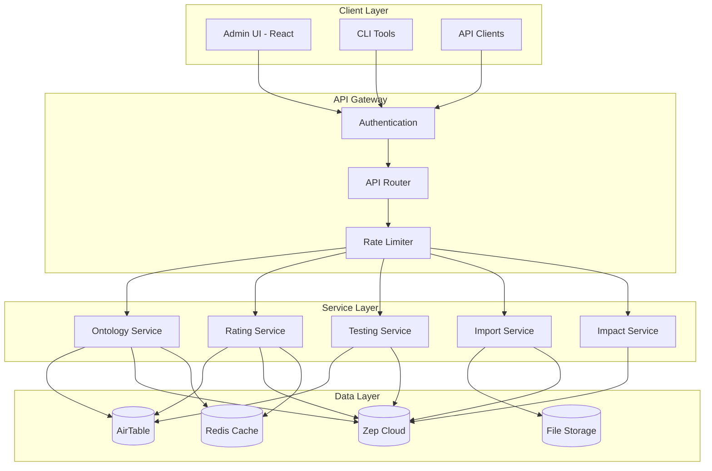
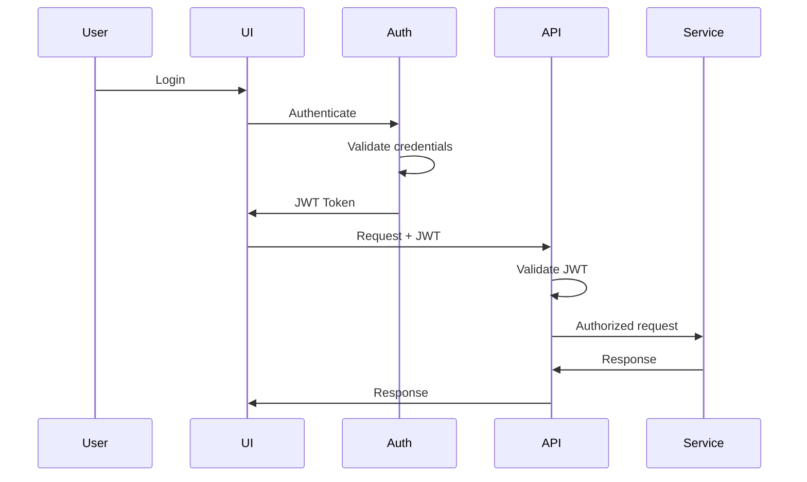

# System Architecture Document
## Krypton-Graph: Ontology Management System

**Version:** 1.0  
**Date:** September 2025  
**Status:** Active Development

---

## 1. System Overview

### 1.1 Architecture Philosophy
Krypton-Graph follows a **layered microservices architecture** with clear separation of concerns:
- **Presentation Layer**: React-based admin UI and user interfaces
- **API Gateway**: RESTful API with authentication and routing
- **Business Logic Layer**: Python-based services for ontology management
- **Data Layer**: AirTable for metadata, Zep for knowledge graphs
- **Integration Layer**: Connectors to external systems

### 1.2 High-Level Architecture



---

## 2. Component Architecture

### 2.1 Frontend Architecture

#### 2.1.1 Admin UI (React)
```
admin-ui/
├── components/           # Reusable UI components
│   ├── common/          # Buttons, forms, modals
│   ├── ontology/        # Ontology-specific components
│   ├── rating/          # Rating configuration components
│   └── testing/         # Test execution components
├── pages/               # Page-level components
├── services/            # API service layer
├── hooks/               # Custom React hooks
├── utils/               # Helper functions
└── store/               # State management (Context/Redux)
```

**Technology Stack:**
- React 18 with TypeScript
- Material-UI v5 for components
- React Query for data fetching
- React Router v6 for navigation
- Recharts for data visualization

#### 2.1.2 State Management
```typescript
interface AppState {
  auth: AuthState;
  ontologies: OntologyState;
  ratings: RatingState;
  tests: TestState;
  notifications: NotificationState;
}
```

### 2.2 Backend Architecture

#### 2.2.1 Service Layer Design
```
src/
├── services/
│   ├── ontology_service.py
│   ├── rating_service.py
│   ├── test_service.py
│   ├── import_service.py
│   └── impact_service.py
├── models/
│   ├── ontology.py
│   ├── entity.py
│   ├── edge.py
│   └── rating.py
├── repositories/
│   ├── airtable_repository.py
│   ├── zep_repository.py
│   └── cache_repository.py
├── api/
│   ├── routes/
│   ├── middleware/
│   └── validators/
└── utils/
```

#### 2.2.2 Service Responsibilities

**Ontology Service**
- CRUD operations for ontologies
- Entity and edge management
- Version control
- Cloning operations

**Rating Service**
- Rating configuration management
- Effectiveness calculation
- Rating application to graphs

**Test Service**
- Test execution orchestration
- Metrics calculation
- Result storage and retrieval

**Import Service**
- File processing and chunking
- Preview generation
- Import execution
- Progress tracking

**Impact Service**
- Clone graph creation
- Change simulation
- Impact calculation
- Conflict detection

### 2.3 Data Architecture

#### 2.3.1 AirTable Schema
```sql
-- Core Tables
Ontologies
├── id (primary key)
├── name
├── domain
├── version
├── status
└── metadata

EntityDefinitions
├── id (primary key)
├── ontology_id (foreign key)
├── entity_name
├── properties_json
└── validation_rules

EdgeDefinitions
├── id (primary key)
├── ontology_id (foreign key)
├── source_entity_id (foreign key)
├── target_entity_id (foreign key)
└── properties_json

FactRatingConfigs
├── id (primary key)
├── ontology_id (foreign key)
├── instruction
├── examples
└── effectiveness_score

GraphAssignments
├── id (primary key)
├── ontology_id (foreign key)
├── target_type
├── target_id
└── active
```

#### 2.3.2 Zep Graph Structure
```python
# User Graph Structure
UserGraph:
  - user_id: str
  - nodes: List[Entity]
  - edges: List[Relation]
  - facts: List[Fact]
  - metadata: Dict

# General Graph Structure  
Graph:
  - graph_id: str
  - nodes: List[Entity]
  - edges: List[Relation]
  - facts: List[Fact]
  - ontology: Optional[Ontology]
```

---

## 3. Integration Architecture

### 3.1 External System Integrations

#### 3.1.1 Zep Cloud Integration
```python
class ZepIntegration:
    def __init__(self, api_key: str):
        self.client = Zep(api_key=api_key)
    
    def apply_ontology(self, graph_id: str, ontology: Ontology):
        # Convert to Zep format
        entities = self._convert_entities(ontology.entities)
        edges = self._convert_edges(ontology.edges)
        
        # Apply to graph
        self.client.graph.set_ontology(
            graph_ids=[graph_id],
            entities=entities,
            edges=edges
        )
```

#### 3.1.2 AirTable Integration
```python
class AirTableIntegration:
    def __init__(self, base_id: str, api_key: str):
        self.base = Airtable(api_key).base(base_id)
    
    def get_ontologies(self) -> List[Ontology]:
        records = self.base('Ontologies').select().all()
        return [self._map_to_ontology(r) for r in records]
```

### 3.2 Internal Service Communication

#### 3.2.1 Service Mesh Pattern
```yaml
services:
  ontology-service:
    endpoints:
      - /ontologies
      - /entities
      - /edges
    dependencies:
      - airtable
      - zep
      - cache
  
  rating-service:
    endpoints:
      - /ratings
      - /effectiveness
    dependencies:
      - airtable
      - zep
      - ontology-service
```

#### 3.2.2 Event-Driven Architecture
```python
# Event Bus
class EventBus:
    events = {
        'ontology.created': [],
        'ontology.updated': [],
        'test.completed': [],
        'import.finished': []
    }
    
    def publish(self, event: str, data: Dict):
        for handler in self.events.get(event, []):
            handler(data)
```

---

## 4. Security Architecture

### 4.1 Authentication & Authorization

#### 4.1.1 Authentication Flow


#### 4.1.2 Role-Based Access Control (RBAC)
```python
class Roles(Enum):
    SUPER_ADMIN = "super_admin"  # Full system access
    ADMIN = "admin"              # Ontology management
    USER = "user"                # Import and view
    VIEWER = "viewer"            # Read-only access

permissions = {
    "super_admin": ["*"],
    "admin": [
        "ontology:*",
        "rating:*",
        "test:*",
        "assignment:*"
    ],
    "user": [
        "ontology:read",
        "import:*",
        "test:read"
    ],
    "viewer": [
        "ontology:read",
        "test:read"
    ]
}
```

### 4.2 Data Security

#### 4.2.1 Encryption
- **At Rest**: AES-256 for stored data
- **In Transit**: TLS 1.3 for all communications
- **Secrets**: Stored in environment variables or secret manager

#### 4.2.2 API Security
```python
# Rate limiting
rate_limits = {
    "default": "100/hour",
    "authenticated": "1000/hour",
    "admin": "10000/hour"
}

# Input validation
validators = {
    "ontology_name": r"^[a-zA-Z0-9_\-\s]{3,100}$",
    "version": r"^\d+\.\d+(\.\d+)?$"
}
```

---

## 5. Performance Architecture

### 5.1 Caching Strategy

#### 5.1.1 Cache Layers
```python
# L1 Cache - Application Memory
memory_cache = {}

# L2 Cache - Redis
redis_cache = Redis(
    host='localhost',
    port=6379,
    decode_responses=True
)

# Cache keys
cache_keys = {
    "ontology": "ontology:{id}",
    "entities": "entities:ontology:{id}",
    "test_results": "test:{id}:results"
}
```

#### 5.1.2 Cache Invalidation
```python
def invalidate_ontology_cache(ontology_id: str):
    # Clear all related caches
    patterns = [
        f"ontology:{ontology_id}",
        f"entities:ontology:{ontology_id}",
        f"edges:ontology:{ontology_id}"
    ]
    for pattern in patterns:
        redis_cache.delete(pattern)
```

### 5.2 Scalability Design

#### 5.2.1 Horizontal Scaling
```yaml
# Kubernetes deployment
apiVersion: apps/v1
kind: Deployment
metadata:
  name: krypton-api
spec:
  replicas: 3
  selector:
    matchLabels:
      app: krypton-api
  template:
    spec:
      containers:
      - name: api
        image: krypton/api:latest
        resources:
          requests:
            memory: "512Mi"
            cpu: "500m"
          limits:
            memory: "1Gi"
            cpu: "1000m"
```

#### 5.2.2 Database Optimization
- **Connection Pooling**: Max 20 connections per service
- **Query Optimization**: Indexed lookups, pagination
- **Batch Operations**: Process in chunks of 100
- **Async Processing**: Queue long-running tasks

---

## 6. Deployment Architecture

### 6.1 Container Architecture

#### 6.1.1 Docker Composition
```dockerfile
# API Service
FROM python:3.11-slim
WORKDIR /app
COPY requirements.txt .
RUN pip install -r requirements.txt
COPY . .
EXPOSE 5000
CMD ["gunicorn", "app:app", "--workers=4"]
```

#### 6.1.2 Service Orchestration
```yaml
version: '3.8'
services:
  api:
    build: ./api
    ports:
      - "5000:5000"
    environment:
      - AIRTABLE_API_KEY=${AIRTABLE_API_KEY}
      - ZEP_API_KEY=${ZEP_API_KEY}
    depends_on:
      - redis
      - postgres
  
  admin-ui:
    build: ./admin-ui
    ports:
      - "3000:3000"
    environment:
      - REACT_APP_API_URL=http://api:5000
  
  redis:
    image: redis:7-alpine
    ports:
      - "6379:6379"
  
  postgres:
    image: postgres:15
    environment:
      - POSTGRES_DB=krypton
      - POSTGRES_PASSWORD=${DB_PASSWORD}
```

### 6.2 Cloud Architecture

#### 6.2.1 AWS Deployment
```
┌─────────────────────────────────────────┐
│            CloudFront CDN               │
└─────────────────────────────────────────┘
                    │
┌─────────────────────────────────────────┐
│         Application Load Balancer       │
└─────────────────────────────────────────┘
                    │
    ┌───────────────┼───────────────┐
    │               │               │
┌────────┐    ┌────────┐    ┌────────┐
│  ECS   │    │  ECS   │    │  ECS   │
│ Task 1 │    │ Task 2 │    │ Task 3 │
└────────┘    └────────┘    └────────┘
    │               │               │
┌─────────────────────────────────────────┐
│           RDS PostgreSQL                │
└─────────────────────────────────────────┘
```

---

## 7. Monitoring Architecture

### 7.1 Observability Stack

#### 7.1.1 Metrics Collection
```python
# Prometheus metrics
from prometheus_client import Counter, Histogram, Gauge

ontology_created = Counter('ontology_created_total', 'Total ontologies created')
test_duration = Histogram('test_duration_seconds', 'Test execution duration')
active_users = Gauge('active_users', 'Currently active users')
```

#### 7.1.2 Logging Architecture
```python
# Structured logging
import structlog

logger = structlog.get_logger()

logger.info("ontology_created", 
    ontology_id=ontology.id,
    user_id=user.id,
    domain=ontology.domain,
    timestamp=datetime.now()
)
```

### 7.2 Health Monitoring

#### 7.2.1 Health Checks
```python
@app.route('/health')
def health_check():
    checks = {
        'api': check_api_health(),
        'airtable': check_airtable_connection(),
        'zep': check_zep_connection(),
        'redis': check_redis_connection()
    }
    
    status = 'healthy' if all(checks.values()) else 'unhealthy'
    return jsonify({
        'status': status,
        'checks': checks,
        'timestamp': datetime.now().isoformat()
    })
```

---

## 8. Disaster Recovery Architecture

### 8.1 Backup Strategy
- **AirTable**: Daily automated exports
- **Zep Graphs**: Snapshot before major operations
- **Configuration**: Version controlled in Git
- **User Data**: Incremental backups every 6 hours

### 8.2 Recovery Procedures
```python
class DisasterRecovery:
    def backup_ontology(self, ontology_id: str):
        # Export ontology and all related data
        data = {
            'ontology': self.export_ontology(ontology_id),
            'entities': self.export_entities(ontology_id),
            'edges': self.export_edges(ontology_id),
            'ratings': self.export_ratings(ontology_id),
            'timestamp': datetime.now().isoformat()
        }
        self.store_backup(data)
    
    def restore_ontology(self, backup_id: str):
        # Restore from backup
        data = self.retrieve_backup(backup_id)
        self.import_ontology(data['ontology'])
        self.import_entities(data['entities'])
        self.import_edges(data['edges'])
        self.import_ratings(data['ratings'])
```

---

## 9. Technology Stack Summary

### 9.1 Frontend
- **Framework**: React 18 + TypeScript
- **UI Library**: Material-UI v5
- **State Management**: React Query + Context
- **Build Tool**: Create React App / Vite
- **Testing**: Jest + React Testing Library

### 9.2 Backend
- **Language**: Python 3.11
- **Framework**: FastAPI / Flask
- **Task Queue**: Celery + Redis
- **Testing**: Pytest
- **Documentation**: OpenAPI/Swagger

### 9.3 Infrastructure
- **Container**: Docker
- **Orchestration**: Kubernetes / ECS
- **CI/CD**: GitHub Actions
- **Monitoring**: Prometheus + Grafana
- **Logging**: ELK Stack

### 9.4 Data Storage
- **Metadata**: AirTable (migrating to PostgreSQL)
- **Knowledge Graphs**: Zep Cloud
- **Cache**: Redis
- **File Storage**: S3 / Azure Blob

---

## 10. Architecture Decisions Record (ADR)

### ADR-001: Use AirTable for Initial Metadata Storage
**Status**: Accepted  
**Context**: Need quick prototype with minimal setup  
**Decision**: Use AirTable as initial metadata store  
**Consequences**: Will need migration path to PostgreSQL for scale  

### ADR-002: Separate Admin UI from User UI
**Status**: Accepted  
**Context**: Different user personas with distinct needs  
**Decision**: Build separate React applications  
**Consequences**: Some code duplication, better UX focus  

### ADR-003: Clone-Based Testing Strategy
**Status**: Accepted  
**Context**: Need safe testing without affecting production  
**Decision**: Create graph clones for all testing  
**Consequences**: Additional storage cost, guaranteed isolation  

---

## Appendices

### A. Component Interaction Diagram
[Detailed sequence diagrams for major workflows]

### B. Database ERD
[Complete entity relationship diagram]

### C. API Specification
[OpenAPI 3.0 specification]

---

**Document Status:** Living document, updated with architectural changes