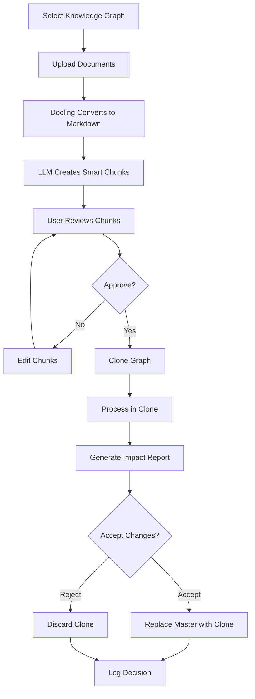

# Krypton Graph Architecture Document

## Introduction

This document captures the comprehensive architecture of Krypton Graph, a knowledge graph management system that enables organizations to build, manage, and query temporal knowledge graphs with sophisticated ontology support. It consolidates decisions from the front-end specification v1.0, technology evaluations, and existing implementations.

### Document Scope

This architecture document covers the complete system design including:
- Frontend architecture using shadcn/ui v4
- Backend patterns adapted from Zep POC
- Airtable as the primary data store
- Processing workflows and data pipelines
- Integration strategies and deployment considerations

### Change Log

| Date | Version | Description | Author |
|------|---------|-------------|---------|
| 2025-09-03 | 1.0 | Initial architecture consolidation | Winston (Architect) |
| 2025-01-03 | 1.1 | Integrated front-end-spec.md requirements | System |

## Quick Reference - Key Files and Entry Points

### Critical Documentation Files
- **Frontend Specification**: `docs/front-end-spec.md` - Authoritative UI/UX requirements
- **Master Decisions**: `docs/consolidation/MASTER-DECISIONS.md` - Technology stack decisions
- **Airtable Schema**: `docs/architecture/decisions/airtable-schema-existing.md` - Database structure
- **UI Components**: `docs/requirements/ui-components-checklist.md` - Implementation checklist

### Configuration Files
- **BMAD Config**: `.bmad-core/core-config.yaml` - Project configuration
- **Environment**: `.env` - API keys and service configuration (not committed)

## High Level Architecture

### System Overview

Krypton Graph is a knowledge graph management platform that combines:
- **Visual ontology design** for defining entity and edge types
- **Document processing pipeline** for extracting knowledge from documents
- **Impact assessment** for reviewing changes before committing
- **Temporal graph capabilities** for tracking knowledge evolution

### Architecture Pattern

```
┌─────────────────────────────────────────┐
│         Frontend Layer                  │
│         (shadcn/ui v4)                  │
│  - React + TypeScript                   │
│  - Radix UI primitives                  │
│  - Tailwind CSS                         │
│  - React Hook Form + Zod                │
│  - D3.js for graph visualization        │
├─────────────────────────────────────────┤
│      Application Services Layer         │
│  - Ontology Management                  │
│  - Document Processing (Docling)        │
│  - Smart Chunk Generation (LLM)         │
│  - Impact Assessment Engine             │
│  - Graph Operations (Zep patterns)      │
├─────────────────────────────────────────┤
│        Data Access Layer                │
│        (Airtable MCP)                   │
│  - CRUD Operations                      │
│  - Query Optimization                   │
│  - Batch Processing                     │
│  - Cache Management                     │
├─────────────────────────────────────────┤
│         Data Storage Layer              │
│         (Airtable)                      │
│  - 8 Table Knowledge Graph Schema       │
│  - JSON Fields for Flexibility          │
│  - Linked Records for Relationships     │
└─────────────────────────────────────────┘
```

### Technology Stack

| Category | Technology | Version | Purpose |
|----------|------------|---------|---------|
| **Frontend Framework** | React | 18.x | UI components and state management |
| **UI Component Library** | shadcn/ui | v4 | Pre-built accessible components |
| **CSS Framework** | Tailwind CSS | 3.x | Utility-first styling |
| **Type System** | TypeScript | 5.x | Type safety across stack |
| **Form Validation** | React Hook Form + Zod | Latest | Form handling and validation |
| **Graph Visualization** | D3.js | 7.x | Knowledge graph rendering |
| **Animation** | Framer Motion | Latest | UI animations and transitions |
| **Data Tables** | Tanstack Table | 8.x | Virtual scrolling and sorting |
| **Database** | Airtable | Cloud | Primary data storage |
| **Database Access** | Airtable MCP | Latest | Programmatic data operations |
| **Document Processing** | Docling | Latest | Convert documents to markdown |
| **LLM Integration** | OpenAI API | Latest | Smart chunk generation |
| **Graph Patterns** | Zep (adapted) | N/A | Entity/edge type management |

## Source Tree and Module Organization

### Project Structure

```
krypton-graph/
├── .bmad-core/          # BMAD agent configuration
│   ├── tasks/           # Agent task definitions
│   ├── templates/       # Document templates
│   └── core-config.yaml # Project configuration
│
├── docs/                # All documentation
│   ├── architecture/    # Architecture decisions and patterns
│   │   ├── decisions/   # ADRs and technology choices
│   │   └── patterns/    # Reusable patterns (Airtable, Zep)
│   ├── consolidation/   # Decision consolidation docs
│   │   └── MASTER-DECISIONS.md # Authoritative decisions
│   ├── requirements/    # Functional and UI requirements
│   │   └── functional/extracted/ # Extracted requirements
│   └── front-end-spec.md # Complete UI/UX specification
│
├── DOCUMENTATION/       # External documentation
│   ├── convex_documentation/ # Convex docs (rejected)
│   └── zep_documentation/    # Zep platform docs
│
├── EXAMPLES/           # Example implementations
│   ├── admin-ui/       # Admin interface examples
│   ├── docs/           # Documentation examples
│   └── zep_examples/   # Zep integration examples
│
└── src/                # Source code (to be created)
    ├── components/     # React components
    ├── services/       # Business logic services
    ├── hooks/          # Custom React hooks
    ├── utils/          # Utility functions
    └── types/          # TypeScript definitions
```

### Key Modules and Their Purpose

#### Frontend Modules

- **Component Library** (`src/components/`)
  - 46 shadcn/ui v4 base components
  - Custom graph visualization components
  - Ontology designer components
  - Impact assessment dashboard
  - Smart chunk editor

- **Application Services** (`src/services/`)
  - `OntologyService` - Entity/edge type management
  - `DocumentService` - Document upload and processing
  - `GraphService` - Graph operations and queries
  - `ImpactService` - Change impact assessment
  - `AirtableService` - Database operations wrapper

- **State Management** (`src/store/`)
  - Graph state management
  - User session handling
  - Processing queue state
  - UI state (sidebars, modals)

#### Backend Services

- **Airtable MCP Integration**
  - Connection management
  - Request batching (5 req/sec limit)
  - Error handling and retries
  - Cache layer

- **Document Processing Pipeline**
  - Docling integration for markdown conversion
  - LLM integration for smart chunking
  - Metadata extraction
  - Chunk approval workflow

## Data Models and APIs

### Airtable Schema (Existing)

The system uses 8 interconnected tables in Airtable:

#### Core Tables

1. **Ontologies** (tblupVP410vrQERwa)
   - Central hub for knowledge domain definitions
   - Fields: Name, Description, Domain, Version, Status
   - Links: EntityDefinitions, EdgeDefinitions, TestRuns

2. **EntityDefinitions** (tbloHlpFxnP5CTBEh)
   - Custom entity type definitions
   - Fields: Entity Name, Entity Class, Properties JSON
   - Validation Rules, Examples, Priority

3. **EdgeDefinitions** (tbldR4dKr1EFlgOFZ)
   - Relationship type definitions
   - Fields: Edge Type, Source/Target Constraints
   - Properties, Examples

4. **TestDatasets** (tblf5a4g0VhFDlhSo)
   - Test data for ontology validation
   - Sample documents and expected outputs

5. **TestRuns** (tble8wm5NYNGRPHkC)
   - Episode-based processing tracking
   - Status, results, timestamps

6. **GraphAssignments** (tbl2eLfeMmzwRpdMT)
   - Assign graphs to contexts/uses

7. **FactRatingConfigs** (tblGxLQO4N3z5Jz9P)
   - Configure fact validation rules

8. **FactRatingTests** (tblLaHGbhn4YbCHDN)
   - Test fact rating configurations

### API Design Patterns

#### RESTful Endpoints (Planned)

```typescript
// Ontology Management
GET    /api/ontologies
POST   /api/ontologies
PUT    /api/ontologies/:id
DELETE /api/ontologies/:id

// Entity/Edge Types
GET    /api/ontologies/:id/entities
POST   /api/ontologies/:id/entities
GET    /api/ontologies/:id/edges
POST   /api/ontologies/:id/edges

// Document Processing
POST   /api/documents/upload
GET    /api/documents/:id/chunks
PUT    /api/documents/:id/chunks/:chunkId
POST   /api/documents/:id/process

// Impact Assessment
POST   /api/graphs/:id/clone
GET    /api/impact-assessments/:id
POST   /api/impact-assessments/:id/accept
POST   /api/impact-assessments/:id/reject
```

### Type Definitions (TypeScript)

```typescript
// Core Domain Types
interface Ontology {
  id: string;
  name: string;
  description: string;
  domain: 'Healthcare' | 'Finance' | 'Legal' | 'Technology' | 'Education' | 'Manufacturing';
  version: string;
  status: 'Draft' | 'Testing' | 'Published' | 'Deprecated';
  entityDefinitions: EntityDefinition[];
  edgeDefinitions: EdgeDefinition[];
}

interface EntityDefinition {
  id: string;
  entityName: string;
  entityClass: string;
  propertiesJson: Record<string, PropertyDefinition>;
  validationRules: ValidationRule[];
  examples: string[];
}

interface EdgeDefinition {
  id: string;
  edgeType: string;
  sourceConstraints: EntityClass[];
  targetConstraints: EntityClass[];
  properties: Record<string, PropertyDefinition>;
}
```

## User Journeys and Workflows

### Core User Personas

1. **Admin User**
   - Deep technical knowledge
   - Manages system configuration, API keys, user access
   - Monitors system health

2. **Advanced User**
   - Creates and manages ontologies
   - Designs entity and edge types
   - Builds reusable templates

3. **Standard User**
   - Imports documents
   - Reviews and validates extractions
   - Makes accept/reject decisions on changes

### Critical Workflow: Document Import with Impact Assessment



### Clone-Before-Modify Pattern

**CRITICAL**: This pattern ensures zero data loss risk:
1. Always clone the master graph before modifications
2. Apply changes to the clone
3. Generate impact assessment comparing master vs clone
4. User decides to accept (replace master) or reject (discard clone)
5. All decisions logged for audit trail

## Integration Points and External Dependencies

### External Services

| Service | Purpose | Integration Method | Configuration |
|---------|---------|-------------------|---------------|
| **Airtable** | Primary database | MCP Server | AIRTABLE_API_KEY |
| **OpenAI** | Smart chunk generation | REST API | OPENAI_API_KEY |
| **Docling** | Document conversion | Python library | Local/API |
| **Zep (Optional)** | NLP extraction | REST API | ZEP_API_KEY |

### Internal Integration Architecture

```
Frontend <--> API Gateway <--> Service Layer <--> External Services
                                     |
                                     v
                              Airtable MCP
                                     |
                                     v
                               Airtable DB
```

## Development and Deployment

### Local Development Setup

```bash
# Prerequisites
- Node.js 18.x or higher
- npm or pnpm
- Airtable account with configured base
- OpenAI API key

# Environment Setup
1. Clone repository
2. Copy .env.example to .env
3. Configure API keys:
   - AIRTABLE_API_KEY
   - AIRTABLE_BASE_ID
   - OPENAI_API_KEY
   - ZEP_API_KEY (optional)

# Installation
npm install

# Development
npm run dev

# Build
npm run build

# Tests
npm test
```

### Deployment Architecture

```
┌─────────────────┐
│   CloudFlare    │  <-- Static frontend hosting
│     Pages       │
└────────┬────────┘
         │
    API Calls
         │
         v
┌─────────────────┐
│   Vercel/AWS    │  <-- API endpoints
│   Functions     │
└────────┬────────┘
         │
    Data Operations
         │
         v
┌─────────────────┐
│    Airtable     │  <-- Managed database
│     Cloud       │
└─────────────────┘
```

### Environment Configuration

```env
# Database
AIRTABLE_API_KEY=key_xxxxxxxxxxxx
AIRTABLE_BASE_ID=appvLsaMZqtLc9EIX

# AI Services
OPENAI_API_KEY=sk-xxxxxxxxxxxx
ZEP_API_KEY=zep_xxxxxxxxxxxx  # Optional

# Application
NODE_ENV=production
API_URL=https://api.krypton-graph.com
FRONTEND_URL=https://app.krypton-graph.com
```

## Security Considerations

### Authentication & Authorization

- **Authentication**: JWT-based with secure token storage
- **Authorization**: Role-based access control (Admin, Advanced, Standard)
- **API Security**: Rate limiting, request validation, CORS configuration

### Data Security

- **Encryption**: HTTPS for all communications
- **API Keys**: Stored securely, never exposed to frontend
- **Sensitive Data**: PII handling compliance
- **Audit Trail**: All changes logged with user attribution

### Security Checklist

- [ ] API keys stored in environment variables
- [ ] HTTPS enforced for all endpoints
- [ ] Input validation on all user inputs
- [ ] SQL injection prevention (N/A - using Airtable)
- [ ] XSS protection in React
- [ ] CORS properly configured
- [ ] Rate limiting implemented
- [ ] Authentication required for all operations
- [ ] Role-based access control enforced
- [ ] Audit logging enabled

## Performance Optimization

### Frontend Performance

1. **Component Optimization**
   - React.memo for expensive components
   - Virtual scrolling for large lists (Tanstack Table)
   - Lazy loading with Suspense
   - Code splitting by route

2. **Graph Visualization**
   - Canvas/WebGL rendering for large graphs
   - Progressive rendering
   - Level-of-detail (LOD) system
   - Viewport culling

3. **Data Fetching**
   - Request batching
   - Optimistic updates
   - Client-side caching
   - Pagination for large datasets

### Backend Performance

1. **Airtable Optimization**
   - Batch operations (10 records max per request)
   - Rate limit management (5 req/sec)
   - Strategic use of views
   - Filtered queries with formulas

2. **Caching Strategy**
   ```typescript
   // TTL-based cache
   - Ontologies: 5 minutes
   - Entity/Edge definitions: 5 minutes
   - Graph data: 1 minute
   - User session: 30 minutes
   ```

3. **Processing Optimization**
   - Async/queue for document processing
   - Chunked uploads for large files
   - Background jobs for impact assessment
   - Incremental graph updates

### Performance Targets

- Page load: < 3 seconds on 3G
- Graph render: < 1 second for 1000 nodes
- API response: < 200ms for queries
- Document processing: < 30 seconds for 10MB file

## Testing Strategy

### Testing Levels

1. **Unit Testing**
   - Components with React Testing Library
   - Services with Jest
   - Utilities with Jest
   - Target: 80% code coverage

2. **Integration Testing**
   - API endpoint testing
   - Airtable MCP integration
   - Document processing pipeline
   - Target: Critical paths covered

3. **E2E Testing**
   - User journey testing with Playwright
   - Cross-browser testing
   - Mobile responsive testing
   - Target: Core workflows covered

4. **Performance Testing**
   - Load testing with k6
   - Graph rendering benchmarks
   - Memory leak detection
   - Target: Meet performance KPIs

### Test Data Management

- Use TestDatasets table for test fixtures
- Separate test Airtable base
- Seeded test data for consistency
- Mock external services in unit tests

## Technical Debt and Known Limitations

### Current Limitations

1. **Airtable Constraints**
   - 5 requests/second rate limit
   - 100,000 records per base soft limit
   - No real-time subscriptions (polling required)
   - Limited query capabilities

2. **Graph Visualization**
   - Performance degrades above 10,000 nodes
   - No 3D visualization currently
   - Limited layout algorithms

3. **Document Processing**
   - Docling accuracy varies by document type
   - LLM costs for large documents
   - No OCR for scanned documents

### Planned Improvements

1. **Phase 2 Features**
   - Real-time collaboration
   - Advanced graph algorithms
   - ML-powered entity extraction
   - Multi-language support

2. **Technical Enhancements**
   - GraphQL API option
   - Redis caching layer
   - WebSocket for real-time updates
   - Elasticsearch for advanced search

## Implementation Roadmap

### Phase 1: Foundation (Week 1)
- [x] Architecture documentation
- [ ] shadcn/ui v4 setup with all components
- [ ] Airtable MCP wrapper implementation
- [ ] Authentication system
- [ ] Basic routing and navigation

### Phase 2: Core Features (Week 2)
- [ ] Ontology Designer implementation
- [ ] Entity/Edge type builders
- [ ] Document upload interface
- [ ] Docling integration
- [ ] Smart chunk editor

### Phase 3: Advanced Features (Week 3-4)
- [ ] Graph visualization with D3.js
- [ ] Impact assessment dashboard
- [ ] Clone-before-modify workflow
- [ ] History and audit trail
- [ ] Command palette (Cmd+K)

### Phase 4: Polish & Deploy (Week 5)
- [ ] Performance optimization
- [ ] Accessibility testing (WCAG 2.1 AA)
- [ ] Documentation completion
- [ ] Deployment setup
- [ ] User acceptance testing

## Success Metrics

### Usability Goals (from front-end-spec.md)
- New users can import and verify first document within 10 minutes
- Advanced users can create complete ontologies with minimal friction
- Zero data loss through clone-before-modify pattern
- All changes tracked, reported, and reversible

### Technical KPIs
- 99.9% uptime
- < 3 second page loads
- < 1% error rate
- 80% test coverage

### Business Metrics
- User adoption rate
- Documents processed per day
- Ontologies created per week
- Knowledge graph query performance

## Appendices

### A. Useful Commands

```bash
# Development
npm run dev              # Start dev server
npm run build           # Production build
npm run test            # Run tests
npm run lint            # Run linter
npm run typecheck       # TypeScript checks

# Database
npm run airtable:sync   # Sync schema types
npm run airtable:seed   # Seed test data

# Documentation
npm run docs:build      # Build documentation
npm run docs:serve      # Serve documentation
```

### B. Key Resources

- [shadcn/ui Documentation](https://ui.shadcn.com)
- [Airtable API Reference](https://airtable.com/api)
- [D3.js Documentation](https://d3js.org)
- [React Hook Form](https://react-hook-form.com)
- [Tailwind CSS](https://tailwindcss.com)

### C. Troubleshooting

Common issues and solutions:

1. **Airtable Rate Limiting**
   - Implement exponential backoff
   - Use request batching
   - Cache frequently accessed data

2. **Large Graph Performance**
   - Enable viewport culling
   - Use progressive rendering
   - Implement LOD system

3. **Document Processing Failures**
   - Check Docling compatibility
   - Verify file size limits
   - Review LLM token limits

---

*This architecture document represents the consolidated technical decisions for Krypton Graph as of 2025-09-03, incorporating the authoritative front-end-spec.md v1.0 and all reviewed technology evaluations.*