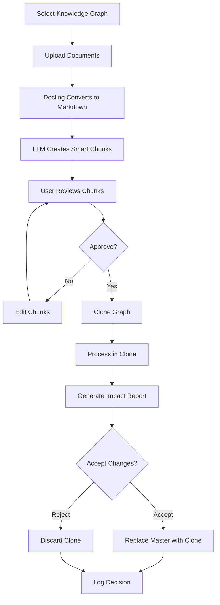

# Krypton Graph Architecture Document

## Introduction

This document captures the comprehensive architecture of Krypton Graph, a knowledge graph management system that enables organizations to build, manage, and query temporal knowledge graphs with sophisticated ontology support. It consolidates decisions from the front-end specification v1.0, technology evaluations, and existing implementations.

### Document Scope

This architecture document covers the complete system design including:
- Frontend architecture using shadcn/ui v4
- Backend patterns adapted from Zep POC
- Airtable as the primary data store
- Processing workflows and data pipelines
- Integration strategies and deployment considerations

### Change Log

| Date | Version | Description | Author |
|------|---------|-------------|---------|
| 2025-09-03 | 1.0 | Initial architecture consolidation | Winston (Architect) |
| 2025-01-03 | 1.1 | Integrated front-end-spec.md requirements | System |
| 2025-01-04 | 1.2 | Updated to align with PRD reconciliation decisions - simplified v1.0 scope | Winston (Architect) |

## Quick Reference - Key Files and Entry Points

### Critical Documentation Files
- **Frontend Specification**: `docs/front-end-spec.md` - Authoritative UI/UX requirements
- **Master Decisions**: `docs/consolidation/MASTER-DECISIONS.md` - Technology stack decisions
- **Airtable Schema**: `docs/architecture/decisions/airtable-schema-existing.md` - Database structure
- **UI Components**: `docs/requirements/ui-components-checklist.md` - Implementation checklist

### Configuration Files
- **BMAD Config**: `.bmad-core/core-config.yaml` - Project configuration
- **Environment**: `.env` - API keys and service configuration (not committed)

## High Level Architecture

### System Overview

Krypton Graph is a knowledge graph management platform that combines:
- **Visual ontology design** for defining entity and edge types
- **Document processing pipeline** for extracting knowledge from documents
- **Impact assessment** for reviewing changes before committing
- **Temporal graph capabilities** for tracking knowledge evolution

### Architecture Pattern

```
┌─────────────────────────────────────────┐
│         Frontend Layer                  │
│         (shadcn/ui v4)                  │
│  - React + TypeScript                   │
│  - Radix UI primitives                  │
│  - Tailwind CSS                         │
│  - React Hook Form + Zod                │
│  - D3.js for graph visualization        │
├─────────────────────────────────────────┤
│      Application Services Layer         │
│  - Ontology Management                  │
│  - Document Processing (Docling)        │
│  - Smart Chunk Generation (LLM)         │
│  - Impact Assessment Engine             │
│  - Graph Operations (Zep patterns)      │
├─────────────────────────────────────────┤
│        Data Access Layer                │
│        (Airtable MCP)                   │
│  - CRUD Operations                      │
│  - Query Optimization                   │
│  - Batch Processing                     │
│  - Cache Management                     │
├─────────────────────────────────────────┤
│         Data Storage Layer              │
│         (Airtable)                      │
│  - 8 Table Knowledge Graph Schema       │
│  - JSON Fields for Flexibility          │
│  - Linked Records for Relationships     │
└─────────────────────────────────────────┘
```

### Technology Stack

| Category | Technology | Version | Purpose |
|----------|------------|---------|---------|
| **Frontend Framework** | React | 18.x | UI components and state management |
| **UI Component Library** | shadcn/ui | v4 | Pre-built accessible components |
| **CSS Framework** | Tailwind CSS | 3.x | Utility-first styling |
| **Type System** | TypeScript | 5.x | Type safety across stack |
| **Form Validation** | React Hook Form + Zod | Latest | Form handling and validation |
| **Graph Visualization** | D3.js | 7.x | Knowledge graph rendering |
| **Animation** | Framer Motion | Latest | UI animations and transitions |
| **Data Tables** | Tanstack Table | 8.x | Virtual scrolling and sorting |
| **Database** | Airtable | Cloud | Primary data storage |
| **Database Access** | Airtable MCP | Latest | Programmatic data operations |
| **Document Processing** | Docling | Latest | Convert documents to markdown |
| **LLM Integration** | OpenAI API | Latest | Smart chunk generation |
| **Graph Patterns** | Zep (adapted) | N/A | Entity/edge type management |

## Source Tree and Module Organization

### Project Structure

```
krypton-graph/
├── .bmad-core/          # BMAD agent configuration
│   ├── tasks/           # Agent task definitions
│   ├── templates/       # Document templates
│   └── core-config.yaml # Project configuration
│
├── docs/                # All documentation
│   ├── architecture/    # Architecture decisions and patterns
│   │   ├── decisions/   # ADRs and technology choices
│   │   └── patterns/    # Reusable patterns (Airtable, Zep)
│   ├── consolidation/   # Decision consolidation docs
│   │   └── MASTER-DECISIONS.md # Authoritative decisions
│   ├── requirements/    # Functional and UI requirements
│   │   └── functional/extracted/ # Extracted requirements
│   └── front-end-spec.md # Complete UI/UX specification
│
├── DOCUMENTATION/       # External documentation
│   ├── convex_documentation/ # Convex docs (rejected)
│   └── zep_documentation/    # Zep platform docs
│
├── EXAMPLES/           # Example implementations
│   ├── admin-ui/       # Admin interface examples
│   ├── docs/           # Documentation examples
│   └── zep_examples/   # Zep integration examples
│
└── src/                # Source code (to be created)
    ├── components/     # React components
    ├── services/       # Business logic services
    ├── hooks/          # Custom React hooks
    ├── utils/          # Utility functions
    └── types/          # TypeScript definitions
```

## Repository Structure Decision

### Chosen Approach: Next.js Hybrid Structure

After evaluating monorepo vs standard repository approaches, we've chosen a **hybrid Next.js-based structure** that provides the benefits of a monorepo (atomic commits, shared code, single deployment) without the complexity overhead. This aligns with our single-developer constraint and Vercel deployment target.

#### Rationale

1. **Simplicity First**: Avoids complex workspace tooling (lerna, nx, turborepo) unnecessary for a single developer
2. **Vercel Optimization**: Next.js is Vercel's primary platform with automatic optimizations
3. **Full-Stack Unity**: API routes and frontend pages in one coherent structure
4. **Natural Code Sharing**: Shared types and utilities without package boundaries
5. **Future Flexibility**: Can evolve to true monorepo when team scales

#### Repository Layout

```
krypton-graph/
├── src/
│   ├── app/                    # Next.js App Router
│   │   ├── api/                # Backend API routes
│   │   │   ├── entities/       # Entity CRUD endpoints
│   │   │   ├── documents/      # Document processing
│   │   │   ├── graphs/         # Graph operations
│   │   │   └── auth/           # Authentication
│   │   ├── (dashboard)/        # Dashboard route group
│   │   │   ├── ontologies/     # Ontology management pages
│   │   │   ├── documents/      # Document import pages
│   │   │   ├── graphs/         # Graph visualization pages
│   │   │   └── settings/       # Settings pages
│   │   ├── layout.tsx          # Root layout
│   │   └── page.tsx            # Landing page
│   │
│   ├── components/             # React Components
│   │   ├── ui/                 # shadcn/ui components
│   │   ├── graph/              # Graph visualization
│   │   ├── ontology/           # Ontology designer
│   │   ├── document/           # Document processing
│   │   └── layout/             # Layout components
│   │
│   ├── lib/                    # Shared libraries
│   │   ├── airtable/           # Airtable MCP integration
│   │   │   ├── client.ts       # MCP client wrapper
│   │   │   ├── schemas.ts      # Table schemas
│   │   │   └── queries.ts      # Query builders
│   │   ├── docling/            # Document processing
│   │   │   ├── processor.ts    # Docling wrapper
│   │   │   └── chunker.ts      # Smart chunking
│   │   ├── graph/              # Graph algorithms
│   │   │   ├── builder.ts      # Graph construction
│   │   │   └── analyzer.ts     # Impact analysis
│   │   ├── types/              # TypeScript definitions
│   │   │   ├── entities.ts     # Entity types
│   │   │   ├── api.ts          # API types
│   │   │   └── ui.ts           # UI types
│   │   └── utils/              # Utilities
│   │       ├── validation.ts   # Zod schemas
│   │       └── helpers.ts      # Helper functions
│   │
│   ├── server/                 # Server-only code
│   │   ├── services/           # Business logic
│   │   │   ├── ontology.ts     # Ontology operations
│   │   │   ├── document.ts     # Document processing
│   │   │   └── impact.ts       # Impact assessment
│   │   └── queue/              # Background jobs
│   │       └── processor.ts    # Document queue
│   │
│   └── styles/                 # Global styles
│       └── globals.css         # Tailwind + custom CSS
│
├── public/                     # Static assets
├── .env.local                  # Environment variables
├── next.config.js              # Next.js configuration
├── package.json                # Single package file
├── tsconfig.json               # TypeScript config
└── tailwind.config.ts          # Tailwind configuration
```

#### Key Design Decisions

1. **App Router over Pages Router**: Leverages React Server Components for better performance
2. **Route Groups**: Organize dashboard routes without affecting URL structure
3. **API Routes**: Colocated with frontend for easy maintenance
4. **Shared `lib/` Directory**: Common code used by both frontend and backend
5. **Server Directory**: Ensures server-only code isn't bundled to client
6. **Single `package.json`**: Simplified dependency management

### Evolution Path to Monorepo

#### When to Consider Migration

Consider migrating to a true monorepo structure when:
- **Team grows beyond 2-3 developers**
- **Need independent deployment** of frontend and backend
- **Want to publish** shared packages to npm
- **Require different** Node versions for different parts
- **Performance requires** microservices extraction

#### Migration Strategy

If migration becomes necessary, the path is straightforward:

```
krypton-graph/                 krypton-graph/
├── src/                   →    ├── packages/
│   ├── app/                    │   ├── web/          (src/app + components)
│   ├── components/             │   ├── api/          (src/app/api + server)
│   ├── lib/                    │   ├── shared/       (src/lib)
│   └── server/                 │   └── ui/           (src/components/ui)
                                ├── turbo.json
                                └── pnpm-workspace.yaml
```

**What stays the same:**
- Business logic organization
- TypeScript types structure  
- Component architecture
- API endpoint patterns

**What changes:**
- Package boundaries become explicit
- Build configuration splits
- Deployment becomes multi-artifact
- Testing can be more isolated

### Benefits of Current Structure

1. **Developer Experience**
   - Single `npm install`
   - Single `npm run dev` for full-stack
   - Hot reload everywhere
   - Unified TypeScript config

2. **Deployment Simplicity**
   - One build artifact
   - Single Vercel project
   - Automatic preview deployments
   - Integrated environment variables

3. **Code Sharing**
   - Import types directly
   - Share validation schemas
   - Reuse utilities naturally
   - No versioning overhead

4. **Performance**
   - Next.js optimizations out of the box
   - Automatic code splitting
   - API routes with edge runtime option
   - React Server Components

### Key Modules and Their Purpose

#### Frontend Modules (Next.js App Router)

- **Component Library** (`src/components/`)
  - 46 shadcn/ui v4 base components in `ui/`
  - Graph visualization components in `graph/`
  - Ontology designer components in `ontology/`
  - Document processing UI in `document/`
  - Layout components in `layout/`

- **App Routes** (`src/app/`)
  - API routes in `api/` for backend endpoints
  - Dashboard pages in `(dashboard)/` route group
  - Authentication flows in `api/auth/`
  - Static pages at root level

- **State Management** 
  - React Server Components for server state
  - React Query for client-side caching
  - Zustand for UI state (sidebars, modals)
  - Form state with React Hook Form

#### Backend Services (API Routes + Server)

- **Airtable Integration** (`src/lib/airtable/`)
  - MCP client wrapper
  - Request batching (5 req/sec limit)
  - Schema definitions and migrations
  - Query builders with type safety
  - Cache layer

- **Document Processing** (`src/server/services/document.ts`)
  - Docling integration for markdown conversion
  - LLM integration for smart chunking
  - Metadata extraction
  - Chunk approval workflow

- **Graph Operations** (`src/lib/graph/`)
  - Clone-before-modify implementation
  - Impact assessment calculation
  - Graph diff generation
  - History tracking

#### Shared Libraries (`src/lib/`)

- **Type Definitions** (`types/`)
  - Shared TypeScript interfaces
  - API request/response types
  - Database schema types
  - UI component props

- **Validation** (`utils/validation.ts`)
  - Zod schemas for forms
  - API payload validation
  - Database constraint validation

- **Utilities** (`utils/`)
  - Date formatting helpers
  - String manipulation
  - Error handling utilities
  - Performance optimizations

## Data Models and APIs

### Airtable Schema (Existing)

The system uses 8 interconnected tables in Airtable:

#### Core Tables

1. **Ontologies** (tblupVP410vrQERwa)
   - Central hub for knowledge domain definitions
   - Fields: Name, Description, Domain, Version, Status
   - Links: EntityDefinitions, EdgeDefinitions, TestRuns

2. **EntityDefinitions** (tbloHlpFxnP5CTBEh)
   - Custom entity type definitions
   - Fields: Entity Name, Entity Class, Properties JSON
   - Validation Rules, Examples, Priority

3. **EdgeDefinitions** (tbldR4dKr1EFlgOFZ)
   - Relationship type definitions
   - Fields: Edge Type, Source/Target Constraints
   - Properties, Examples

4. **TestDatasets** (tblf5a4g0VhFDlhSo)
   - Test data for ontology validation
   - Sample documents and expected outputs

5. **TestRuns** (tble8wm5NYNGRPHkC)
   - Episode-based processing tracking
   - Status, results, timestamps

6. **GraphAssignments** (tbl2eLfeMmzwRpdMT)
   - Assign graphs to contexts/uses

7. **FactRatingConfigs** (tblGxLQO4N3z5Jz9P)
   - Configure fact validation rules

8. **FactRatingTests** (tblLaHGbhn4YbCHDN)
   - Test fact rating configurations

### API Design Patterns

#### RESTful Endpoints (Planned)

```typescript
// Ontology Management
GET    /api/ontologies
POST   /api/ontologies
PUT    /api/ontologies/:id
DELETE /api/ontologies/:id

// Entity/Edge Types
GET    /api/ontologies/:id/entities
POST   /api/ontologies/:id/entities
GET    /api/ontologies/:id/edges
POST   /api/ontologies/:id/edges

// Document Processing
POST   /api/documents/upload
GET    /api/documents/:id/chunks
PUT    /api/documents/:id/chunks/:chunkId
POST   /api/documents/:id/process

// Impact Assessment
POST   /api/graphs/:id/clone
GET    /api/impact-assessments/:id
POST   /api/impact-assessments/:id/accept
POST   /api/impact-assessments/:id/reject
```

### Type Definitions (TypeScript)

```typescript
// Core Domain Types
interface Ontology {
  id: string;
  name: string;
  description: string;
  domain: 'Healthcare' | 'Finance' | 'Legal' | 'Technology' | 'Education' | 'Manufacturing';
  version: string;
  status: 'Draft' | 'Testing' | 'Published' | 'Deprecated';
  entityDefinitions: EntityDefinition[];
  edgeDefinitions: EdgeDefinition[];
}

interface EntityDefinition {
  id: string;
  entityName: string;
  entityClass: string;
  propertiesJson: Record<string, PropertyDefinition>;
  validationRules: ValidationRule[];
  examples: string[];
}

interface EdgeDefinition {
  id: string;
  edgeType: string;
  sourceConstraints: EntityClass[];
  targetConstraints: EntityClass[];
  properties: Record<string, PropertyDefinition>;
}
```

## Frontend Component Architecture

### Component Architecture Principles

Building on shadcn/ui v4's composable approach, our component architecture follows these core principles:

#### 1. Composition Over Configuration
Components are built by composing smaller, reusable primitives rather than passing complex configuration objects. This provides maximum flexibility while maintaining consistency.

```typescript
// Compose complex components from primitives
<Card>
  <CardHeader>
    <CardTitle>Knowledge Graph Status</CardTitle>
    <CardDescription>Real-time graph metrics</CardDescription>
  </CardHeader>
  <CardContent>
    <GraphVisualization />
  </CardContent>
  <CardFooter>
    <Button variant="outline">View Details</Button>
  </CardFooter>
</Card>
```

#### 2. Variant-Based Styling with CVA
Use Class Variance Authority (CVA) for type-safe variant management across all components:

```typescript
const buttonVariants = cva(
  "inline-flex items-center justify-center rounded-md text-sm font-medium transition-colors focus-visible:outline-none focus-visible:ring-2 disabled:pointer-events-none disabled:opacity-50",
  {
    variants: {
      variant: {
        default: "bg-primary text-primary-foreground hover:bg-primary/90",
        destructive: "bg-destructive text-destructive-foreground hover:bg-destructive/90",
        outline: "border border-input bg-background hover:bg-accent",
        secondary: "bg-secondary text-secondary-foreground hover:bg-secondary/80",
        ghost: "hover:bg-accent hover:text-accent-foreground",
        link: "text-primary underline-offset-4 hover:underline",
        // Custom variants for Krypton Graph
        impact: "bg-warning text-warning-foreground hover:bg-warning/90",
        success: "bg-success text-success-foreground hover:bg-success/90",
      },
      size: {
        default: "h-10 px-4 py-2",
        sm: "h-9 rounded-md px-3",
        lg: "h-11 rounded-md px-8",
        icon: "h-10 w-10",
      },
    },
    defaultVariants: {
      variant: "default",
      size: "default",
    },
  }
)
```

#### 3. Controlled and Uncontrolled Support
Components support both controlled and uncontrolled patterns for maximum flexibility:

```typescript
interface ComponentProps {
  value?: string;              // Controlled
  defaultValue?: string;        // Uncontrolled
  onValueChange?: (value: string) => void;
}
```

### Core shadcn/ui Components (46 Total)

Our implementation leverages the full shadcn/ui v4 component library, organized by function:

#### Navigation & Layout
- **Sidebar** (`sidebar`): Multi-level collapsible navigation with role-based item visibility
- **Navigation Menu** (`navigation-menu`): Top-bar navigation with mega-menu support
- **Breadcrumb** (`breadcrumb`): Contextual navigation with graph name integration
- **Tabs** (`tabs`): Content organization for complex interfaces
- **Sheet** (`sheet`): Slide-out panels for secondary content

#### Form & Input
- **Form** (`form`): React Hook Form integration with Zod validation
- **Input** (`input`): Text input with error states and descriptions
- **Select** (`select`): Searchable dropdowns with async data loading
- **Command** (`command`): Command palette for power users (Cmd+K)
- **Textarea** (`textarea`): Multi-line input for descriptions
- **Switch** (`switch`): Toggle for boolean settings
- **Checkbox** (`checkbox`): Multi-selection controls
- **Radio Group** (`radio-group`): Single selection from options
- **Slider** (`slider`): Numeric value selection
- **Date Picker** (`date-picker`): Date selection with calendar

#### Feedback & Overlay
- **Alert Dialog** (`alert-dialog`): Confirmation dialogs for destructive actions
- **Dialog** (`dialog`): Modal windows for focused tasks
- **Toast** (`sonner`): Non-blocking notifications with actions
- **Alert** (`alert`): Inline alerts for important messages
- **Tooltip** (`tooltip`): Contextual help on hover
- **Popover** (`popover`): Rich content overlays
- **Hover Card** (`hover-card`): Preview cards for entities
- **Context Menu** (`context-menu`): Right-click menus

#### Data Display
- **Table** (`table`): Sortable, filterable data tables
- **Data Table** (`data-table`): Advanced table with Tanstack Table integration
- **Card** (`card`): Content containers with consistent spacing
- **Badge** (`badge`): Status indicators and counts
- **Avatar** (`avatar`): User profile images with fallbacks
- **Progress** (`progress`): Loading and progress indicators
- **Skeleton** (`skeleton`): Loading placeholders
- **Separator** (`separator`): Visual content dividers
- **Accordion** (`accordion`): Collapsible content sections
- **Collapsible** (`collapsible`): Toggle content visibility
- **Scroll Area** (`scroll-area`): Custom scrollbar styling

#### Layout Utilities
- **Aspect Ratio** (`aspect-ratio`): Maintain consistent dimensions
- **Toggle** (`toggle`): Binary state buttons
- **Toggle Group** (`toggle-group`): Multi-option toggles
- **Menubar** (`menubar`): Application menu structure
- **Dropdown Menu** (`dropdown-menu`): Action menus
- **Resizable** (`resizable`): Adjustable panel layouts

### Custom Krypton Graph Components

Building on shadcn/ui primitives, we've created specialized components for our domain:

#### 1. KnowledgeGraphViewer
Interactive graph visualization with D3.js integration:

```typescript
interface KnowledgeGraphViewerProps {
  graphId: string;
  mode: 'view' | 'edit' | 'compare';
  layout?: 'force' | 'hierarchical' | 'radial';
  filters?: EntityFilter[];
  onNodeClick?: (node: GraphNode) => void;
  onEdgeClick?: (edge: GraphEdge) => void;
  maxNodes?: number; // Default: 1000 for v1.0
}

// Implementation uses:
// - D3.js force simulation for layout
// - Canvas/WebGL rendering for performance
// - React.memo for optimization
// - ResizeObserver for responsive sizing
// - Virtual viewport for large graphs
```

#### 2. EntityTypeBuilder
Form-based Pydantic entity type creation:

```typescript
interface EntityTypeBuilderProps {
  ontologyId: string;
  existingEntity?: EntityDefinition;
  onSave: (entity: EntityDefinition) => Promise<void>;
  validationRules?: ValidationRule[];
}

// Combines multiple shadcn components:
// - Form with React Hook Form
// - Dynamic field list management
// - Collapsible advanced settings
// - Real-time Python code preview
```

#### 3. SmartChunkEditor
Document chunk boundary adjustment with AI assistance:

```typescript
interface SmartChunkEditorProps {
  chunks: DocumentChunk[];
  maxTokens: number; // 10,000 character limit
  onUpdate: (chunks: DocumentChunk[]) => void;
  onApprove: (chunks: DocumentChunk[]) => void;
}

// Features:
// - Resizable panels for chunk boundaries
// - Token count visualization
// - Split/merge operations
// - AI-suggested boundaries
// - Metadata editing
```

#### 4. ImpactAssessmentDashboard
Comprehensive change review interface:

```typescript
interface ImpactAssessmentProps {
  masterGraph: GraphSnapshot;
  proposedGraph: GraphSnapshot;
  changes: ChangeSet;
  onAccept: () => Promise<void>;
  onReject: () => Promise<void>;
  onPartialAccept?: (selected: Change[]) => Promise<void>;
}

// Implements:
// - Side-by-side graph comparison
// - Change categorization (added/modified/removed)
// - Ripple effect visualization
// - Selective change approval
```

### Implementation Patterns

#### Virtual Scrolling for Large Lists
```typescript
import { useVirtualizer } from '@tanstack/react-virtual';

const VirtualizedEntityList = ({ entities }: { entities: Entity[] }) => {
  const parentRef = useRef<HTMLDivElement>(null);
  
  const virtualizer = useVirtualizer({
    count: entities.length,
    getScrollElement: () => parentRef.current,
    estimateSize: () => 45,
    overscan: 10,
  });

  return (
    <ScrollArea ref={parentRef} className="h-[600px]">
      <div style={{ height: `${virtualizer.getTotalSize()}px` }}>
        {virtualizer.getVirtualItems().map((virtualItem) => (
          <EntityCard 
            key={virtualItem.key}
            entity={entities[virtualItem.index]}
            style={{
              transform: `translateY(${virtualItem.start}px)`
            }}
          />
        ))}
      </div>
    </ScrollArea>
  );
};
```

#### Debounced Search Pattern
```typescript
const SearchableList = () => {
  const [search, setSearch] = useState('');
  const [results, setResults] = useState<Item[]>([]);
  
  const debouncedSearch = useMemo(
    () => debounce(async (value: string) => {
      const data = await searchAPI(value);
      setResults(data);
    }, 300),
    []
  );

  return (
    <div className="space-y-4">
      <Input
        placeholder="Search..."
        value={search}
        onChange={(e) => {
          setSearch(e.target.value);
          debouncedSearch(e.target.value);
        }}
      />
      <ResultsList results={results} />
    </div>
  );
};
```

### Performance Optimization Patterns

1. **Component Memoization**
   ```typescript
   const ExpensiveComponent = React.memo(({ data }) => {
     // Complex rendering logic
   }, (prevProps, nextProps) => {
     return prevProps.data.id === nextProps.data.id;
   });
   ```

2. **Lazy Loading with Suspense**
   ```typescript
   const GraphVisualization = lazy(() => 
     import('./components/GraphVisualization')
   );
   
   <Suspense fallback={<Skeleton className="h-[600px]" />}>
     <GraphVisualization />
   </Suspense>
   ```

3. **Optimistic Updates**
   ```typescript
   const optimisticUpdate = (newData: Data) => {
     // Update UI immediately
     setLocalData(newData);
     // Then sync with backend
     updateBackend(newData).catch(() => {
       // Revert on failure
       setLocalData(previousData);
       toast.error("Update failed");
     });
   };
   ```

### Accessibility Patterns

1. **ARIA Implementation**
   ```typescript
   <Button
     aria-label="Delete entity"
     aria-describedby="delete-warning"
     onClick={handleDelete}
   >
     <Trash className="h-4 w-4" />
     <span className="sr-only">Delete</span>
   </Button>
   ```

2. **Keyboard Navigation**
   ```typescript
   const handleKeyDown = (e: KeyboardEvent) => {
     switch(e.key) {
       case 'Enter':
       case ' ':
         handleSelect();
         break;
       case 'Escape':
         handleClose();
         break;
       case 'ArrowDown':
         focusNext();
         break;
     }
   };
   ```

3. **Focus Management**
   ```typescript
   useEffect(() => {
     if (isOpen) {
       firstFocusableRef.current?.focus();
     }
     return () => {
       previouslyFocusedElement?.focus();
     };
   }, [isOpen]);
   ```

## Animation System

### Motion Principles

Our animation system follows these core principles to ensure a polished, performant user experience:

1. **Purposeful** - Every animation serves a functional purpose (feedback, guidance, or context)
2. **Fast** - Keep durations under 300ms for UI transitions to maintain responsiveness
3. **Smooth** - Use appropriate easing functions (ease-out for entering, ease-in for exiting)
4. **Respectful** - Honor user preferences including `prefers-reduced-motion`
5. **Consistent** - Same actions produce same animations throughout the application
6. **Performant** - Maintain 60 FPS using GPU-accelerated transforms

### Framer Motion Configuration

#### Global Animation Settings
```typescript
// app/lib/motion.ts
import { MotionConfig } from 'framer-motion';

export const motionConfig = {
  reducedMotion: "user", // Respect user's system preference
  transition: {
    type: "spring",
    stiffness: 260,
    damping: 20,
  }
};

// Wrap app in MotionConfig
<MotionConfig {...motionConfig}>
  <App />
</MotionConfig>
```

#### Core Animation Variants

```typescript
// app/lib/animations.ts
export const animationVariants = {
  // Page transitions
  pageEnter: {
    initial: { opacity: 0, y: 20 },
    animate: { opacity: 1, y: 0 },
    exit: { opacity: 0, y: -20 },
    transition: { duration: 0.2, ease: "easeOut" }
  },
  
  // Fade transitions
  fadeIn: {
    initial: { opacity: 0 },
    animate: { opacity: 1 },
    exit: { opacity: 0 },
    transition: { duration: 0.15 }
  },
  
  // Slide transitions
  slideInFromRight: {
    initial: { x: "100%", opacity: 0 },
    animate: { x: 0, opacity: 1 },
    exit: { x: "100%", opacity: 0 },
    transition: { type: "spring", damping: 25, stiffness: 200 }
  },
  
  slideInFromLeft: {
    initial: { x: "-100%", opacity: 0 },
    animate: { x: 0, opacity: 1 },
    exit: { x: "-100%", opacity: 0 },
    transition: { type: "spring", damping: 25, stiffness: 200 }
  },
  
  // List animations with stagger
  listContainer: {
    hidden: { opacity: 0 },
    show: {
      opacity: 1,
      transition: {
        staggerChildren: 0.05,
        delayChildren: 0.03
      }
    }
  },
  
  listItem: {
    hidden: { opacity: 0, x: -20, scale: 0.95 },
    show: { 
      opacity: 1, 
      x: 0, 
      scale: 1,
      transition: {
        type: "spring",
        stiffness: 300,
        damping: 24
      }
    }
  },
  
  // Graph node animations
  nodeHover: {
    scale: 1.1,
    transition: { duration: 0.15, ease: "easeOut" }
  },
  
  nodeSelected: {
    scale: 1.15,
    boxShadow: "0 0 0 3px var(--primary)",
    transition: { duration: 0.2, ease: "easeInOut" }
  },
  
  // Success/Error feedback
  successPulse: {
    scale: [1, 1.05, 1],
    transition: { duration: 0.3, times: [0, 0.5, 1] }
  },
  
  errorShake: {
    x: [0, -10, 10, -10, 10, 0],
    transition: { duration: 0.4, ease: "easeInOut" }
  },
  
  // Modal/Dialog animations
  modalOverlay: {
    initial: { opacity: 0 },
    animate: { opacity: 1 },
    exit: { opacity: 0 },
    transition: { duration: 0.2 }
  },
  
  modalContent: {
    initial: { scale: 0.95, opacity: 0, y: 20 },
    animate: { scale: 1, opacity: 1, y: 0 },
    exit: { scale: 0.95, opacity: 0, y: 20 },
    transition: { type: "spring", damping: 25, stiffness: 300 }
  },
  
  // Accordion/Collapse
  accordionContent: {
    closed: { height: 0, opacity: 0 },
    open: { height: "auto", opacity: 1 },
    transition: { 
      height: { duration: 0.3, ease: "easeInOut" },
      opacity: { duration: 0.25, delay: 0.05 }
    }
  }
};
```

### Component Implementation Patterns

#### Animated Page Transitions
```typescript
import { motion, AnimatePresence } from 'framer-motion';
import { animationVariants } from '@/lib/animations';

export const PageTransition = ({ children, pageKey }) => {
  return (
    <AnimatePresence mode="wait">
      <motion.div
        key={pageKey}
        variants={animationVariants.pageEnter}
        initial="initial"
        animate="animate"
        exit="exit"
      >
        {children}
      </motion.div>
    </AnimatePresence>
  );
};
```

#### Staggered List Animation
```typescript
export const AnimatedList = ({ items }) => {
  return (
    <motion.ul
      variants={animationVariants.listContainer}
      initial="hidden"
      animate="show"
    >
      {items.map((item) => (
        <motion.li
          key={item.id}
          variants={animationVariants.listItem}
          whileHover={{ scale: 1.02 }}
          whileTap={{ scale: 0.98 }}
        >
          <Card>{item.content}</Card>
        </motion.li>
      ))}
    </motion.ul>
  );
};
```

#### Interactive Graph Nodes
```typescript
export const GraphNode = ({ node, isSelected }) => {
  return (
    <motion.g
      initial={false}
      animate={isSelected ? "selected" : "default"}
      whileHover="hover"
      variants={{
        default: { scale: 1 },
        hover: animationVariants.nodeHover,
        selected: animationVariants.nodeSelected
      }}
    >
      <circle r={node.radius} fill={node.color} />
      <text>{node.label}</text>
    </motion.g>
  );
};
```

#### Loading Skeleton Animation
```typescript
export const SkeletonLoader = () => {
  return (
    <motion.div
      className="bg-muted rounded-md"
      animate={{
        opacity: [0.5, 1, 0.5],
      }}
      transition={{
        duration: 1.5,
        ease: "easeInOut",
        repeat: Infinity,
      }}
    />
  );
};
```

### Gesture Animations

#### Drag and Drop
```typescript
export const DraggableCard = ({ children }) => {
  return (
    <motion.div
      drag
      dragConstraints={{ top: -50, left: -50, right: 50, bottom: 50 }}
      dragElastic={0.2}
      whileDrag={{ scale: 1.1, zIndex: 1 }}
      dragTransition={{ bounceStiffness: 600, bounceDamping: 20 }}
      whileTap={{ cursor: "grabbing" }}
    >
      {children}
    </motion.div>
  );
};
```

#### Swipe to Dismiss
```typescript
export const SwipeableNotification = ({ onDismiss }) => {
  return (
    <motion.div
      drag="x"
      dragConstraints={{ left: 0, right: 0 }}
      onDragEnd={(e, { offset, velocity }) => {
        if (offset.x > 100 || velocity.x > 500) {
          onDismiss();
        }
      }}
      animate={{ x: 0 }}
      transition={{ type: "spring", damping: 30, stiffness: 300 }}
    >
      <Alert>Swipe right to dismiss</Alert>
    </motion.div>
  );
};
```

### Performance Optimization

#### Layout Animations
```typescript
// Use layoutId for smooth layout transitions
export const LayoutAnimation = ({ items }) => {
  return (
    <motion.div layout>
      {items.map(item => (
        <motion.div
          key={item.id}
          layoutId={item.id}
          initial={{ opacity: 0 }}
          animate={{ opacity: 1 }}
          exit={{ opacity: 0 }}
          transition={{
            layout: { type: "spring", damping: 25, stiffness: 200 }
          }}
        >
          {item.content}
        </motion.div>
      ))}
    </motion.div>
  );
};
```

#### GPU Acceleration
```typescript
// Use transform properties for better performance
const optimizedAnimation = {
  initial: { 
    opacity: 0, 
    transform: "translateY(20px) scale(0.95)" 
  },
  animate: { 
    opacity: 1, 
    transform: "translateY(0px) scale(1)" 
  },
  // Avoid animating properties that trigger reflow
  // Bad: width, height, padding, margin
  // Good: transform, opacity
};
```

#### Reduced Motion Support
```typescript
import { useReducedMotion } from 'framer-motion';

export const AccessibleAnimation = ({ children }) => {
  const shouldReduceMotion = useReducedMotion();
  
  const variants = shouldReduceMotion
    ? { initial: {}, animate: {} }  // No animation
    : animationVariants.pageEnter;    // Full animation
  
  return (
    <motion.div variants={variants} initial="initial" animate="animate">
      {children}
    </motion.div>
  );
};
```

### Animation Timing Guide

| Animation Type | Duration | Easing | Use Case |
|---------------|----------|--------|----------|
| **Micro-interactions** | 100-200ms | ease-out | Hover, focus, small state changes |
| **Layout shifts** | 200-300ms | ease-in-out | Expanding panels, reordering |
| **Page transitions** | 200-250ms | ease-out | Route changes, tab switches |
| **Modal/Sheet** | 250-300ms | spring | Opening overlays, dialogs |
| **Complex sequences** | 400-600ms | custom | Multi-step animations |
| **Loading skeletons** | 1000-1500ms | ease-in-out | Continuous pulse effect |

### Common Animation Patterns

1. **Entrance Animations** - Fade up, scale up, slide in
2. **Exit Animations** - Fade down, scale down, slide out  
3. **Feedback Animations** - Pulse, shake, bounce
4. **State Transitions** - Morphing, color changes, size adjustments
5. **Loading States** - Skeleton screens, progress indicators, spinners
6. **Micro-interactions** - Hover effects, active states, focus indicators
7. **Gesture Responses** - Drag feedback, swipe actions, pinch zoom

## Form Validation Architecture

### Overview

Our form validation system combines React Hook Form for performant form state management with Zod for type-safe schema validation. This approach provides runtime type safety, automatic error handling, and excellent developer experience.

### Core Technologies

- **React Hook Form** - Performant form state management with minimal re-renders
- **Zod** - TypeScript-first schema validation with static type inference
- **shadcn/ui Form Components** - Pre-built accessible form components
- **@hookform/resolvers** - Integration between React Hook Form and Zod

### Form Architecture Principles

1. **Schema-First Validation** - Define validation rules in Zod schemas that serve as single source of truth
2. **Type Safety** - Automatic TypeScript type inference from Zod schemas
3. **Progressive Enhancement** - Client-side validation with server-side fallback
4. **Accessibility** - ARIA attributes and error announcements built-in
5. **Performance** - Minimal re-renders using uncontrolled components
6. **User Experience** - Real-time validation with debouncing for optimal feedback

### Zod Schema Patterns

#### Basic Entity Schema
```typescript
import { z } from 'zod';

// Define reusable schema primitives
const nonEmptyString = z.string().min(1, "This field is required");
const email = z.string().email("Invalid email address");
const url = z.string().url("Invalid URL");

// Entity Definition Schema
export const entityDefinitionSchema = z.object({
  entityName: nonEmptyString
    .min(2, "Name must be at least 2 characters")
    .max(50, "Name must be less than 50 characters")
    .regex(/^[a-zA-Z][a-zA-Z0-9_]*$/, "Must start with letter, contain only letters, numbers, underscore"),
  
  entityClass: z.enum(["Person", "Organization", "Document", "Event", "Location", "Custom"], {
    required_error: "Please select an entity class",
  }),
  
  description: z.string().max(500, "Description must be less than 500 characters").optional(),
  
  properties: z.array(z.object({
    name: nonEmptyString,
    type: z.enum(["string", "number", "boolean", "date", "array", "object"]),
    required: z.boolean().default(false),
    description: z.string().optional(),
    validation: z.string().optional(), // Additional Pydantic validation rules
  })).min(1, "At least one property is required"),
  
  validationRules: z.array(z.object({
    field: nonEmptyString,
    rule: z.enum(["unique", "immutable", "computed", "indexed"]),
    message: z.string().optional(),
  })).optional(),
  
  examples: z.array(z.string()).max(10, "Maximum 10 examples allowed").optional(),
});

// Infer TypeScript type from schema
export type EntityDefinition = z.infer<typeof entityDefinitionSchema>;
```

#### Document Import Schema
```typescript
export const documentImportSchema = z.object({
  files: z.array(z.instanceof(File))
    .min(1, "Please select at least one file")
    .max(10, "Maximum 10 files at once")
    .refine(
      files => files.every(file => file.size <= 50 * 1024 * 1024),
      "Each file must be less than 50MB"
    )
    .refine(
      files => files.every(file => 
        ['application/pdf', 'text/plain', 'text/markdown', 'application/vnd.openxmlformats-officedocument.wordprocessingml.document']
        .includes(file.type)
      ),
      "Only PDF, TXT, MD, and DOCX files are supported"
    ),
  
  targetGraph: nonEmptyString,
  
  processingOptions: z.object({
    chunkSize: z.number()
      .min(1000, "Minimum chunk size is 1,000 characters")
      .max(10000, "Maximum chunk size is 10,000 characters")
      .default(5000),
    
    overlap: z.number()
      .min(0, "Overlap cannot be negative")
      .max(50, "Overlap cannot exceed 50%")
      .default(10),
    
    smartChunking: z.boolean().default(true),
    preserveFormatting: z.boolean().default(true),
    extractMetadata: z.boolean().default(true),
  }),
  
  category: z.enum(["technical", "legal", "financial", "research", "other"]).optional(),
  
  tags: z.array(z.string().max(20)).max(10).optional(),
});

export type DocumentImportForm = z.infer<typeof documentImportSchema>;
```

#### Ontology Creation Schema
```typescript
export const ontologySchema = z.object({
  name: nonEmptyString
    .min(3, "Name must be at least 3 characters")
    .max(100, "Name must be less than 100 characters"),
  
  description: z.string()
    .min(10, "Please provide a meaningful description")
    .max(1000, "Description too long"),
  
  domain: z.enum([
    "Healthcare",
    "Finance", 
    "Legal",
    "Technology",
    "Education",
    "Manufacturing",
    "Other"
  ]),
  
  version: z.string()
    .regex(/^\d+\.\d+\.\d+$/, "Version must be in format X.Y.Z")
    .default("1.0.0"),
  
  status: z.enum(["Draft", "Testing", "Published", "Deprecated"])
    .default("Draft"),
  
  entityTypes: z.array(entityDefinitionSchema)
    .min(1, "At least one entity type is required"),
  
  edgeTypes: z.array(z.object({
    name: nonEmptyString,
    sourceConstraints: z.array(z.string()).min(1),
    targetConstraints: z.array(z.string()).min(1),
    properties: z.record(z.any()).optional(),
  })).optional(),
});
```

### React Hook Form Integration

#### Form Setup and Configuration
```typescript
import { useForm } from 'react-hook-form';
import { zodResolver } from '@hookform/resolvers/zod';
import { Form } from '@/components/ui/form';

export const EntityDefinitionForm = () => {
  const form = useForm<EntityDefinition>({
    resolver: zodResolver(entityDefinitionSchema),
    defaultValues: {
      entityName: '',
      entityClass: 'Custom',
      properties: [{ name: '', type: 'string', required: false }],
    },
    mode: 'onBlur', // Validate on blur for better UX
    criteriaMode: 'all', // Show all errors at once
  });

  const onSubmit = async (data: EntityDefinition) => {
    try {
      await saveEntityDefinition(data);
      toast.success('Entity definition saved');
      form.reset();
    } catch (error) {
      toast.error('Failed to save entity definition');
    }
  };

  return (
    <Form {...form}>
      <form onSubmit={form.handleSubmit(onSubmit)} className="space-y-6">
        {/* Form fields */}
      </form>
    </Form>
  );
};
```

#### Form Field Components
```typescript
import { FormField, FormItem, FormLabel, FormControl, FormDescription, FormMessage } from '@/components/ui/form';
import { Input } from '@/components/ui/input';
import { Select, SelectContent, SelectItem, SelectTrigger, SelectValue } from '@/components/ui/select';

// Text Input Field
<FormField
  control={form.control}
  name="entityName"
  render={({ field }) => (
    <FormItem>
      <FormLabel>Entity Name*</FormLabel>
      <FormControl>
        <Input 
          placeholder="e.g., Person, Document, Organization"
          {...field}
          aria-invalid={!!form.formState.errors.entityName}
          aria-describedby="entityName-error"
        />
      </FormControl>
      <FormDescription>
        A unique name for this entity type using PascalCase
      </FormDescription>
      <FormMessage id="entityName-error" />
    </FormItem>
  )}
/>

// Select Field
<FormField
  control={form.control}
  name="entityClass"
  render={({ field }) => (
    <FormItem>
      <FormLabel>Entity Class*</FormLabel>
      <Select onValueChange={field.onChange} defaultValue={field.value}>
        <FormControl>
          <SelectTrigger aria-label="Select entity class">
            <SelectValue placeholder="Select a class" />
          </SelectTrigger>
        </FormControl>
        <SelectContent>
          <SelectItem value="Person">Person</SelectItem>
          <SelectItem value="Organization">Organization</SelectItem>
          <SelectItem value="Document">Document</SelectItem>
          <SelectItem value="Custom">Custom</SelectItem>
        </SelectContent>
      </Select>
      <FormMessage />
    </FormItem>
  )}
/>
```

#### Dynamic Field Arrays
```typescript
import { useFieldArray } from 'react-hook-form';
import { Plus, Trash2 } from 'lucide-react';

export const PropertiesFieldArray = () => {
  const { fields, append, remove } = useFieldArray({
    control: form.control,
    name: "properties",
  });

  return (
    <div className="space-y-4">
      <div className="flex items-center justify-between">
        <FormLabel>Properties</FormLabel>
        <Button
          type="button"
          variant="outline"
          size="sm"
          onClick={() => append({ name: '', type: 'string', required: false })}
        >
          <Plus className="h-4 w-4 mr-2" />
          Add Property
        </Button>
      </div>
      
      {fields.map((field, index) => (
        <Card key={field.id} className="p-4">
          <div className="grid grid-cols-12 gap-4">
            <div className="col-span-4">
              <FormField
                control={form.control}
                name={`properties.${index}.name`}
                render={({ field }) => (
                  <FormItem>
                    <FormControl>
                      <Input placeholder="Property name" {...field} />
                    </FormControl>
                    <FormMessage />
                  </FormItem>
                )}
              />
            </div>
            
            <div className="col-span-3">
              <FormField
                control={form.control}
                name={`properties.${index}.type`}
                render={({ field }) => (
                  <FormItem>
                    <Select onValueChange={field.onChange} value={field.value}>
                      <FormControl>
                        <SelectTrigger>
                          <SelectValue />
                        </SelectTrigger>
                      </FormControl>
                      <SelectContent>
                        <SelectItem value="string">String</SelectItem>
                        <SelectItem value="number">Number</SelectItem>
                        <SelectItem value="boolean">Boolean</SelectItem>
                        <SelectItem value="date">Date</SelectItem>
                      </SelectContent>
                    </Select>
                    <FormMessage />
                  </FormItem>
                )}
              />
            </div>
            
            <div className="col-span-4">
              <FormField
                control={form.control}
                name={`properties.${index}.required`}
                render={({ field }) => (
                  <FormItem className="flex items-center space-x-2">
                    <FormControl>
                      <Checkbox
                        checked={field.value}
                        onCheckedChange={field.onChange}
                      />
                    </FormControl>
                    <FormLabel className="text-sm font-normal">
                      Required
                    </FormLabel>
                  </FormItem>
                )}
              />
            </div>
            
            <div className="col-span-1">
              <Button
                type="button"
                variant="ghost"
                size="icon"
                onClick={() => remove(index)}
                disabled={fields.length === 1}
              >
                <Trash2 className="h-4 w-4" />
              </Button>
            </div>
          </div>
        </Card>
      ))}
    </div>
  );
};
```

### Advanced Validation Patterns

#### Async Validation
```typescript
const checkNameUnique = async (name: string): Promise<boolean> => {
  const response = await fetch(`/api/entities/check-name/${name}`);
  return response.ok;
};

const entitySchemaWithAsync = entityDefinitionSchema.extend({
  entityName: nonEmptyString.refine(
    async (name) => await checkNameUnique(name),
    { message: "This entity name already exists" }
  ),
});
```

#### Cross-Field Validation
```typescript
const dateRangeSchema = z.object({
  startDate: z.date(),
  endDate: z.date(),
}).refine(
  (data) => data.endDate > data.startDate,
  {
    message: "End date must be after start date",
    path: ["endDate"], // Error will appear on endDate field
  }
);
```

#### Conditional Validation
```typescript
const conditionalSchema = z.object({
  entityClass: z.enum(["Person", "Organization", "Custom"]),
  customClassName: z.string().optional(),
}).refine(
  (data) => {
    if (data.entityClass === "Custom") {
      return data.customClassName && data.customClassName.length > 0;
    }
    return true;
  },
  {
    message: "Custom class name is required when Entity Class is Custom",
    path: ["customClassName"],
  }
);
```

### Error Handling and Display

#### Global Error Handler
```typescript
export const FormErrorHandler = ({ error }: { error: any }) => {
  if (error?.errors) {
    return (
      <Alert variant="destructive">
        <AlertCircle className="h-4 w-4" />
        <AlertTitle>Validation Error</AlertTitle>
        <AlertDescription>
          <ul className="list-disc list-inside">
            {Object.entries(error.errors).map(([field, messages]) => (
              <li key={field}>
                <strong>{field}:</strong> {Array.isArray(messages) ? messages.join(', ') : messages}
              </li>
            ))}
          </ul>
        </AlertDescription>
      </Alert>
    );
  }
  
  return (
    <Alert variant="destructive">
      <AlertCircle className="h-4 w-4" />
      <AlertTitle>Error</AlertTitle>
      <AlertDescription>{error?.message || 'An unexpected error occurred'}</AlertDescription>
    </Alert>
  );
};
```

#### Field-Level Error Display
```typescript
const FieldWithError = ({ name, ...props }) => {
  const { 
    formState: { errors }, 
    register 
  } = useFormContext();
  
  const error = errors[name];
  
  return (
    <div className="space-y-2">
      <Input
        {...register(name)}
        {...props}
        className={cn(
          props.className,
          error && "border-destructive focus:ring-destructive"
        )}
        aria-invalid={!!error}
        aria-describedby={error ? `${name}-error` : undefined}
      />
      {error && (
        <p id={`${name}-error`} className="text-sm text-destructive">
          {error.message}
        </p>
      )}
    </div>
  );
};
```

### Form State Management

#### Form Persistence
```typescript
// Auto-save form data to localStorage
const useFormPersistence = (key: string, form: UseFormReturn) => {
  const { watch, reset } = form;
  const watchedValues = watch();

  // Save to localStorage on change
  useEffect(() => {
    const timeoutId = setTimeout(() => {
      localStorage.setItem(key, JSON.stringify(watchedValues));
    }, 1000); // Debounce saves

    return () => clearTimeout(timeoutId);
  }, [watchedValues, key]);

  // Load from localStorage on mount
  useEffect(() => {
    const saved = localStorage.getItem(key);
    if (saved) {
      try {
        const parsed = JSON.parse(saved);
        reset(parsed);
      } catch (e) {
        console.error('Failed to load saved form data');
      }
    }
  }, [key, reset]);

  // Clear saved data
  const clearSaved = () => localStorage.removeItem(key);
  
  return { clearSaved };
};
```

#### Multi-Step Form
```typescript
export const MultiStepEntityForm = () => {
  const [step, setStep] = useState(1);
  const form = useForm({
    resolver: zodResolver(entityDefinitionSchema),
    mode: 'onChange',
  });

  const steps = [
    { title: 'Basic Info', fields: ['entityName', 'entityClass', 'description'] },
    { title: 'Properties', fields: ['properties'] },
    { title: 'Validation', fields: ['validationRules'] },
    { title: 'Examples', fields: ['examples'] },
  ];

  const currentStepValid = async () => {
    const fields = steps[step - 1].fields;
    return await form.trigger(fields as any);
  };

  const nextStep = async () => {
    const valid = await currentStepValid();
    if (valid && step < steps.length) {
      setStep(step + 1);
    }
  };

  const prevStep = () => {
    if (step > 1) setStep(step - 1);
  };

  return (
    <div>
      <Progress value={(step / steps.length) * 100} />
      <Form {...form}>
        <form onSubmit={form.handleSubmit(onSubmit)}>
          {/* Conditionally render fields based on current step */}
          {step === 1 && <BasicInfoFields />}
          {step === 2 && <PropertiesFields />}
          {step === 3 && <ValidationFields />}
          {step === 4 && <ExamplesFields />}
          
          <div className="flex justify-between">
            <Button 
              type="button" 
              variant="outline" 
              onClick={prevStep}
              disabled={step === 1}
            >
              Previous
            </Button>
            
            {step < steps.length ? (
              <Button type="button" onClick={nextStep}>
                Next
              </Button>
            ) : (
              <Button type="submit">
                Submit
              </Button>
            )}
          </div>
        </form>
      </Form>
    </div>
  );
};
```

### Performance Optimization

#### Debounced Validation
```typescript
const DebouncedInput = ({ name, delay = 500, ...props }) => {
  const { control } = useFormContext();
  
  return (
    <Controller
      name={name}
      control={control}
      render={({ field, fieldState }) => {
        const [value, setValue] = useState(field.value);
        
        useEffect(() => {
          const timer = setTimeout(() => {
            field.onChange(value);
          }, delay);
          
          return () => clearTimeout(timer);
        }, [value, delay, field]);
        
        return (
          <Input
            {...props}
            value={value}
            onChange={(e) => setValue(e.target.value)}
            onBlur={field.onBlur}
            aria-invalid={!!fieldState.error}
          />
        );
      }}
    />
  );
};
```

#### Optimized Re-renders
```typescript
// Use watch with specific fields to minimize re-renders
const watchedEntityClass = form.watch('entityClass');

// Use FormProvider for deeply nested forms
<FormProvider {...form}>
  <NestedFormComponent />
</FormProvider>

// In nested component, use useFormContext
const NestedFormComponent = () => {
  const { control } = useFormContext();
  // Component only re-renders when its specific fields change
};
```

### Testing Form Validation

```typescript
import { renderHook, act, waitFor } from '@testing-library/react';
import { useForm } from 'react-hook-form';
import { zodResolver } from '@hookform/resolvers/zod';

describe('EntityDefinition Form Validation', () => {
  it('should validate required fields', async () => {
    const { result } = renderHook(() => 
      useForm({
        resolver: zodResolver(entityDefinitionSchema),
        defaultValues: {},
      })
    );

    await act(async () => {
      await result.current.trigger();
    });

    expect(result.current.formState.errors.entityName).toBeDefined();
    expect(result.current.formState.errors.entityName?.message).toBe('This field is required');
  });

  it('should validate entity name format', async () => {
    const { result } = renderHook(() => 
      useForm({
        resolver: zodResolver(entityDefinitionSchema),
      })
    );

    act(() => {
      result.current.setValue('entityName', '123Invalid');
    });

    await act(async () => {
      await result.current.trigger('entityName');
    });

    expect(result.current.formState.errors.entityName).toBeDefined();
  });
});
```

## Error Handling UI Architecture

### Overview

Our error handling system provides robust error boundaries, graceful degradation, and user-friendly error experiences throughout the application. It combines React Error Boundaries with custom error handling utilities to ensure application resilience and maintain user trust.

### Error Handling Principles

1. **Fail Gracefully** - Never show raw errors to users; always provide helpful context
2. **Preserve User Work** - Auto-save and recover from errors when possible
3. **Provide Clear Actions** - Tell users what they can do to resolve issues
4. **Log Everything** - Capture detailed error information for debugging
5. **Progressive Degradation** - Maintain core functionality even when features fail
6. **User-Centric Messaging** - Use plain language, avoid technical jargon

### React Error Boundary Implementation

#### Base Error Boundary Component
```typescript
import React, { Component, ErrorInfo, ReactNode } from 'react';
import { AlertCircle, RefreshCw, Home } from 'lucide-react';
import { Button } from '@/components/ui/button';
import { Alert, AlertDescription, AlertTitle } from '@/components/ui/alert';

interface Props {
  children: ReactNode;
  fallback?: ReactNode;
  onError?: (error: Error, errorInfo: ErrorInfo) => void;
  level?: 'page' | 'section' | 'component';
  resetKeys?: Array<string | number>;
  resetOnPropsChange?: boolean;
}

interface State {
  hasError: boolean;
  error: Error | null;
  errorInfo: ErrorInfo | null;
  errorCount: number;
}

export class ErrorBoundary extends Component<Props, State> {
  private resetTimeoutId: number | null = null;

  constructor(props: Props) {
    super(props);
    this.state = {
      hasError: false,
      error: null,
      errorInfo: null,
      errorCount: 0,
    };
  }

  static getDerivedStateFromError(error: Error): State {
    return {
      hasError: true,
      error,
      errorInfo: null,
      errorCount: 0,
    };
  }

  componentDidCatch(error: Error, errorInfo: ErrorInfo) {
    const { onError } = this.props;
    
    // Log to error reporting service
    this.logErrorToService(error, errorInfo);
    
    // Call custom error handler
    onError?.(error, errorInfo);
    
    // Update state with error details
    this.setState(prevState => ({
      errorInfo,
      errorCount: prevState.errorCount + 1,
    }));
    
    // Auto-recover after 3 errors
    if (this.state.errorCount >= 3) {
      this.scheduleReset(10000); // Reset after 10 seconds
    }
  }

  componentDidUpdate(prevProps: Props) {
    const { resetKeys, resetOnPropsChange } = this.props;
    const { hasError } = this.state;
    
    // Reset on prop changes if configured
    if (hasError && resetOnPropsChange && prevProps.children !== this.props.children) {
      this.resetErrorBoundary();
    }
    
    // Reset when resetKeys change
    if (hasError && resetKeys && prevProps.resetKeys !== resetKeys) {
      this.resetErrorBoundary();
    }
  }

  private logErrorToService = (error: Error, errorInfo: ErrorInfo) => {
    // Send to monitoring service (e.g., Sentry, LogRocket)
    if (typeof window !== 'undefined' && window.Sentry) {
      window.Sentry.withScope(scope => {
        scope.setContext('errorBoundary', {
          level: this.props.level,
          componentStack: errorInfo.componentStack,
        });
        window.Sentry.captureException(error);
      });
    }
    
    // Also log to console in development
    if (process.env.NODE_ENV === 'development') {
      console.error('Error Boundary Caught:', error);
      console.error('Component Stack:', errorInfo.componentStack);
    }
  };

  private scheduleReset = (delay: number) => {
    this.resetTimeoutId = window.setTimeout(() => {
      this.resetErrorBoundary();
    }, delay);
  };

  resetErrorBoundary = () => {
    if (this.resetTimeoutId) {
      clearTimeout(this.resetTimeoutId);
      this.resetTimeoutId = null;
    }
    
    this.setState({
      hasError: false,
      error: null,
      errorInfo: null,
      errorCount: 0,
    });
  };

  render() {
    const { hasError, error } = this.state;
    const { children, fallback, level = 'component' } = this.props;

    if (hasError && error) {
      if (fallback) {
        return <>{fallback}</>;
      }

      return <ErrorFallback
        error={error}
        resetErrorBoundary={this.resetErrorBoundary}
        level={level}
      />;
    }

    return children;
  }
}
```

#### Error Fallback Components

```typescript
interface ErrorFallbackProps {
  error: Error;
  resetErrorBoundary: () => void;
  level: 'page' | 'section' | 'component';
}

const ErrorFallback: React.FC<ErrorFallbackProps> = ({
  error,
  resetErrorBoundary,
  level,
}) => {
  // Different fallbacks based on error level
  switch (level) {
    case 'page':
      return <PageErrorFallback error={error} reset={resetErrorBoundary} />;
    case 'section':
      return <SectionErrorFallback error={error} reset={resetErrorBoundary} />;
    case 'component':
      return <ComponentErrorFallback error={error} reset={resetErrorBoundary} />;
  }
};

const PageErrorFallback = ({ error, reset }) => (
  <div className="min-h-screen flex items-center justify-center p-4">
    <div className="max-w-md w-full space-y-4">
      <Alert variant="destructive">
        <AlertCircle className="h-4 w-4" />
        <AlertTitle>Something went wrong</AlertTitle>
        <AlertDescription>
          {getErrorMessage(error)}
        </AlertDescription>
      </Alert>
      
      <div className="flex gap-2">
        <Button onClick={reset} variant="default">
          <RefreshCw className="mr-2 h-4 w-4" />
          Try Again
        </Button>
        <Button onClick={() => window.location.href = '/'} variant="outline">
          <Home className="mr-2 h-4 w-4" />
          Go Home
        </Button>
      </div>
      
      {process.env.NODE_ENV === 'development' && (
        <details className="text-sm text-muted-foreground">
          <summary className="cursor-pointer">Technical Details</summary>
          <pre className="mt-2 p-2 bg-muted rounded text-xs overflow-auto">
            {error.stack}
          </pre>
        </details>
      )}
    </div>
  </div>
);

const SectionErrorFallback = ({ error, reset }) => (
  <Card className="p-6">
    <div className="space-y-4">
      <div className="flex items-start gap-2">
        <AlertCircle className="h-5 w-5 text-destructive mt-0.5" />
        <div className="space-y-1">
          <p className="font-medium">This section couldn't load</p>
          <p className="text-sm text-muted-foreground">
            {getErrorMessage(error)}
          </p>
        </div>
      </div>
      
      <Button onClick={reset} size="sm" variant="outline">
        Try Again
      </Button>
    </div>
  </Card>
);

const ComponentErrorFallback = ({ error, reset }) => (
  <div className="p-4 border border-destructive/50 rounded-md bg-destructive/10">
    <p className="text-sm text-destructive">
      Failed to load this component
    </p>
    <button
      onClick={reset}
      className="text-xs underline mt-1 hover:no-underline"
    >
      Retry
    </button>
  </div>
);
```

### Async Error Handling

#### Async Component Wrapper
```typescript
import { Suspense } from 'react';
import { ErrorBoundary } from './ErrorBoundary';
import { Skeleton } from '@/components/ui/skeleton';

interface AsyncBoundaryProps {
  children: React.ReactNode;
  fallback?: React.ReactNode;
  errorFallback?: React.ReactNode;
  onError?: (error: Error) => void;
}

export const AsyncBoundary: React.FC<AsyncBoundaryProps> = ({
  children,
  fallback = <Skeleton className="h-32 w-full" />,
  errorFallback,
  onError,
}) => {
  return (
    <ErrorBoundary
      fallback={errorFallback}
      onError={onError}
      level="component"
    >
      <Suspense fallback={fallback}>
        {children}
      </Suspense>
    </ErrorBoundary>
  );
};
```

#### API Error Handler
```typescript
export class APIError extends Error {
  constructor(
    message: string,
    public status: number,
    public code?: string,
    public details?: any
  ) {
    super(message);
    this.name = 'APIError';
  }
}

export const handleAPIError = async (response: Response) => {
  if (!response.ok) {
    const contentType = response.headers.get('content-type');
    let errorDetails;
    
    if (contentType?.includes('application/json')) {
      errorDetails = await response.json();
    } else {
      errorDetails = await response.text();
    }
    
    throw new APIError(
      errorDetails.message || `HTTP ${response.status}: ${response.statusText}`,
      response.status,
      errorDetails.code,
      errorDetails
    );
  }
  
  return response;
};

// Usage with React Query
export const useEntityData = (id: string) => {
  return useQuery({
    queryKey: ['entity', id],
    queryFn: async () => {
      const response = await fetch(`/api/entities/${id}`);
      await handleAPIError(response);
      return response.json();
    },
    retry: (failureCount, error) => {
      // Don't retry on 4xx errors
      if (error instanceof APIError && error.status >= 400 && error.status < 500) {
        return false;
      }
      return failureCount < 3;
    },
    onError: (error: Error) => {
      // Show user-friendly error message
      if (error instanceof APIError) {
        switch (error.status) {
          case 404:
            toast.error('Entity not found');
            break;
          case 403:
            toast.error('You don\'t have permission to view this entity');
            break;
          case 500:
            toast.error('Server error. Please try again later.');
            break;
          default:
            toast.error(error.message);
        }
      } else {
        toast.error('An unexpected error occurred');
      }
    },
  });
};
```

### Network Error Recovery

```typescript
export const NetworkErrorBoundary: React.FC<{ children: React.ReactNode }> = ({
  children
}) => {
  const [isOnline, setIsOnline] = useState(navigator.onLine);
  const [retryCount, setRetryCount] = useState(0);

  useEffect(() => {
    const handleOnline = () => {
      setIsOnline(true);
      toast.success('Connection restored');
      // Trigger data refetch
      queryClient.refetchQueries();
    };
    
    const handleOffline = () => {
      setIsOnline(false);
      toast.warning('Connection lost. Working offline.');
    };
    
    window.addEventListener('online', handleOnline);
    window.addEventListener('offline', handleOffline);
    
    return () => {
      window.removeEventListener('online', handleOnline);
      window.removeEventListener('offline', handleOffline);
    };
  }, []);

  if (!isOnline) {
    return (
      <div className="min-h-screen flex items-center justify-center">
        <Alert className="max-w-md">
          <WifiOff className="h-4 w-4" />
          <AlertTitle>You're offline</AlertTitle>
          <AlertDescription>
            Please check your internet connection. Your work is being saved locally.
          </AlertDescription>
        </Alert>
      </div>
    );
  }

  return (
    <ErrorBoundary
      resetKeys={[retryCount]}
      onError={(error) => {
        if (error.message.includes('Network')) {
          setRetryCount(prev => prev + 1);
        }
      }}
    >
      {children}
    </ErrorBoundary>
  );
};
```

### Graph Visualization Error Handling

```typescript
export const GraphVisualizationErrorBoundary = ({ children, graphId }) => {
  const [hasError, setHasError] = useState(false);
  const [errorType, setErrorType] = useState<'render' | 'data' | 'memory'>();

  const handleGraphError = useCallback((error: Error) => {
    // Detect error type
    if (error.message.includes('Maximum call stack')) {
      setErrorType('memory');
    } else if (error.message.includes('Cannot read')) {
      setErrorType('data');
    } else {
      setErrorType('render');
    }
    setHasError(true);
  }, []);

  const retry = useCallback(() => {
    setHasError(false);
    setErrorType(undefined);
  }, []);

  if (hasError) {
    return (
      <Card className="h-full flex items-center justify-center p-8">
        <div className="text-center space-y-4">
          {errorType === 'memory' && (
            <>
              <AlertTriangle className="h-12 w-12 text-warning mx-auto" />
              <div>
                <h3 className="font-medium">Graph too large</h3>
                <p className="text-sm text-muted-foreground mt-1">
                  This graph has too many nodes to display. Try filtering or using the table view.
                </p>
              </div>
              <div className="flex gap-2 justify-center">
                <Button variant="outline" onClick={() => router.push(`/graphs/${graphId}/table`)}>
                  View as Table
                </Button>
                <Button onClick={() => openFilterDialog()}>
                  Add Filters
                </Button>
              </div>
            </>
          )}
          
          {errorType === 'data' && (
            <>
              <AlertCircle className="h-12 w-12 text-destructive mx-auto" />
              <div>
                <h3 className="font-medium">Invalid graph data</h3>
                <p className="text-sm text-muted-foreground mt-1">
                  The graph data couldn't be processed. This might be a temporary issue.
                </p>
              </div>
              <Button onClick={retry}>
                <RefreshCw className="mr-2 h-4 w-4" />
                Try Again
              </Button>
            </>
          )}
          
          {errorType === 'render' && (
            <>
              <AlertCircle className="h-12 w-12 text-destructive mx-auto" />
              <div>
                <h3 className="font-medium">Display error</h3>
                <p className="text-sm text-muted-foreground mt-1">
                  There was a problem displaying the graph visualization.
                </p>
              </div>
              <Button onClick={retry}>
                <RefreshCw className="mr-2 h-4 w-4" />
                Retry
              </Button>
            </>
          )}
        </div>
      </Card>
    );
  }

  return (
    <ErrorBoundary onError={handleGraphError} level="section">
      {children}
    </ErrorBoundary>
  );
};
```

### Form Error Recovery

```typescript
export const FormErrorRecovery = () => {
  const [savedFormData, setSavedFormData] = useState<any>(null);
  const [showRecovery, setShowRecovery] = useState(false);

  useEffect(() => {
    // Check for saved form data on mount
    const saved = localStorage.getItem('form_recovery');
    if (saved) {
      try {
        const data = JSON.parse(saved);
        if (Date.now() - data.timestamp < 3600000) { // Less than 1 hour old
          setSavedFormData(data.values);
          setShowRecovery(true);
        }
      } catch {
        localStorage.removeItem('form_recovery');
      }
    }
  }, []);

  if (!showRecovery || !savedFormData) return null;

  return (
    <Alert className="mb-4">
      <History className="h-4 w-4" />
      <AlertTitle>Recover previous work?</AlertTitle>
      <AlertDescription>
        We found unsaved changes from your last session.
      </AlertDescription>
      <div className="flex gap-2 mt-2">
        <Button
          size="sm"
          onClick={() => {
            form.reset(savedFormData);
            setShowRecovery(false);
            toast.success('Form data recovered');
          }}
        >
          Recover
        </Button>
        <Button
          size="sm"
          variant="outline"
          onClick={() => {
            localStorage.removeItem('form_recovery');
            setShowRecovery(false);
          }}
        >
          Discard
        </Button>
      </div>
    </Alert>
  );
};
```

### Error Message Utilities

```typescript
// User-friendly error messages
const ERROR_MESSAGES: Record<string, string> = {
  'Network Error': 'Connection issue. Please check your internet.',
  'TypeError': 'Something went wrong. Please refresh and try again.',
  'ValidationError': 'Please check your input and try again.',
  'PermissionError': 'You don\'t have permission to perform this action.',
  'RateLimitError': 'Too many requests. Please wait a moment.',
  'TimeoutError': 'This is taking longer than expected. Please try again.',
  'NotFoundError': 'The requested item couldn\'t be found.',
  'ConflictError': 'This item has been modified. Please refresh.',
};

export const getErrorMessage = (error: Error | unknown): string => {
  if (error instanceof APIError) {
    return error.message;
  }
  
  if (error instanceof Error) {
    // Check for known error types
    for (const [key, message] of Object.entries(ERROR_MESSAGES)) {
      if (error.name === key || error.message.includes(key)) {
        return message;
      }
    }
    
    // Generic message for unknown errors
    if (process.env.NODE_ENV === 'production') {
      return 'An unexpected error occurred. Please try again.';
    }
    
    // Show actual error in development
    return error.message;
  }
  
  return 'An unexpected error occurred';
};

// Error action suggestions
export const getErrorAction = (error: Error): {
  action: string;
  handler: () => void;
} | null => {
  if (error.message.includes('Network')) {
    return {
      action: 'Retry',
      handler: () => window.location.reload(),
    };
  }
  
  if (error.message.includes('Permission')) {
    return {
      action: 'Request Access',
      handler: () => router.push('/request-access'),
    };
  }
  
  if (error.message.includes('Not Found')) {
    return {
      action: 'Go Back',
      handler: () => router.back(),
    };
  }
  
  return null;
};
```

### Global Error Monitoring

```typescript
// Global error handler setup
export const setupErrorMonitoring = () => {
  // Catch unhandled promise rejections
  window.addEventListener('unhandledrejection', (event) => {
    console.error('Unhandled promise rejection:', event.reason);
    
    // Log to monitoring service
    if (window.Sentry) {
      window.Sentry.captureException(event.reason);
    }
    
    // Show user notification for critical errors
    if (event.reason?.critical) {
      toast.error('A critical error occurred. Please refresh the page.');
    }
    
    // Prevent default browser error handling
    event.preventDefault();
  });
  
  // Catch global errors
  window.addEventListener('error', (event) => {
    console.error('Global error:', event.error);
    
    // Don't show notifications for script loading errors
    if (event.message.includes('Script error')) {
      return;
    }
    
    // Log to monitoring service
    if (window.Sentry) {
      window.Sentry.captureException(event.error);
    }
  });
};

// Initialize on app start
if (typeof window !== 'undefined') {
  setupErrorMonitoring();
}
```

### Error Prevention Patterns

```typescript
// Safe data access with fallbacks
export const safeGet = (obj: any, path: string, defaultValue: any = null) => {
  try {
    return path.split('.').reduce((acc, part) => acc?.[part], obj) ?? defaultValue;
  } catch {
    return defaultValue;
  }
};

// Safe JSON parsing
export const safeJSONParse = <T>(json: string, fallback: T): T => {
  try {
    return JSON.parse(json);
  } catch {
    console.error('JSON parse error:', json);
    return fallback;
  }
};

// Safe async operation with timeout
export const withTimeout = async <T>(
  promise: Promise<T>,
  timeoutMs: number,
  timeoutError = new Error('Operation timed out')
): Promise<T> => {
  const timeout = new Promise<never>((_, reject) =>
    setTimeout(() => reject(timeoutError), timeoutMs)
  );
  
  return Promise.race([promise, timeout]);
};

// Retry with exponential backoff
export const retryWithBackoff = async <T>(
  fn: () => Promise<T>,
  maxRetries = 3,
  baseDelay = 1000
): Promise<T> => {
  let lastError: Error;
  
  for (let i = 0; i < maxRetries; i++) {
    try {
      return await fn();
    } catch (error) {
      lastError = error as Error;
      
      if (i < maxRetries - 1) {
        const delay = baseDelay * Math.pow(2, i);
        await new Promise(resolve => setTimeout(resolve, delay));
      }
    }
  }
  
  throw lastError!;
};
```

### Testing Error Boundaries

```typescript
import { render, screen } from '@testing-library/react';
import { ErrorBoundary } from './ErrorBoundary';

const ThrowError = ({ shouldThrow }: { shouldThrow: boolean }) => {
  if (shouldThrow) {
    throw new Error('Test error');
  }
  return <div>No error</div>;
};

describe('ErrorBoundary', () => {
  it('should render children when there is no error', () => {
    render(
      <ErrorBoundary>
        <ThrowError shouldThrow={false} />
      </ErrorBoundary>
    );
    
    expect(screen.getByText('No error')).toBeInTheDocument();
  });
  
  it('should render error fallback when error occurs', () => {
    render(
      <ErrorBoundary>
        <ThrowError shouldThrow={true} />
      </ErrorBoundary>
    );
    
    expect(screen.getByText(/something went wrong/i)).toBeInTheDocument();
    expect(screen.getByText(/try again/i)).toBeInTheDocument();
  });
  
  it('should reset error state when reset is clicked', () => {
    const { rerender } = render(
      <ErrorBoundary>
        <ThrowError shouldThrow={true} />
      </ErrorBoundary>
    );
    
    const resetButton = screen.getByText(/try again/i);
    fireEvent.click(resetButton);
    
    rerender(
      <ErrorBoundary>
        <ThrowError shouldThrow={false} />
      </ErrorBoundary>
    );
    
    expect(screen.getByText('No error')).toBeInTheDocument();
  });
});
```

## User Journeys and Workflows

### Core User Personas

1. **Admin User**
   - Deep technical knowledge
   - Manages system configuration, API keys, user access
   - Monitors system health

2. **Advanced User**
   - Creates and manages ontologies
   - Designs entity and edge types
   - Builds reusable templates

3. **Standard User**
   - Imports documents
   - Reviews and validates extractions
   - Makes accept/reject decisions on changes

### Critical Workflow: Document Import with Impact Assessment



### Clone-Before-Modify Pattern

**CRITICAL**: This pattern ensures zero data loss risk:
1. Always clone the master graph before modifications
2. Apply changes to the clone
3. Generate impact assessment comparing master vs clone
4. User decides to accept (replace master) or reject (discard clone)
5. All decisions logged for audit trail

## Integration Points and External Dependencies

### External Services

| Service | Purpose | Integration Method | Configuration |
|---------|---------|-------------------|---------------|
| **Airtable** | Primary database | MCP Server | AIRTABLE_API_KEY |
| **OpenAI** | Smart chunk generation | REST API | OPENAI_API_KEY |
| **Docling** | Document conversion | Python library | Local/API |
| **Zep (Optional)** | NLP extraction | REST API | ZEP_API_KEY |

### Internal Integration Architecture

```
Frontend <--> API Gateway <--> Service Layer <--> External Services
                                     |
                                     v
                              Airtable MCP
                                     |
                                     v
                               Airtable DB
```

## Development and Deployment

### Local Development Setup

```bash
# Prerequisites
- Node.js 18.x or higher
- npm or pnpm
- Airtable account with configured base
- OpenAI API key

# Environment Setup
1. Clone repository
2. Copy .env.example to .env
3. Configure API keys:
   - AIRTABLE_API_KEY
   - AIRTABLE_BASE_ID
   - OPENAI_API_KEY
   - ZEP_API_KEY (optional)

# Installation
npm install

# Development
npm run dev

# Build
npm run build

# Tests
npm test
```

### Deployment Architecture (Vercel)

```
┌──────────────────────────┐
│      Vercel Edge        │
│   (Global CDN + Edge)    │
├──────────────────────────┤
│   Next.js Application    │
│  ┌────────────────────┐  │
│  │  Static Assets     │  │ <-- Automatically optimized
│  │  (JS, CSS, Images) │  │
│  └────────────────────┘  │
│  ┌────────────────────┐  │
│  │  Server Components │  │ <-- React Server Components
│  │  (SSR + Streaming) │  │
│  └────────────────────┘  │
│  ┌────────────────────┐  │
│  │   API Routes       │  │ <-- Serverless Functions
│  │  (/api/* endpoints)│  │
│  └────────────────────┘  │
└────────────┬─────────────┘
             │
      Data Operations
             │
             v
    ┌─────────────────┐
    │    Airtable     │  <-- Managed database
    │   (via MCP)     │
    └─────────────────┘
```

#### Vercel-Specific Features

1. **Automatic Optimizations**
   - Image optimization with next/image
   - Font optimization with next/font
   - Script optimization with next/script
   - Automatic code splitting

2. **Edge Runtime Support**
   - API routes can run at edge locations
   - Reduced latency for global users
   - Middleware for auth and redirects

3. **Environment Management**
   - Development, Preview, Production environments
   - Automatic preview deployments for PRs
   - Environment variable management
   - Secrets encryption

4. **Performance Features**
   - Incremental Static Regeneration (ISR)
   - On-demand revalidation
   - Edge caching
   - Serverless function optimization

#### Deployment Configuration

```javascript
// next.config.js
module.exports = {
  images: {
    domains: ['airtable.com'], // For Airtable attachments
  },
  experimental: {
    serverActions: true,
  },
  env: {
    AIRTABLE_API_KEY: process.env.AIRTABLE_API_KEY,
    OPENAI_API_KEY: process.env.OPENAI_API_KEY,
  },
}

// vercel.json (optional overrides)
{
  "functions": {
    "src/app/api/documents/process/route.ts": {
      "maxDuration": 60  // Long-running document processing
    }
  },
  "crons": [{
    "path": "/api/cron/cleanup",
    "schedule": "0 2 * * *"  // Daily at 2 AM
  }]
}

### Environment Configuration

```env
# Database
AIRTABLE_API_KEY=key_xxxxxxxxxxxx
AIRTABLE_BASE_ID=appvLsaMZqtLc9EIX

# AI Services
OPENAI_API_KEY=sk-xxxxxxxxxxxx
ZEP_API_KEY=zep_xxxxxxxxxxxx  # Optional

# Application
NODE_ENV=production
API_URL=https://api.krypton-graph.com
FRONTEND_URL=https://app.krypton-graph.com
```

## Security Considerations

### Authentication & Authorization

- **Authentication (v1.0)**: Simple session-based authentication for 1-3 users
- **Authentication (Version Next)**: JWT-based with refresh tokens and secure token storage
- **Authorization**: Role-based access control (Admin, Advanced, Standard)
- **API Security**: Rate limiting, request validation, CORS configuration

### Data Security

- **Encryption**: HTTPS for all communications
- **API Keys**: Stored securely, never exposed to frontend
- **Sensitive Data**: PII handling compliance
- **Audit Trail**: All changes logged with user attribution

### Security Checklist

- [ ] API keys stored in environment variables
- [ ] HTTPS enforced for all endpoints
- [ ] Input validation on all user inputs
- [ ] SQL injection prevention (N/A - using Airtable)
- [ ] XSS protection in React
- [ ] CORS properly configured
- [ ] Rate limiting implemented
- [ ] Authentication required for all operations
- [ ] Role-based access control enforced
- [ ] Audit logging enabled

## Performance Optimization

### Frontend Performance

1. **Component Optimization**
   - React.memo for expensive components
   - Virtual scrolling for large lists (Tanstack Table)
   - Lazy loading with Suspense
   - Code splitting by route

2. **Graph Visualization**
   - Canvas/WebGL rendering for graphs up to 1,000 nodes (v1.0 target)
   - Progressive rendering
   - Level-of-detail (LOD) system
   - Viewport culling

3. **Data Fetching**
   - Request batching
   - Optimistic updates
   - Client-side caching
   - Pagination for large datasets

### Backend Performance

1. **Airtable Optimization**
   - Batch operations (10 records max per request)
   - Rate limit management (5 req/sec)
   - Strategic use of views
   - Filtered queries with formulas

2. **Caching Strategy**
   ```typescript
   // TTL-based cache
   - Ontologies: 5 minutes
   - Entity/Edge definitions: 5 minutes
   - Graph data: 1 minute
   - User session: 30 minutes
   ```

3. **Processing Optimization**
   - Async/queue for document processing (max 5 concurrent documents)
   - Chunked uploads for large files
   - Background jobs for impact assessment
   - Incremental graph updates

### Performance Targets (v1.0)

- Page load: < 3 seconds on 3G
- Graph render: < 1 second for 1,000 nodes (v1.0 limit)
- API response: < 200ms for queries
- Document processing: < 30 seconds for 10MB file
- Concurrent processing: Up to 5 documents simultaneously

## Testing Strategy

### Testing Levels

1. **Unit Testing**
   - Components with React Testing Library
   - Services with Jest
   - Utilities with Jest
   - Target: 80% code coverage

2. **Integration Testing**
   - API endpoint testing
   - Airtable MCP integration
   - Document processing pipeline
   - Target: Critical paths covered

3. **E2E Testing**
   - User journey testing with Playwright
   - Cross-browser testing
   - Mobile responsive testing
   - Target: Core workflows covered

4. **Performance Testing**
   - Load testing with k6
   - Graph rendering benchmarks
   - Memory leak detection
   - Target: Meet performance KPIs

### Test Data Management

- Use TestDatasets table for test fixtures
- Separate test Airtable base
- Seeded test data for consistency
- Mock external services in unit tests

## Technical Debt and Known Limitations

### Current Limitations

1. **Airtable Constraints**
   - 5 requests/second rate limit
   - 100,000 records per base soft limit
   - No real-time subscriptions (polling required)
   - Limited query capabilities

2. **Graph Visualization**
   - Optimized for up to 1,000 nodes in v1.0
   - Performance degrades above 1,000 nodes (10,000+ target for Version Next)
   - No 3D visualization currently
   - Limited layout algorithms

3. **Document Processing**
   - Docling accuracy varies by document type
   - LLM costs for large documents
   - No OCR for scanned documents

### Version Next - Planned Improvements

#### High Priority Features (per reconciliation decision 2025-01-04)
1. **Multi-Source Document Connectors**
   - BOX integration with OAuth authentication
   - Zoom transcript API integration
   - Exchange email connector
   - Incremental sync capabilities

2. **Enhanced Authentication**
   - JWT-based authentication with refresh tokens
   - Multi-user support (10+ users)
   - Advanced role management

3. **Advanced Processing**
   - Bulk operations interface
   - Graph optimization for 10,000+ nodes
   - Concurrent processing beyond 5 documents

4. **Monitoring & Analytics**
   - System health dashboard
   - API usage tracking
   - Performance analytics
   - Export/import functionality

#### Low Priority Features
1. **Collaboration Features**
   - Ontology versioning UI
   - User management & permissions
   - Real-time collaboration
   - Team workspaces

2. **Technical Enhancements**
   - GraphQL API option
   - Redis caching layer
   - WebSocket for real-time updates
   - Elasticsearch for advanced search
   - ML-powered entity extraction
   - Multi-language support

## Implementation Roadmap

### Phase 1: Foundation (Week 1)
- [x] Architecture documentation
- [ ] shadcn/ui v4 setup with all components
- [ ] Airtable MCP wrapper implementation
- [ ] Simple session-based authentication (1-3 users)
- [ ] Basic routing and navigation

### Phase 2: Core Features (Week 2)
- [ ] Ontology Designer implementation
- [ ] Entity/Edge type builders
- [ ] Document upload interface
- [ ] Docling integration
- [ ] Smart chunk editor

### Phase 3: Advanced Features (Week 3-4)
- [ ] Graph visualization with D3.js (optimized for 1,000 nodes)
- [ ] Impact assessment dashboard
- [ ] Clone-before-modify workflow
- [ ] History and audit trail
- [ ] Command palette (Cmd+K)

### Phase 4: Polish & Deploy (Week 5)
- [ ] Performance optimization
- [ ] Accessibility testing (WCAG 2.1 AA)
- [ ] Documentation completion
- [ ] Deployment setup
- [ ] User acceptance testing

## Success Metrics

### Usability Goals (from front-end-spec.md)
- New users can import and verify first document within 10 minutes
- Advanced users can create complete ontologies with minimal friction
- Zero data loss through clone-before-modify pattern
- All changes tracked, reported, and reversible
- Full mobile functionality across all features (per reconciliation decision 2025-01-04)

### Technical KPIs
- 99.9% uptime
- < 3 second page loads
- < 1% error rate
- 80% test coverage

### Business Metrics
- User adoption rate
- Documents processed per day
- Ontologies created per week
- Knowledge graph query performance

## Appendices

### A. Useful Commands

```bash
# Development
npm run dev              # Start dev server
npm run build           # Production build
npm run test            # Run tests
npm run lint            # Run linter
npm run typecheck       # TypeScript checks

# Database
npm run airtable:sync   # Sync schema types
npm run airtable:seed   # Seed test data

# Documentation
npm run docs:build      # Build documentation
npm run docs:serve      # Serve documentation
```

### B. Key Resources

- [shadcn/ui Documentation](https://ui.shadcn.com)
- [Airtable API Reference](https://airtable.com/api)
- [D3.js Documentation](https://d3js.org)
- [React Hook Form](https://react-hook-form.com)
- [Tailwind CSS](https://tailwindcss.com)

### C. Troubleshooting

Common issues and solutions:

1. **Airtable Rate Limiting**
   - Implement exponential backoff
   - Use request batching
   - Cache frequently accessed data

2. **Large Graph Performance**
   - Enable viewport culling
   - Use progressive rendering
   - Implement LOD system

3. **Document Processing Failures**
   - Check Docling compatibility
   - Verify file size limits
   - Review LLM token limits

---

*This architecture document represents the consolidated technical decisions for Krypton Graph as of 2025-09-03, incorporating the authoritative front-end-spec.md v1.0 and all reviewed technology evaluations.*