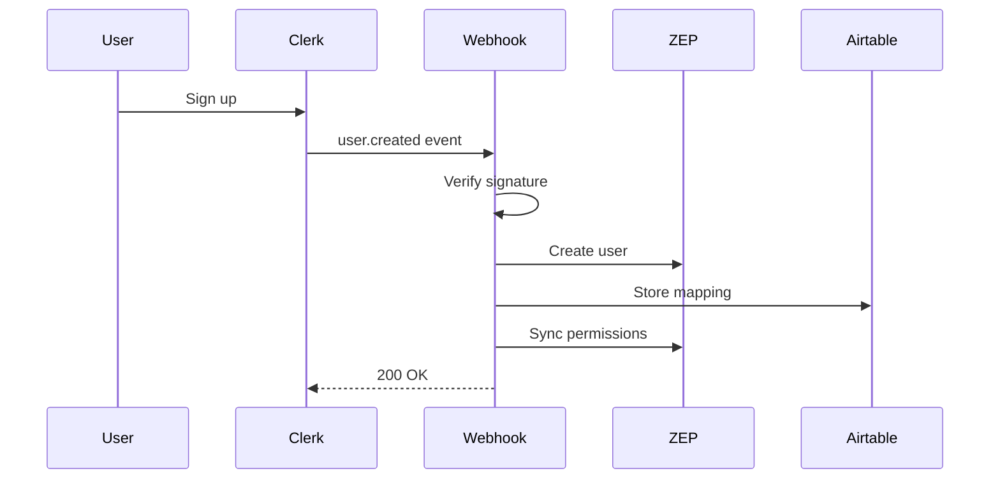

# Clerk-ZEP User Integration Documentation

## Overview

This document describes the integration between Clerk (authentication) and ZEP (graph database) for user management in the Krypton Graph system.

## Architecture

### Components

1. **Webhook Handler** (`app/api/clerk/webhooks/route.ts`)
   - Receives user lifecycle events from Clerk
   - Verifies webhook signatures using Svix
   - Processes events asynchronously

2. **User Mappings** (Airtable)
   - Stores mapping between Clerk and ZEP user IDs
   - Tracks sync status and timestamps
   - Maintains user roles and permissions

3. **Permission System** (`src/lib/auth/permission-sync.ts`)
   - Maps Clerk roles to ZEP permissions
   - Implements 5-minute cache for performance
   - Supports hierarchical permissions

## Setup Guide

### 1. Environment Variables

Add the following to your `.env.local`:

```bash
# Clerk Configuration
NEXT_PUBLIC_CLERK_PUBLISHABLE_KEY=pk_xxx
CLERK_SECRET_KEY=sk_xxx
CLERK_WEBHOOK_SECRET=whsec_xxx

# ZEP Configuration
ZEP_API_KEY=xxx
ZEP_API_URL=https://api.getzep.com

# Airtable Configuration
AIRTABLE_API_KEY=xxx
AIRTABLE_BASE_ID=xxx
```

### 2. Clerk Dashboard Configuration

1. Navigate to Clerk Dashboard → Webhooks
2. Create new webhook endpoint:
   - URL: `https://your-domain.com/api/clerk/webhooks`
   - Events to subscribe:
     - `user.created`
     - `user.updated`
     - `user.deleted`
     - `organizationMembership.created`
     - `organizationMembership.updated`
3. Copy the signing secret to `CLERK_WEBHOOK_SECRET`

### 3. Airtable Setup

Create a table named `UserMappings` with the following fields:

| Field | Type | Description |
|-------|------|-------------|
| clerk_user_id | Text (unique) | Clerk user identifier |
| zep_user_id | Text (unique) | ZEP user identifier |
| email | Email | User's email address |
| name | Text | User's display name |
| roles | Multi-select | User roles (admin, user, viewer) |
| status | Select | Account status (active, deleted, suspended) |
| last_synced_at | DateTime | Last successful sync timestamp |
| created_at | DateTime | Record creation time |
| updated_at | DateTime | Last update time |

### 4. SSO Configuration

#### Google OAuth
1. In Clerk Dashboard → SSO Connections
2. Enable Google OAuth
3. Configure redirect URLs:
   - `https://your-domain.com/sign-in`
   - `https://your-domain.com/sign-up`

#### Microsoft OAuth
1. In Clerk Dashboard → SSO Connections
2. Enable Microsoft OAuth
3. Configure redirect URLs (same as Google)

## User Lifecycle

### User Creation Flow



### Profile Update Flow

When a user updates their profile in Clerk:
1. Webhook receives `user.updated` event
2. Fetches existing mapping from Airtable
3. Updates ZEP user metadata
4. Updates Airtable mapping
5. Syncs permissions if roles changed

### Account Deletion Flow

When a user account is deleted:
1. Webhook receives `user.deleted` event
2. Archives user content (30-day retention)
3. Deletes ZEP user
4. Updates Airtable status to 'deleted'

## Permission Mapping

| Clerk Role | ZEP Permission | Access Level |
|------------|----------------|--------------|
| admin | admin | Full access |
| org:admin | admin | Full access |
| user | user | Read/write |
| org:member | user | Read/write |
| viewer | read_only | Read only |
| org:viewer | read_only | Read only |

## Troubleshooting

### Common Issues

#### 1. User Not Syncing

**Symptoms:** User exists in Clerk but not in ZEP

**Resolution:**
1. Check webhook logs in Clerk Dashboard
2. Verify webhook secret is correct
3. Use admin dashboard to trigger manual sync
4. Check Airtable for mapping record

#### 2. Permission Mismatch

**Symptoms:** User has wrong permissions in ZEP

**Resolution:**
1. Clear permission cache: Call `clearPermissionCache(userId)`
2. Trigger manual permission sync from admin dashboard
3. Verify role mapping in Clerk Dashboard

#### 3. Webhook Failures

**Symptoms:** Webhook events showing as failed in Clerk

**Resolution:**
1. Check application logs for errors
2. Verify all environment variables are set
3. Ensure webhook endpoint is accessible
4. Check rate limiting (if implemented)

### Manual Sync

Admin users can trigger manual sync via the dashboard:
1. Navigate to `/admin/user-sync`
2. Find the user in the table
3. Click "Sync" button

### Error Recovery

The system implements automatic error recovery:
- **Retry Logic:** 3 attempts with exponential backoff
- **Duplicate Handling:** Gracefully handles existing users
- **Failed Deletions:** Logged for manual cleanup
- **Queue System:** Failed operations queued for retry

## Monitoring

### Metrics Dashboard

Access the admin dashboard at `/admin/user-sync` to monitor:
- Total users and sync status
- Sync success rate
- Failed sync operations
- Last sync timestamps

### Key Metrics to Monitor

1. **Webhook Latency**
   - Target: < 500ms
   - Alert threshold: > 1000ms

2. **Sync Success Rate**
   - Target: > 99%
   - Alert threshold: < 95%

3. **Permission Cache Hit Rate**
   - Target: > 80%
   - Monitor for cache invalidation issues

### Logging

All sync operations are logged with:
- User identifiers (Clerk and ZEP)
- Operation type and status
- Error details for failures
- Timing information

## Security Considerations

1. **Webhook Verification**
   - All webhooks verified using Svix signatures
   - Reject unverified requests immediately

2. **Secret Management**
   - Store secrets in environment variables
   - Never log sensitive information
   - Rotate webhook secrets periodically

3. **Rate Limiting** (Recommended)
   - Implement rate limiting on webhook endpoint
   - Prevent webhook flooding attacks
   - Consider using middleware like express-rate-limit

4. **Data Privacy**
   - Archive deleted user data for 30 days
   - Implement data export for GDPR compliance
   - Log PII access for audit trails

## API Reference

### Webhook Endpoint

`POST /api/clerk/webhooks`

Receives and processes Clerk webhook events.

**Headers Required:**
- `svix-id`: Webhook event ID
- `svix-timestamp`: Event timestamp
- `svix-signature`: HMAC signature

### SSO Sync Endpoint

`POST /api/auth/sso-sync`

Synchronizes SSO user with ZEP.

**Request Body:**
```json
{
  "organizationId": "org_123"
}
```

**Response:**
```json
{
  "success": true,
  "firstTimeLogin": false,
  "userId": "zep_user_123"
}
```

### Admin Endpoints

#### Get User Mappings
`GET /api/admin/user-mappings`

Returns all user mappings (admin only).

#### Get Sync Metrics
`GET /api/admin/sync-metrics`

Returns synchronization metrics.

#### Manual Sync
`POST /api/admin/manual-sync`

Manually sync a specific user.

**Request Body:**
```json
{
  "userId": "clerk_user_123"
}
```

## Testing

### Unit Tests

Run webhook handler tests:
```bash
npm test app/api/clerk/webhooks/__tests__/route.test.ts
```

### Integration Testing

1. Create test user in Clerk
2. Verify ZEP user creation
3. Update user profile
4. Verify sync in Airtable
5. Delete user
6. Verify cascade deletion

### Load Testing

Test webhook endpoint under load:
```bash
# Example using artillery
artillery quick --count 100 --num 10 \
  -p '{"type":"user.created","data":{}}' \
  https://your-domain.com/api/clerk/webhooks
```

## Maintenance

### Regular Tasks

1. **Weekly**
   - Review failed sync logs
   - Check sync success rate
   - Clear stale permission cache

2. **Monthly**
   - Audit user mappings
   - Clean up deleted user archives
   - Review webhook performance

3. **Quarterly**
   - Rotate webhook secrets
   - Update permission mappings
   - Security audit of endpoints