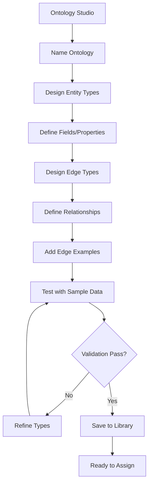
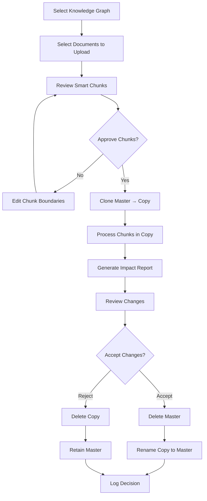
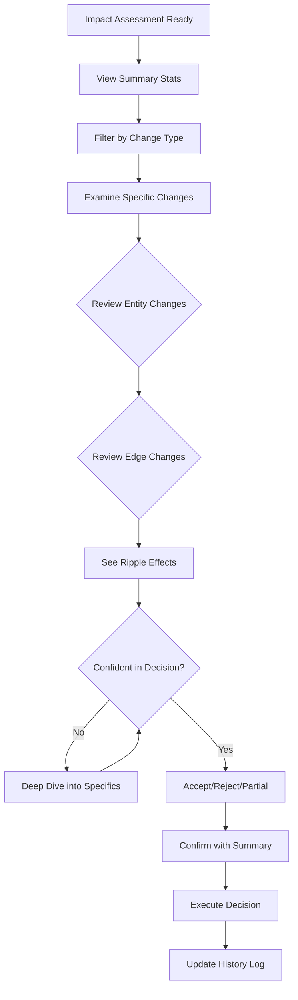

# Krypton Graph UI/UX Specification

## Introduction

This document defines the user experience goals, information architecture, user flows, and visual design specifications for Krypton Graph's user interface. It serves as the foundation for visual design and frontend development, ensuring a cohesive and user-centered experience.

### Overall UX Goals & Principles

#### Target User Personas

**Admin User**
- Deep technical system knowledge
- Responsible for system setup, authentication, and API key management
- Monitors system health and manages user access
- Primary goals: System stability, security, and user enablement

**Advanced User**
- Understands ontologies and their role in knowledge graph structure
- Creates and manages custom entity and edge types
- Designs reusable ontology templates for different domains
- Primary goals: Build robust, flexible knowledge structures

**Standard User**
- Understands document categorization and appropriate knowledge graph selection
- Validates entity and edge extraction from imported documents
- Reviews impact assessments and makes accept/reject decisions
- Primary goals: Accurate data import and quality control

#### Usability Goals

- **Ease of learning:** New users can import and verify their first document within 10 minutes
- **Efficiency of use:** Advanced users can create complete ontologies with minimal friction
- **Error prevention:** Clone-before-modify pattern ensures zero data loss risk
- **Transparency:** Every change is stored, tracked, reported, and reversible (roll-back with clone image or re-play past transactions to rebuild graph)
- **Confidence building:** Impact assessments provide clear visibility before committing changes

#### Design Principles

1. **Progressive Disclosure** - Show complexity only when needed, basic users see simple interfaces
2. **Visual Clarity** - Make processes immediately understandable and the relationship between source/example text the ontology rules/filters and the resulting entities/edges immediately understandable
3. **Safety First** - All destructive actions require confirmation and provide rollback options
4. **Consistent Patterns** - Similar operations use similar UI patterns across all modules
5. **Data Transparency** - Users always know what data exists, what changed, and why

### Change Log

| Date | Version | Description | Author |
|------|---------|-------------|---------|
| 2025-01-03 | 1.0 | Initial specification created | UX Expert |

## User Journey Maps

### Admin User Journey - System Setup & Maintenance

**Goal:** Configure and maintain the Krypton Graph system for organizational use

**Journey Stages:**
```
INITIAL SETUP → CONFIGURATION → MONITORING → MAINTENANCE
      ↓             ↓              ↓            ↓
[First Access] [API Setup]   [User Mgmt]  [System Health]
```

**Key Touchpoints:**
1. Login → Admin Dashboard
2. Environment Variables Setup (ZEP, OpenAI, Database)
3. API Key Management with secure storage
4. User Role Assignment and permissions
5. System Monitoring Dashboard with real-time metrics
6. Troubleshooting tools and support access

**Emotional Journey:** 😰 Overwhelmed → 😤 Focused → 😌 Confident → 😊 Satisfied

### Advanced User Journey - Ontology Design & Graph Creation

**Goal:** Design ontologies and create knowledge graphs for different data domains

**Journey Stages:**
```
LEARN → DESIGN → CREATE → TEST → DEPLOY → MANAGE
   ↓       ↓        ↓       ↓       ↓        ↓
[Explore] [Define] [Build] [Validate] [Use] [Evolve]
```

**Key Touchpoints:**
1. Ontology Designer Interface with visual builder
2. Entity Type Builder (Pydantic wrapper UI)
3. Edge Type Builder with relationship examples
4. Grouping & Naming Ontologies for reusability
5. Knowledge Graph Creation with ontology assignment
6. Clone/Test/Delete Operations
7. Ontology Version Management and evolution

**Emotional Journey:** 🤔 Curious → 💡 Inspired → 🔨 Building → ✅ Validated → 😎 Expert

### Standard User Journey - Document Import & Verification

**Goal:** Import documents and verify correct entity/edge extraction

**Journey Stages:**
```
PREPARE → IMPORT → PROCESS → REVIEW → DECIDE → TRACK
    ↓        ↓         ↓        ↓        ↓       ↓
[Select KG] [Upload] [Chunk] [Assess] [Accept] [History]
```

**Key Touchpoints:**
1. Selection interface of active Knowledge Graphs as target for USER's document upload 
2. Selection interface of file(s) to upload. File(s) processed into mark down format using Docling. Markdown stored in krypton-graph's relational DB.
3. Review chunks of mark down that an LLM created and enriched with meta data, these 'smart chunks' provide an option for review and course correction by the USER before step 4.  
4. Impact Assessment Report generation created after SYSTEM clones KG before  importing all approved smart chunks. SYSTEM compares the differences between the two KGs. The impact report UI lists all changes to entity/edges in the KG. The USER can Accept/Reject the new KG.
5. History & Audit Trail lists all previous Accept/Reject decisions with links to past Impact Assessment Report. 

**Emotional Journey:** 📄 Ready → ⏳ Waiting → 🔍 Analyzing → 🤓 Evaluating → ✅ Decided → 📊 Informed

### Critical User Flows

#### Ontology Creation Flow (Advanced User)
```
Dashboard → Ontology Manager → Create New →
Define Entities → Define Edges → Add Examples →
Group Types → Save as Named Ontology → Test
```

#### Document Import Flow (Standard User)
```
Select KG → Import Document → Docling Processes →
Review Markdown → Approve Chunks → 
Master Cloned → Process Chunks → 
Review Impact → Accept/Reject → Update History
```

#### Impact Assessment Review Flow
```
View Report → Compare Master vs Copy →
Review Added Entities/Edges → 
Review Impacted Relationships →
Make Decision → Execute (Keep/Reject) →
Log Decision
```

### Cross-Journey Touchpoints

1. **Knowledge Graph Dashboard** - Central hub showing all active graphs with statistics
2. **Ontology Library** - Reusable ontology templates and versions
3. **Processing Queue** - Real-time status of document imports and chunking operations
4. **History & Audit** - Complete trail of all changes, decisions, and system events
5. **Help & Documentation** - Context-sensitive guidance and tooltips

## Information Architecture (IA)

### Site Map / Screen Inventory

```mermaid
graph TD
    A[Krypton Graph] --> B[Dashboard]
    A --> C[Active Graph]
    A --> D[Ontology Studio]
    A --> E[Impact Center]
    A --> F[System]
    
    B --> B1[Graph Selector]
    B --> B2[Activity Feed]
    B --> B3[Quick Actions]
    B --> B4[Processing Queue]
    
    C --> C1[Overview]
    C --> C2[Import & Process]
    C --> C3[Ontology]
    C --> C4[Graph Settings]
    
    C2 --> C2a[Import Documents]
    C2 --> C2b[Review Chunks]
    C2 --> C2c[Impact Assessment]
    
    C3 --> C3a[Entities]
    C3 --> C3b[Edges]
    
    D --> D1[Quick Access Toolbar]
    D --> D2[Design Center]
    D --> D3[Library]
    D --> D4[Test Workspace]
    
    D2 --> D2a[Entity Designer]
    D2 --> D2b[Edge Designer]
    D2 --> D2c[Ontology Builder]
    
    E --> E1[Active Assessments]
    E --> E2[Review & Decide]
    E --> E3[History]
    
    F --> F1[Reports & Analytics]
    F --> F2[Admin Settings]
    F --> F3[User Management]
    
    F2 --> F2a[Environment Variables]
    F2 --> F2b[API Keys]
    F2 --> F2c[Database Config]
```



### Navigation Structure

**Primary Navigation (shadcn/ui NavigationMenu):** 
- Horizontal top bar using `NavigationMenu` component with Graph Selector dropdown
- Main sections: Dashboard | Active Graph | Ontology Studio | Impact Center | System
- Implement with `NavigationMenuTrigger` and `NavigationMenuContent` for dropdowns
- Role-based visibility using conditional rendering based on user context

**Secondary Navigation (shadcn/ui Sidebar):**
- Use `Sidebar` component with `SidebarProvider` for state management
- `SidebarContent` with `SidebarGroup` for organized sections
- `CollapsibleTrigger` for expandable menu items
- Implement `useSidebar` hook for programmatic control

**Breadcrumb Strategy (shadcn/ui Breadcrumb):**
- Use `Breadcrumb` with `BreadcrumbList`, `BreadcrumbItem`, and `BreadcrumbSeparator`
- Include `BreadcrumbPage` for current location
- Graph context using `BreadcrumbEllipsis` for long paths
- Example: "Krypton Graph > [Graph: Legal Contracts] > Import & Process > Review Chunks"

## User Flows

### Flow 1: Ontology Creation (Advanced User)

**User Goal:** Create a reusable ontology for legal document processing

**Entry Points:** 
- Dashboard > Quick Actions > "Create Ontology"
- Ontology Studio > Design Center

**Success Criteria:** 
- Ontology saved with custom entity and edge types
- Ontology tested and validated
- Ready for assignment to knowledge graphs

#### Flow Diagram



**Edge Cases & Error Handling:**
- Duplicate ontology names → Show error, suggest alternatives
- Invalid Pydantic type definitions → Real-time validation with helpful error messages
- Test failures → Detailed error report with specific issues highlighted

**Notes:** Advanced users need powerful tools but with guardrails to prevent invalid configurations

### Flow 2: Document Import with Impact Assessment (Standard User)

**User Goal:** Import financial documents into the accounting knowledge graph

**Entry Points:**
- Active Graph > Import & Process > Import Documents
- Dashboard > Quick Actions > "Import to Current Graph"

**Success Criteria:**
- Document successfully converted to markdown
- Smart chunks reviewed and approved
- Impact assessed and changes accepted/rejected

#### Flow Diagram



**Edge Cases & Error Handling:**
- Unsupported file format → Show supported formats, offer conversion help
- Docling conversion failure → Retry with different settings, manual markdown option
- LLM chunking timeout → Show progress, allow manual chunking
- Massive impact (>1000 changes) → Pagination, filtering, summary view
- Connection loss during processing → Auto-save state, resume capability

**Notes:** The clone-compare pattern ensures zero data loss risk, building user confidence

### Flow 3: Impact Assessment Review and Decision

**User Goal:** Understand and decide on proposed knowledge graph changes

**Entry Points:**
- Impact Center > Active Assessments
- Notification > "New Impact Assessment Ready"

**Success Criteria:**
- User understands all proposed changes
- Confident decision made
- Changes tracked in history

#### Flow Diagram



**Edge Cases & Error Handling:**
- Conflicting changes → Highlight conflicts, provide resolution options
- Partial acceptance needed → Cherry-pick interface for selective changes
- Timeout on large assessments → Extend session, background processing
- Multiple pending assessments → Queue management, priority settings

**Notes:** Visual comparison tools are critical for user confidence in decision-making

## Wireframes & Mockups

**Primary Design Files:** [To be created in Figma/Sketch - Link TBD]

### Key Screen Layouts

#### Dashboard Screen

**Purpose:** Central hub for all users to see system status and navigate to key functions

**Key shadcn/ui Components:**
- **Graph selector:** `Select` component with `SelectTrigger`, `SelectContent`, `SelectItem`
- **Active graphs grid:** `Card` components in responsive grid with `CardHeader`, `CardContent`
- **Statistics:** Custom cards using `Card` with embedded `Chart` components (Recharts)
- **Processing queue:** `ScrollArea` with `Table` for queue items
- **Activity feed:** `ScrollArea` containing `Alert` components for activities
- **Quick actions:** `Card` with `Button` components using variant="outline" or "default"
- **System health:** `Progress` bars and `Badge` components for status indicators
- **Layout:** `SidebarProvider` with `AppSidebar` and `SidebarInset` (dashboard-01 pattern)

**Interaction Implementation:** 
- Graph cards using `onClick` handlers with router navigation
- Drag-and-drop via `@dnd-kit/sortable` with `Card` components
- Real-time updates using `useEffect` with WebSocket and `Skeleton` loading states

**Design File Reference:** Dashboard_Main_v1

#### Ontology Designer Screen

**Purpose:** Advanced users create and modify entity/edge type definitions

**Key shadcn/ui Components:**
- **Left panel:** 
  - `Card` with `ScrollArea` for entity/edge list
  - `Input` with search icon for filtering
  - `Accordion` for grouped type categories
- **Center canvas:** 
  - Custom canvas component with `Card` wrapper
  - `Form` with `FormField`, `FormItem`, `FormLabel` for field builder
  - `Select` dropdowns for Pydantic types
- **Right panel:** 
  - `Tabs` with `TabsList`, `TabsTrigger`, `TabsContent`
  - `Label` and `Input` for properties
  - `Alert` for validation messages
- **Bottom panel:** 
  - `Textarea` for example data
  - `Button` with loading states for testing
- **Top toolbar:** 
  - `Button` group with variants
  - `DropdownMenu` for export options
  - `Badge` for version display

**Interaction Implementation:**
- Drag-drop using `@dnd-kit/core` with visual feedback
- Real-time validation using `react-hook-form` with `zod`
- `Collapsible` components for panel management
- `CommandDialog` (Cmd+K) for power user actions

**Design File Reference:** Ontology_Designer_v1

#### Document Import Screen

**Purpose:** Upload and process documents through the Docling conversion pipeline

**Key shadcn/ui Components:**
- **Drop zone:** 
  - Custom dropzone with `Card` and dashed border styling
  - `Button` variant="outline" for browse option
  - `Badge` components for file type indicators
- **File list:**
  - `Table` with `TableHeader`, `TableBody`, `TableRow`
  - `Badge` for compatibility status
  - `Button` size="icon" for individual file actions
- **Progress tracker:**
  - `Progress` component for overall progress
  - Custom stepper using `Badge` and `Separator`
- **Preview panels:**
  - `Tabs` for switching between views
  - `ScrollArea` for markdown content
  - `Card` with syntax highlighting (Prism.js)
- **Chunk editor:**
  - `Resizable` panels from `react-resizable-panels`
  - `Slider` for boundary adjustment
  - `Badge` for chunk metadata
- **Metadata:**
  - `Form` with `Input` and `Textarea` fields
  - `Select` for document categories

**Interaction Implementation:**
- Drag-and-drop using native HTML5 APIs with visual feedback
- `ResizablePanel` and `ResizableHandle` for split views
- `Textarea` with controlled input for inline editing
- `Checkbox` for batch selection with `DataTable` pattern

**Design File Reference:** Document_Import_v1

#### Impact Assessment Screen

**Purpose:** Review and decide on proposed knowledge graph changes

**Key shadcn/ui Components:**
- **Split-screen visualization:**
  - `ResizablePanel` with `ResizableHandle` for adjustable split
  - Custom graph components wrapped in `Card`
  - `Toggle` for sync scroll option
- **Statistics header:**
  - `Card` with `CardHeader` and `CardContent`
  - `Badge` components for change counts
  - `Progress` for review completion
- **Change list:**
  - `Tabs` for filter views (Added/Modified/Removed)
  - `DataTable` with sortable columns
  - `Badge` variant colors for change types
- **Detail inspector:**
  - `Sheet` component sliding from right
  - `ScrollArea` for long content
  - `Tabs` for different detail views
- **Ripple visualization:**
  - Custom D3.js component in `Card`
  - `Tooltip` for relationship details
- **Decision toolbar:**
  - `Button` group with destructive/success variants
  - `AlertDialog` for confirmation
  - `Checkbox` for selective items

**Interaction Implementation:**
- `useSyncedScroll` custom hook for synchronized views
- `HoverCard` for entity preview on hover
- `onClick` handlers with state management
- `Command` palette for bulk operations (Cmd+Shift+A)

**Design File Reference:** Impact_Assessment_v1

#### Knowledge Graph Viewer

**Purpose:** Explore and navigate the knowledge graph structure

**Key shadcn/ui Components:**
- **Graph canvas:**
  - Custom D3.js/Canvas component in fullscreen `Card`
  - `ResizablePanel` for adjustable layout
- **Legend & Filters:**
  - `Popover` with `PopoverTrigger` and `PopoverContent`
  - `Checkbox` group for node type filters
  - `Badge` with color coding for types
- **Search:**
  - `Command` component with `CommandInput`
  - `CommandList` with `CommandItem` for suggestions
  - `CommandEmpty` state handling
- **Detail panel:**
  - `Sheet` or `Card` in sidebar
  - `Tabs` for entity properties, relationships, history
  - `ScrollArea` for long content
- **Zoom controls:**
  - `Button` group with icon variants
  - `Slider` for zoom level
  - Minimap in `Card` with fixed positioning
- **Export toolbar:**
  - `DropdownMenu` for export formats
  - `Button` with `Download` icon
  - `Dialog` for share settings

**Interaction Implementation:**
- Pan/zoom using D3.js zoom behavior
- `ContextMenu` with `ContextMenuTrigger` for right-click
- Keyboard navigation with `useKeyboard` custom hook
- `Tooltip` for node details on hover

**Design File Reference:** Graph_Viewer_v1

## Component Library / Design System

### Design System Foundation

**Architecture:** Modern, composable component system built on shadcn/ui v4 principles with Radix UI primitives for accessibility and Tailwind CSS for styling. This approach provides maximum flexibility while maintaining consistency and performance.

**Core Technologies:**
- **shadcn/ui v4:** Copy-paste component library providing full control over implementation
- **Radix UI:** Unstyled, accessible component primitives
- **Tailwind CSS:** Utility-first CSS framework with custom design tokens
- **CVA (Class Variance Authority):** Type-safe variant management
- **React Hook Form + Zod:** Form validation and type safety
- **Recharts/Tremor:** Data visualization for graphs and metrics
- **Framer Motion:** Production-ready animation library
- **Tanstack Table:** Powerful data table with virtualization support

### Component Architecture Principles

**1. Composition Over Configuration**
```typescript
// Compose complex components from primitives
<Card>
  <CardHeader>
    <CardTitle>Knowledge Graph Status</CardTitle>
    <CardDescription>Real-time graph metrics</CardDescription>
  </CardHeader>
  <CardContent>
    <GraphVisualization />
  </CardContent>
  <CardFooter>
    <Button variant="outline">View Details</Button>
  </CardFooter>
</Card>
```

**2. Variant-Based Styling with CVA**
```typescript
const buttonVariants = cva(
  "inline-flex items-center justify-center rounded-md text-sm font-medium transition-colors focus-visible:outline-none focus-visible:ring-2 disabled:pointer-events-none disabled:opacity-50",
  {
    variants: {
      variant: {
        default: "bg-primary text-primary-foreground hover:bg-primary/90",
        destructive: "bg-destructive text-destructive-foreground hover:bg-destructive/90",
        outline: "border border-input bg-background hover:bg-accent",
        secondary: "bg-secondary text-secondary-foreground hover:bg-secondary/80",
        ghost: "hover:bg-accent hover:text-accent-foreground",
        link: "text-primary underline-offset-4 hover:underline",
        // Custom variants for Krypton Graph
        impact: "bg-warning text-warning-foreground hover:bg-warning/90",
        success: "bg-success text-success-foreground hover:bg-success/90",
      },
      size: {
        default: "h-10 px-4 py-2",
        sm: "h-9 rounded-md px-3",
        lg: "h-11 rounded-md px-8",
        icon: "h-10 w-10",
      },
    },
    defaultVariants: {
      variant: "default",
      size: "default",
    },
  }
)
```

**3. Controlled and Uncontrolled Component Support**
```typescript
// Support both patterns for maximum flexibility
interface ComponentProps {
  value?: string;
  defaultValue?: string;
  onValueChange?: (value: string) => void;
}
```

### Core shadcn/ui Components

**Foundation Components (46 total):**

#### Navigation & Layout
- **Sidebar** (`sidebar`): Multi-level collapsible navigation with role-based item visibility
- **Navigation Menu** (`navigation-menu`): Top-bar navigation with mega-menu support
- **Breadcrumb** (`breadcrumb`): Contextual navigation with graph name integration
- **Tabs** (`tabs`): Content organization for complex interfaces
- **Sheet** (`sheet`): Slide-out panels for secondary content

#### Form & Input
- **Form** (`form`): React Hook Form integration with Zod validation
- **Input** (`input`): Text input with error states and descriptions
- **Select** (`select`): Searchable dropdowns with async data loading
- **Command** (`command`): Command palette for power users (Cmd+K)
- **Textarea** (`textarea`): Multi-line input for descriptions
- **Switch** (`switch`): Toggle for boolean settings
- **Checkbox** (`checkbox`): Multi-selection controls
- **Radio Group** (`radio-group`): Single selection from options

#### Feedback & Overlay
- **Alert Dialog** (`alert-dialog`): Confirmation dialogs for destructive actions
- **Dialog** (`dialog`): Modal windows for focused tasks
- **Toast** (`sonner`): Non-blocking notifications with actions
- **Alert** (`alert`): Inline alerts for important messages
- **Tooltip** (`tooltip`): Contextual help on hover
- **Popover** (`popover`): Rich content overlays
- **Hover Card** (`hover-card`): Preview cards for entities

#### Data Display
- **Table** (`table`): Sortable, filterable data tables
- **Card** (`card`): Content containers with consistent spacing
- **Badge** (`badge`): Status indicators and counts
- **Avatar** (`avatar`): User profile images with fallbacks
- **Progress** (`progress`): Loading and progress indicators
- **Skeleton** (`skeleton`): Loading placeholders
- **Separator** (`separator`): Visual content dividers

### Custom Krypton Graph Components

Building on shadcn/ui primitives, these specialized components address domain-specific needs:

#### 1. Graph Visualization Suite

**KnowledgeGraphViewer**
```typescript
interface KnowledgeGraphViewerProps {
  graphId: string;
  mode: 'view' | 'edit' | 'compare';
  layout?: 'force' | 'hierarchical' | 'radial';
  filters?: EntityFilter[];
  onNodeClick?: (node: GraphNode) => void;
  onEdgeClick?: (edge: GraphEdge) => void;
}

// Built with:
// - D3.js force simulation for layout
// - Canvas/WebGL rendering for performance
// - React.memo for optimization
// - ResizeObserver for responsive sizing
```

**Implementation Pattern:**
```tsx
<Card className="h-[600px]">
  <CardHeader className="flex flex-row items-center justify-between">
    <div>
      <CardTitle>Knowledge Graph</CardTitle>
      <CardDescription>{nodeCount} entities, {edgeCount} relationships</CardDescription>
    </div>
    <div className="flex gap-2">
      <Toggle pressed={showLabels} onPressedChange={setShowLabels}>
        <Label className="h-4 w-4" />
      </Toggle>
      <DropdownMenu>
        <DropdownMenuTrigger asChild>
          <Button variant="outline" size="icon">
            <Settings className="h-4 w-4" />
          </Button>
        </DropdownMenuTrigger>
        <DropdownMenuContent>
          <DropdownMenuLabel>Layout</DropdownMenuLabel>
          <DropdownMenuRadioGroup value={layout} onValueChange={setLayout}>
            <DropdownMenuRadioItem value="force">Force Directed</DropdownMenuRadioItem>
            <DropdownMenuRadioItem value="hierarchical">Hierarchical</DropdownMenuRadioItem>
            <DropdownMenuRadioItem value="radial">Radial</DropdownMenuRadioItem>
          </DropdownMenuRadioGroup>
        </DropdownMenuContent>
      </DropdownMenu>
    </div>
  </CardHeader>
  <CardContent className="p-0">
    <GraphCanvas ref={canvasRef} />
  </CardContent>
</Card>
```

#### 2. Ontology Designer Components

**EntityTypeBuilder**
```typescript
// Combines multiple shadcn components for complex form building
const EntityTypeBuilder = () => {
  return (
    <Form {...form}>
      <div className="space-y-6">
        <FormField
          control={form.control}
          name="name"
          render={({ field }) => (
            <FormItem>
              <FormLabel>Entity Type Name</FormLabel>
              <FormControl>
                <Input placeholder="Person, Organization, Document..." {...field} />
              </FormControl>
              <FormDescription>
                A descriptive name for this entity type
              </FormDescription>
              <FormMessage />
            </FormItem>
          )}
        />
        
        <div className="space-y-4">
          <Label>Properties</Label>
          <DynamicFieldList
            fields={fields}
            onAdd={handleAddField}
            onRemove={handleRemoveField}
            onUpdate={handleUpdateField}
          />
        </div>
        
        <Collapsible>
          <CollapsibleTrigger asChild>
            <Button variant="ghost" className="w-full justify-between">
              Advanced Settings
              <ChevronDown className="h-4 w-4" />
            </Button>
          </CollapsibleTrigger>
          <CollapsibleContent>
            <PydanticConfigEditor />
          </CollapsibleContent>
        </Collapsible>
      </div>
    </Form>
  );
};
```

#### 3. Smart Chunk Editor

**Implementation using shadcn/ui patterns:**
```tsx
const SmartChunkEditor = ({ chunks, onUpdate }: SmartChunkEditorProps) => {
  return (
    <div className="space-y-4">
      <ScrollArea className="h-[600px] w-full rounded-md border">
        <div className="p-4 space-y-4">
          {chunks.map((chunk, index) => (
            <Card key={chunk.id} className="relative">
              <CardHeader className="pb-3">
                <div className="flex items-center justify-between">
                  <Badge variant={chunk.approved ? "success" : "secondary"}>
                    Chunk {index + 1}
                  </Badge>
                  <div className="flex gap-2">
                    <TooltipProvider>
                      <Tooltip>
                        <TooltipTrigger asChild>
                          <Button
                            variant="ghost"
                            size="icon"
                            onClick={() => handleSplit(chunk.id)}
                          >
                            <Split className="h-4 w-4" />
                          </Button>
                        </TooltipTrigger>
                        <TooltipContent>Split chunk</TooltipContent>
                      </Tooltip>
                    </TooltipProvider>
                    
                    <TooltipProvider>
                      <Tooltip>
                        <TooltipTrigger asChild>
                          <Button
                            variant="ghost"
                            size="icon"
                            onClick={() => handleMerge(chunk.id)}
                          >
                            <Merge className="h-4 w-4" />
                          </Button>
                        </TooltipTrigger>
                        <TooltipContent>Merge with next</TooltipContent>
                      </Tooltip>
                    </TooltipProvider>
                  </div>
                </div>
              </CardHeader>
              
              <CardContent>
                <Textarea
                  value={chunk.content}
                  onChange={(e) => updateChunk(chunk.id, e.target.value)}
                  className="min-h-[100px] font-mono text-sm"
                />
                
                <div className="mt-4 flex gap-2">
                  <Badge variant="outline">
                    {chunk.tokenCount} tokens
                  </Badge>
                  <Badge variant="outline">
                    {chunk.startLine}-{chunk.endLine}
                  </Badge>
                </div>
              </CardContent>
              
              <ResizableHandle className="absolute bottom-0" />
            </Card>
          ))}
        </div>
      </ScrollArea>
    </div>
  );
};
```

#### 4. Impact Assessment Dashboard

**Comprehensive impact review using shadcn/ui blocks:**
```tsx
const ImpactAssessmentDashboard = () => {
  return (
    <div className="grid gap-4 md:grid-cols-7">
      {/* Summary Cards */}
      <Card className="col-span-7 lg:col-span-2">
        <CardHeader>
          <CardTitle>Impact Summary</CardTitle>
        </CardHeader>
        <CardContent className="space-y-4">
          <div className="space-y-2">
            <div className="flex items-center justify-between">
              <span className="text-sm text-muted-foreground">Total Changes</span>
              <Badge variant="outline">{totalChanges}</Badge>
            </div>
            <Progress value={percentageReviewed} className="h-2" />
          </div>
          
          <Separator />
          
          <div className="space-y-2">
            <ImpactMetric
              label="Entities Added"
              value={entitiesAdded}
              variant="success"
              icon={<Plus className="h-4 w-4" />}
            />
            <ImpactMetric
              label="Entities Modified"
              value={entitiesModified}
              variant="warning"
              icon={<Edit className="h-4 w-4" />}
            />
            <ImpactMetric
              label="Entities Removed"
              value={entitiesRemoved}
              variant="destructive"
              icon={<Trash className="h-4 w-4" />}
            />
          </div>
        </CardContent>
      </Card>
      
      {/* Comparison View */}
      <Card className="col-span-7 lg:col-span-5">
        <CardHeader>
          <CardTitle>Graph Comparison</CardTitle>
          <CardDescription>
            Visual diff between master and proposed changes
          </CardDescription>
        </CardHeader>
        <CardContent>
          <Tabs defaultValue="split">
            <TabsList className="grid w-full grid-cols-3">
              <TabsTrigger value="split">Split View</TabsTrigger>
              <TabsTrigger value="overlay">Overlay</TabsTrigger>
              <TabsTrigger value="changes">Changes Only</TabsTrigger>
            </TabsList>
            <TabsContent value="split" className="space-y-4">
              <div className="grid grid-cols-2 gap-4">
                <GraphViewer
                  title="Current Master"
                  graph={masterGraph}
                  highlights={[]}
                />
                <GraphViewer
                  title="With Changes"
                  graph={proposedGraph}
                  highlights={changes}
                />
              </div>
            </TabsContent>
          </Tabs>
        </CardContent>
      </Card>
    </div>
  );
};
```

#### 5. Advanced Data Table with Virtual Scrolling

**Using Tanstack Table with shadcn/ui styling:**
```tsx
const DataTableAdvanced = <T,>({
  data,
  columns,
  enableVirtualization = true,
  enableFiltering = true,
  enableSorting = true,
}: DataTableProps<T>) => {
  const table = useReactTable({
    data,
    columns,
    getCoreRowModel: getCoreRowModel(),
    getFilteredRowModel: getFilteredRowModel(),
    getSortedRowModel: getSortedRowModel(),
    getPaginationRowModel: getPaginationRowModel(),
  });

  return (
    <div className="w-full space-y-4">
      {enableFiltering && (
        <div className="flex items-center gap-2">
          <Input
            placeholder="Filter..."
            value={globalFilter ?? ''}
            onChange={(e) => setGlobalFilter(e.target.value)}
            className="max-w-sm"
          />
          <DropdownMenu>
            <DropdownMenuTrigger asChild>
              <Button variant="outline" className="ml-auto">
                Columns <ChevronDown className="ml-2 h-4 w-4" />
              </Button>
            </DropdownMenuTrigger>
            <DropdownMenuContent align="end">
              {table.getAllColumns()
                .filter((column) => column.getCanHide())
                .map((column) => (
                  <DropdownMenuCheckboxItem
                    key={column.id}
                    checked={column.getIsVisible()}
                    onCheckedChange={(value) => column.toggleVisibility(!!value)}
                  >
                    {column.id}
                  </DropdownMenuCheckboxItem>
                ))}
            </DropdownMenuContent>
          </DropdownMenu>
        </div>
      )}
      
      <div className="rounded-md border">
        <Table>
          <TableHeader>
            {table.getHeaderGroups().map((headerGroup) => (
              <TableRow key={headerGroup.id}>
                {headerGroup.headers.map((header) => (
                  <TableHead key={header.id}>
                    {header.isPlaceholder ? null : (
                      <div className="flex items-center space-x-2">
                        {flexRender(
                          header.column.columnDef.header,
                          header.getContext()
                        )}
                        {enableSorting && header.column.getCanSort() && (
                          <Button
                            variant="ghost"
                            size="sm"
                            onClick={() => header.column.toggleSorting()}
                          >
                            <ArrowUpDown className="h-4 w-4" />
                          </Button>
                        )}
                      </div>
                    )}
                  </TableHead>
                ))}
              </TableRow>
            ))}
          </TableHeader>
          <TableBody>
            {enableVirtualization ? (
              <VirtualizedRows table={table} />
            ) : (
              <StandardRows table={table} />
            )}
          </TableBody>
        </Table>
      </div>
      
      <DataTablePagination table={table} />
    </div>
  );
};
```

### Design Tokens & Theming

**CSS Variables for Theming:**
```css
@layer base {
  :root {
    /* Core Colors - HSL for easy manipulation */
    --background: 0 0% 100%;
    --foreground: 222.2 84% 4.9%;
    
    --primary: 221.2 83.2% 53.3%;
    --primary-foreground: 210 40% 98%;
    
    --secondary: 210 40% 96.1%;
    --secondary-foreground: 222.2 47.4% 11.2%;
    
    --muted: 210 40% 96.1%;
    --muted-foreground: 215.4 16.3% 46.9%;
    
    --accent: 210 40% 96.1%;
    --accent-foreground: 222.2 47.4% 11.2%;
    
    /* Semantic Colors for Krypton Graph */
    --success: 142 76% 36%;
    --success-foreground: 355.7 100% 97.3%;
    
    --warning: 45 93% 47%;
    --warning-foreground: 26 83.3% 14.1%;
    
    --destructive: 0 84.2% 60.2%;
    --destructive-foreground: 0 0% 98%;
    
    --info: 199 89% 48%;
    --info-foreground: 199 5% 98%;
    
    /* Graph Visualization Colors */
    --graph-node-default: 217 91% 60%;
    --graph-node-selected: 142 76% 36%;
    --graph-node-hover: 221 83% 53%;
    --graph-edge-default: 215 20.2% 65.1%;
    --graph-edge-selected: 217 91% 60%;
    
    /* Component Specific */
    --border: 214.3 31.8% 91.4%;
    --input: 214.3 31.8% 91.4%;
    --ring: 221.2 83.2% 53.3%;
    
    --radius: 0.5rem;
    
    /* Shadows */
    --shadow-sm: 0 1px 2px 0 rgb(0 0 0 / 0.05);
    --shadow: 0 1px 3px 0 rgb(0 0 0 / 0.1);
    --shadow-md: 0 4px 6px -1px rgb(0 0 0 / 0.1);
    --shadow-lg: 0 10px 15px -3px rgb(0 0 0 / 0.1);
    --shadow-xl: 0 20px 25px -5px rgb(0 0 0 / 0.1);
  }
  
  .dark {
    /* Dark mode overrides */
    --background: 222.2 84% 4.9%;
    --foreground: 210 40% 98%;
    
    --primary: 217.2 91.2% 59.8%;
    --primary-foreground: 222.2 47.4% 11.2%;
    
    /* Graph colors adjusted for dark mode */
    --graph-node-default: 217 91% 70%;
    --graph-edge-default: 215 20.2% 45.1%;
  }
}
```

### Animation System

**Framer Motion Integration:**
```tsx
// Consistent animation variants
const animationVariants = {
  // Page transitions
  pageEnter: {
    initial: { opacity: 0, y: 20 },
    animate: { opacity: 1, y: 0 },
    exit: { opacity: 0, y: -20 },
    transition: { duration: 0.2, ease: "easeOut" }
  },
  
  // List animations
  listContainer: {
    hidden: { opacity: 0 },
    show: {
      opacity: 1,
      transition: {
        staggerChildren: 0.05
      }
    }
  },
  
  listItem: {
    hidden: { opacity: 0, x: -20 },
    show: { opacity: 1, x: 0 }
  },
  
  // Graph node animations
  nodeHover: {
    scale: 1.1,
    transition: { duration: 0.15, ease: "easeOut" }
  },
  
  // Success feedback
  successPulse: {
    scale: [1, 1.05, 1],
    transition: { duration: 0.3 }
  }
};

// Usage in components
<motion.div
  variants={animationVariants.pageEnter}
  initial="initial"
  animate="animate"
  exit="exit"
>
  <YourComponent />
</motion.div>
```

### Accessibility Implementation

**ARIA Patterns & Keyboard Navigation:**
```tsx
// Command palette with full keyboard support
const CommandPalette = () => {
  return (
    <CommandDialog open={open} onOpenChange={setOpen}>
      <CommandInput 
        placeholder="Type a command or search..." 
        aria-label="Command palette input"
      />
      <CommandList aria-label="Command suggestions">
        <CommandEmpty>No results found.</CommandEmpty>
        <CommandGroup heading="Suggestions" aria-label="Suggested commands">
          <CommandItem
            onSelect={() => handleAction('create-ontology')}
            aria-description="Create a new ontology for entity and edge types"
          >
            <PlusCircle className="mr-2 h-4 w-4" aria-hidden="true" />
            <span>Create Ontology</span>
            <CommandShortcut>⌘O</CommandShortcut>
          </CommandItem>
        </CommandGroup>
      </CommandList>
    </CommandDialog>
  );
};

// Accessible graph visualization
const AccessibleGraphNode = ({ node }: { node: GraphNode }) => {
  return (
    <g
      role="button"
      tabIndex={0}
      aria-label={`${node.type} entity: ${node.label}`}
      aria-describedby={`node-details-${node.id}`}
      onKeyDown={(e) => {
        if (e.key === 'Enter' || e.key === ' ') {
          handleNodeSelect(node);
        }
      }}
    >
      <circle r={node.radius} fill={node.color} />
      <text id={`node-details-${node.id}`} className="sr-only">
        {node.description}
      </text>
    </g>
  );
};
```

### Performance Optimization Patterns

**1. Virtual Scrolling for Large Lists:**
```tsx
import { useVirtualizer } from '@tanstack/react-virtual';

const VirtualizedEntityList = ({ entities }: { entities: Entity[] }) => {
  const parentRef = useRef<HTMLDivElement>(null);
  
  const virtualizer = useVirtualizer({
    count: entities.length,
    getScrollElement: () => parentRef.current,
    estimateSize: () => 45,
    overscan: 10,
  });

  return (
    <ScrollArea ref={parentRef} className="h-[600px]">
      <div
        style={{
          height: `${virtualizer.getTotalSize()}px`,
          width: '100%',
          position: 'relative',
        }}
      >
        {virtualizer.getVirtualItems().map((virtualItem) => (
          <div
            key={virtualItem.key}
            style={{
              position: 'absolute',
              top: 0,
              left: 0,
              width: '100%',
              height: `${virtualItem.size}px`,
              transform: `translateY(${virtualItem.start}px)`,
            }}
          >
            <EntityCard entity={entities[virtualItem.index]} />
          </div>
        ))}
      </div>
    </ScrollArea>
  );
};
```

**2. Lazy Loading with Suspense:**
```tsx
const LazyGraphVisualization = lazy(() => 
  import('./components/GraphVisualization')
);

const GraphContainer = () => {
  return (
    <Suspense 
      fallback={
        <Card className="h-[600px] flex items-center justify-center">
          <Skeleton className="h-[400px] w-[400px]" />
        </Card>
      }
    >
      <LazyGraphVisualization />
    </Suspense>
  );
};
```

**3. Debounced Search with Loading States:**
```tsx
const SearchableEntityList = () => {
  const [search, setSearch] = useState('');
  const [isSearching, setIsSearching] = useState(false);
  
  const debouncedSearch = useMemo(
    () => debounce((value: string) => {
      setIsSearching(true);
      performSearch(value).finally(() => setIsSearching(false));
    }, 300),
    []
  );

  return (
    <div className="space-y-4">
      <div className="relative">
        <Search className="absolute left-2 top-2.5 h-4 w-4 text-muted-foreground" />
        <Input
          placeholder="Search entities..."
          value={search}
          onChange={(e) => {
            setSearch(e.target.value);
            debouncedSearch(e.target.value);
          }}
          className="pl-8"
        />
        {isSearching && (
          <Loader2 className="absolute right-2 top-2.5 h-4 w-4 animate-spin" />
        )}
      </div>
      <EntityResults results={results} />
    </div>
  );
};
```

### Component Documentation Pattern

**Storybook Integration:**
```tsx
// EntityCard.stories.tsx
export default {
  title: 'Krypton/EntityCard',
  component: EntityCard,
  parameters: {
    layout: 'centered',
  },
  argTypes: {
    variant: {
      control: { type: 'select' },
      options: ['default', 'compact', 'expanded', 'comparison'],
    },
    state: {
      control: { type: 'select' },
      options: ['default', 'selected', 'modified', 'new', 'deleted'],
    },
  },
} as Meta<typeof EntityCard>;

export const Default: Story = {
  args: {
    entity: mockEntity,
    variant: 'default',
    state: 'default',
  },
};

export const AllStates: Story = {
  render: () => (
    <div className="grid grid-cols-2 gap-4">
      {['default', 'selected', 'modified', 'new', 'deleted'].map(state => (
        <EntityCard key={state} entity={mockEntity} state={state} />
      ))}
    </div>
  ),
};
```

### Testing Strategy

**Component Testing with React Testing Library:**
```tsx
describe('ImpactAssessment', () => {
  it('should display correct change counts', () => {
    render(
      <ImpactAssessment 
        changes={mockChanges}
        onAccept={jest.fn()}
        onReject={jest.fn()}
      />
    );
    
    expect(screen.getByText('15 Entities Added')).toBeInTheDocument();
    expect(screen.getByText('8 Entities Modified')).toBeInTheDocument();
    expect(screen.getByText('3 Entities Removed')).toBeInTheDocument();
  });
  
  it('should handle keyboard navigation', async () => {
    const onAccept = jest.fn();
    render(<ImpactAssessment changes={mockChanges} onAccept={onAccept} />);
    
    const acceptButton = screen.getByRole('button', { name: /accept all/i });
    acceptButton.focus();
    
    await userEvent.keyboard('{Enter}');
    expect(onAccept).toHaveBeenCalled();
  });
});
```

### Component Usage Guidelines

**Best Practices:**

1. **Consistent Spacing:** Use the spacing scale (4px base) for all component margins and padding
2. **Color Semantic Usage:** Always use semantic color variables for states (success, warning, error)
3. **Loading States:** Every async operation should show skeleton or spinner feedback
4. **Error Boundaries:** Wrap complex components in error boundaries for graceful degradation
5. **Responsive by Default:** All components should work on mobile, tablet, and desktop
6. **Keyboard Accessible:** Every interactive element must be keyboard navigable
7. **Performance First:** Use virtualization for lists over 100 items
8. **Type Safety:** All components should have full TypeScript definitions
9. **Composition Over Props:** Prefer component composition over complex prop APIs
10. **Documentation:** Every custom component needs usage examples and prop documentation

This comprehensive component library leverages the full power of shadcn/ui v4 while providing specialized components for knowledge graph manipulation, ensuring a consistent, accessible, and performant user experience throughout the Krypton Graph application.

## Branding & Style Guide

### Visual Identity

**Brand Guidelines:** [To be aligned with company brand standards]

### Color Palette

| Color Type | Hex Code | Usage |
|------------|----------|--------|
| Primary | #2563EB | Primary actions, active states, links |
| Secondary | #7C3AED | Secondary actions, accents |
| Accent | #06B6D4 | Highlights, badges, indicators |
| Success | #10B981 | Positive feedback, confirmations, additions |
| Warning | #F59E0B | Cautions, important notices, modifications |
| Error | #EF4444 | Errors, destructive actions, deletions |
| Neutral | #6B7280, #F3F4F6 | Text, borders, backgrounds |

### Typography

#### Font Families
- **Primary:** Inter, -apple-system, system-ui, sans-serif
- **Secondary:** IBM Plex Sans, sans-serif
- **Monospace:** JetBrains Mono, Consolas, monospace

#### Type Scale

| Element | Size | Weight | Line Height |
|---------|------|--------|-------------|
| H1 | 32px | 700 | 1.2 |
| H2 | 24px | 600 | 1.3 |
| H3 | 20px | 600 | 1.4 |
| Body | 14px | 400 | 1.5 |
| Small | 12px | 400 | 1.4 |

### Iconography

**Icon Library:** Lucide Icons (shadcn/ui default icon library)

**Implementation Pattern:**
```tsx
import { Search, Plus, Settings, ChevronDown } from 'lucide-react'

// Usage in components
<Button size="icon" variant="ghost">
  <Settings className="h-4 w-4" />
  <span className="sr-only">Settings</span>
</Button>
```

**Icon Usage Guidelines:** 
- **Navigation:** Use outline Lucide icons (default style)
- **Actions:** Lucide icons with `Button` component wrapping
- **Status:** Lucide icons with color via Tailwind classes
- **Sizing:** Use className for consistent sizing:
  - `h-4 w-4` (16px) - default for most UI elements
  - `h-5 w-5` (20px) - standard buttons and inputs
  - `h-6 w-6` (24px) - primary actions and headers
  - `h-3 w-3` (12px) - compact spaces and badges
- **Accessibility:** Always include `aria-label` or `sr-only` text

**Common Krypton Graph Icons:**
- Graph operations: `Network`, `GitBranch`, `Share2`
- Entity management: `Box`, `Tag`, `Link`
- Document handling: `FileText`, `FileUp`, `FileCheck`
- Actions: `Plus`, `Edit`, `Trash2`, `Save`
- Navigation: `ChevronRight`, `Menu`, `X`
- Status: `CheckCircle`, `AlertCircle`, `Info`

### Spacing & Layout

**Grid System:** 8px base unit with 4px for fine adjustments

**Spacing Scale:** 
- xs: 4px
- sm: 8px
- md: 16px
- lg: 24px
- xl: 32px
- 2xl: 48px

## Accessibility Requirements

### Compliance Target

**Standard:** WCAG 2.1 Level AA compliance with Level AAA for critical features

### Key Requirements

**Visual:**
- Color contrast ratios: Minimum 4.5:1 for normal text, 3:1 for large text
- Focus indicators: Visible outline with 2px minimum width, 3:1 contrast ratio
- Text sizing: Support 200% zoom without horizontal scrolling

**Interaction:**
- Keyboard navigation: All interactive elements accessible via keyboard
- Screen reader support: Proper ARIA labels, roles, and descriptions
- Touch targets: Minimum 44x44px for mobile interfaces

**Content:**
- Alternative text: Descriptive alt text for all informational images
- Heading structure: Logical hierarchy with no skipped levels
- Form labels: Clear, associated labels for all form inputs

### Testing Strategy

- Automated testing with axe-core in development
- Manual keyboard navigation testing for all new features
- Screen reader testing with NVDA/JAWS (Windows) and VoiceOver (Mac)
- Color contrast validation in design phase
- User testing with participants who use assistive technologies

## Responsiveness Strategy

### Breakpoints

| Breakpoint | Min Width | Max Width | Target Devices |
|------------|-----------|-----------|----------------|
| Mobile | 320px | 767px | Phones, small tablets |
| Tablet | 768px | 1023px | Tablets, small laptops |
| Desktop | 1024px | 1919px | Laptops, desktops |
| Wide | 1920px | - | Large monitors, TV displays |

### Adaptation Patterns

**Layout Changes:** 
- Mobile: Single column, stacked navigation
- Tablet: Two-column layouts where appropriate
- Desktop: Full multi-column layouts with sidebars
- Wide: Centered content with max-width constraints

**Navigation Changes:** 
- Mobile: Hamburger menu with slide-out drawer
- Tablet: Collapsed sidebar with icon navigation
- Desktop: Full sidebar with labels
- Wide: Persistent navigation with all options visible

**Content Priority:** 
- Mobile: Essential information first, progressive disclosure
- Tablet: Balanced information density
- Desktop: Full information display
- Wide: Additional context panels and previews

**Interaction Changes:** 
- Mobile: Touch-optimized with larger tap targets
- Tablet: Mixed touch/mouse optimization
- Desktop: Hover states and right-click menus
- Wide: Advanced keyboard shortcuts and multi-select

## Animation & Micro-interactions

### Motion Principles

- **Purposeful:** Every animation serves a functional purpose
- **Fast:** Keep durations under 300ms for UI transitions
- **Smooth:** Use easing functions (ease-out for entering, ease-in for exiting)
- **Respectful:** Honor prefers-reduced-motion settings
- **Consistent:** Same actions produce same animations

### Key Animations

- **Page Transitions:** Fade with subtle slide (Duration: 200ms, Easing: ease-out)
- **Graph Node Hover:** Scale up 1.1x with shadow (Duration: 150ms, Easing: ease-out)
- **Accordion Expand:** Height auto with fade (Duration: 250ms, Easing: ease-in-out)
- **Loading States:** Skeleton pulse animation (Duration: 1.5s, Easing: ease-in-out)
- **Success Feedback:** Check mark draw-in (Duration: 300ms, Easing: ease-out)
- **Error Shake:** Horizontal shake 3x (Duration: 400ms, Easing: ease-in-out)

## Performance Considerations

### Performance Goals

- **Page Load:** Initial load under 3 seconds on 3G
- **Interaction Response:** Under 100ms for user input feedback
- **Animation FPS:** Maintain 60 FPS for all animations

### Design Strategies

- Use virtual scrolling for large lists and tables
- Implement progressive loading for graph visualizations
- Lazy load images and non-critical components
- Use skeleton screens during data fetching
- Optimize SVG complexity for graph rendering
- Implement debouncing for search and filter inputs
- Use web workers for heavy computations
- Cache frequently accessed data locally

## Next Steps

### Immediate Actions

1. Review specification with stakeholders for alignment
2. Create high-fidelity mockups in Figma based on wireframes
3. Prototype critical interactions (graph visualization, impact assessment)
4. Conduct usability testing with representative users
5. Refine component specifications based on technical feasibility
6. Create frontend architecture document for implementation
7. Establish development environment with design system

### Design Handoff Checklist

- [x] All user flows documented
- [x] Component inventory complete
- [x] Accessibility requirements defined
- [x] Responsive strategy clear
- [x] Brand guidelines incorporated
- [x] Performance goals established
- [ ] High-fidelity mockups created
- [ ] Interactive prototypes built
- [ ] Design tokens exported
- [ ] Component documentation written
- [ ] Developer handoff meeting scheduled

## Checklist Results

The UI/UX specification has been completed with comprehensive coverage of:
- User personas and journeys for all three user types
- Complete information architecture with navigation structure
- Detailed user flows for critical tasks
- Wireframe concepts for key screens
- Extensive component library tailored to knowledge graph needs
- Accessibility and performance requirements
- Responsive design strategy

This specification provides a solid foundation for the visual design and frontend development phases of Krypton Graph.