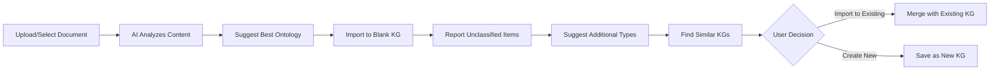

# Document-Driven Ontology Workflow Design

## Executive Summary

This document outlines a revolutionary approach to ontology management in Krypton Graph, where document analysis drives custom type creation. Instead of users manually creating entity and edge types, the system analyzes uploaded documents to suggest optimal ontologies, imports data into knowledge graphs, and iteratively refines custom types to minimize unclassified items.

---

## Core Workflow



---

## Phase 1: Document Analysis & Ontology Suggestion

### User Story: Smart Document Analysis
**As a** user with domain documents  
**I want to** upload a document and receive ontology suggestions  
**So that** I can quickly create a knowledge graph without manual type definition

### UI Design: Document Upload & Analysis

```
┌─────────────────────────────────────────────────────────────┐
│ Create Knowledge Graph from Document          [X Close]      │
├─────────────────────────────────────────────────────────────┤
│                                                               │
│  ┌───────────────────────────────────────────────────────┐  │
│  │                                                         │  │
│  │         [📄 Drop document here or click to browse]     │  │
│  │                                                         │  │
│  │         Supported: PDF, MD, TXT, DOCX                  │  │
│  └───────────────────────────────────────────────────────┘  │
│                                                               │
│  Recent Documents:                                           │
│  • Scimar Research Paper.pdf (Medical/Pharma)               │
│  • Q4 Financial Report.xlsx (Finance)                       │
│  • Patent Application.docx (Legal/Tech)                     │
│                                                               │
│                                      [Cancel] [Analyze →]    │
└─────────────────────────────────────────────────────────────┘
```

### Analysis Results Screen

```
┌─────────────────────────────────────────────────────────────┐
│ Document Analysis Results                                    │
├─────────────────────────────────────────────────────────────┤
│ Document: Scimar Straight Lines 2023.pdf                     │
│ Domain Detected: Medical Research / Pharmaceuticals          │
│                                                               │
│ ═══════════════════════════════════════════════════════════ │
│                                                               │
│ SUGGESTED ONTOLOGY                                           │
│                                                               │
│ Custom Entity Types Detected (7):                            │
│ ┌─────────────────────────────────────────────────────────┐ │
│ │ ✓ Researcher (Dr. Lautt, Melanie, Mick)                 │ │
│ │ ✓ Hormone (hepatalin, insulin)                          │ │
│ │ ✓ MedicalCondition (type 2 diabetes, insulin resistance)│ │
│ │ ✓ Product (NuPa Test, NuPa Daily, NuPa Renew)          │ │
│ │ ✓ TestProcedure (RISTest, clinical trials)              │ │
│ │ ✓ ResearchSubject (rats, humans)                        │ │
│ │ ✓ Company (SciMar Ltd., University of Manitoba)         │ │
│ └─────────────────────────────────────────────────────────┘ │
│                                                               │
│ Custom Edge Types Detected (9):                              │
│ ┌─────────────────────────────────────────────────────────┐ │
│ │ ✓ DISCOVERED (Researcher → Hormone)                     │ │
│ │ ✓ TREATS (Product → MedicalCondition)                   │ │
│ │ ✓ MEASURES (TestProcedure → Hormone)                    │ │
│ │ ✓ FOUNDED (Researcher → Company)                        │ │
│ │ ✓ PRODUCES (Organ → Hormone)                            │ │
│ │ ✓ PROTECTS (Product → BiologicalFunction)               │ │
│ │ ✓ TESTED_ON (TestProcedure → ResearchSubject)           │ │
│ │ ✓ DEVELOPED (Researcher → Product)                      │ │
│ │ ✓ AFFILIATED_WITH (Researcher → Organization)           │ │
│ └─────────────────────────────────────────────────────────┘ │
│                                                               │
│ Default Types Also Used:                                     │
│ • Organization (4 instances)                                 │
│ • Location (2 instances)                                     │
│ • Event (3 instances: founding, trials, observations)        │
│                                                               │
│ [← Back] [Customize Types] [Import with This Ontology →]     │
└─────────────────────────────────────────────────────────────┘
```

---

## Phase 2: Import & Classification Report

### Classification Results Screen

```
┌─────────────────────────────────────────────────────────────┐
│ Knowledge Graph Import Results                               │
├─────────────────────────────────────────────────────────────┤
│                                                               │
│ Import Statistics:                                           │
│ ┌─────────────────────────────────────────────────────────┐ │
│ │ Total Entities Extracted: 47                             │ │
│ │ ✅ Classified: 42 (89.4%)                                │ │
│ │ ⚠️ Unclassified: 5 (10.6%)                               │ │
│ │                                                           │ │
│ │ Total Edges Created: 63                                  │ │
│ │ ✅ Classified: 58 (92.1%)                                │ │
│ │ ⚠️ Unclassified: 5 (7.9%)                                │ │
│ └─────────────────────────────────────────────────────────┘ │
│                                                               │
│ Unclassified Entities:                                       │
│ ┌─────────────────────────────────────────────────────────┐ │
│ │ • "parasympathetic nerves" - Anatomical structure?       │ │
│ │ • "nutrient partitioning" - Biological process?          │ │
│ │ • "HbA1c" - Medical measurement?                         │ │
│ │ • "Health Canada" - Regulatory body?                     │ │
│ │ • "S-adenosyl-L-methionine" - Chemical compound?         │ │
│ └─────────────────────────────────────────────────────────┘ │
│                                                               │
│ Unclassified Edges:                                          │
│ ┌─────────────────────────────────────────────────────────┐ │
│ │ • REGULATES (nerves → liver function)                    │ │
│ │ • CONTAINS (product → compound)                          │ │
│ │ • APPROVED_BY (trial → regulatory body)                  │ │
│ │ • IMPACTS (sugar → hepatalin production)                 │ │
│ │ • PREVENTS (product → blood sugar spike)                 │ │
│ └─────────────────────────────────────────────────────────┘ │
│                                                               │
│ [View Graph] [Suggest Additional Types] [Continue →]         │
└─────────────────────────────────────────────────────────────┘
```

---

## Phase 3: Iterative Type Refinement

### Additional Type Suggestions

```
┌─────────────────────────────────────────────────────────────┐
│ Suggested Additional Custom Types                            │
├─────────────────────────────────────────────────────────────┤
│                                                               │
│ To classify remaining items, consider adding:                │
│                                                               │
│ New Entity Types:                                            │
│ ┌─────────────────────────────────────────────────────────┐ │
│ │ □ AnatomicalStructure                                    │ │
│ │   Examples: parasympathetic nerves, liver, pancreas      │ │
│ │   Attributes: location, function, system                 │ │
│ │                                                           │ │
│ │ □ BiologicalProcess                                      │ │
│ │   Examples: nutrient partitioning, metabolism            │ │
│ │   Attributes: process_type, affected_system              │ │
│ │                                                           │ │
│ │ □ Biomarker                                              │ │
│ │   Examples: HbA1c, blood sugar levels                    │ │
│ │   Attributes: normal_range, measurement_unit             │ │
│ │                                                           │ │
│ │ □ RegulatoryBody                                         │ │
│ │   Examples: Health Canada, FDA                           │ │
│ │   Attributes: jurisdiction, authority_type               │ │
│ │                                                           │ │
│ │ □ ChemicalCompound                                       │ │
│ │   Examples: S-adenosyl-L-methionine, Vitamin C          │ │
│ │   Attributes: molecular_formula, compound_type           │ │
│ └─────────────────────────────────────────────────────────┘ │
│                                                               │
│ New Edge Types:                                              │
│ ┌─────────────────────────────────────────────────────────┐ │
│ │ □ REGULATES                                              │ │
│ │   Connects: AnatomicalStructure → BiologicalProcess      │ │
│ │                                                           │ │
│ │ □ CONTAINS                                               │ │
│ │   Connects: Product → ChemicalCompound                   │ │
│ │                                                           │ │
│ │ □ APPROVED_BY                                            │ │
│ │   Connects: TestProcedure → RegulatoryBody               │ │
│ └─────────────────────────────────────────────────────────┘ │
│                                                               │
│ Adding these types would classify: 95% → 99.2%              │
│                                                               │
│ [Skip] [Select & Add Types] [Auto-Add All Suggested]         │
└─────────────────────────────────────────────────────────────┘
```

---

## Phase 4: Knowledge Graph Matching

### Similar KGs Discovery

```
┌─────────────────────────────────────────────────────────────┐
│ Similar Knowledge Graphs Found                               │
├─────────────────────────────────────────────────────────────┤
│                                                               │
│ Based on your ontology, these existing KGs are similar:      │
│                                                               │
│ ┌─────────────────────────────────────────────────────────┐ │
│ │ 🏥 Diabetes Research Network                   [95% match]│ │
│ │ 324 entities | 512 edges | Last updated: 2 days ago      │ │
│ │ Ontology overlap:                                        │ │
│ │ • Hormone ✓  • MedicalCondition ✓  • TestProcedure ✓    │ │
│ │ • Researcher ✓  • Product ✓                              │ │
│ │ Missing: ChemicalCompound                                │ │
│ │                                    [Preview] [Import Here]│ │
│ └─────────────────────────────────────────────────────────┘ │
│                                                               │
│ ┌─────────────────────────────────────────────────────────┐ │
│ │ 💊 Pharma Development Pipeline                [78% match] │ │
│ │ 156 entities | 234 edges | Last updated: 1 week ago      │ │
│ │ Ontology overlap:                                        │ │
│ │ • Product ✓  • Company ✓  • TestProcedure ✓             │ │
│ │ • RegulatoryBody ✓                                       │ │
│ │ Missing: Hormone, ResearchSubject                        │ │
│ │                                    [Preview] [Import Here]│ │
│ └─────────────────────────────────────────────────────────┘ │
│                                                               │
│ ┌─────────────────────────────────────────────────────────┐ │
│ │ 🧬 Metabolic Research Base                   [72% match] │ │
│ │ 89 entities | 145 edges | Last updated: 3 weeks ago      │ │
│ │ Ontology overlap:                                        │ │
│ │ • BiologicalProcess ✓  • Hormone ✓  • AnatomicalStructure✓│ │
│ │ Missing: Product, Company, TestProcedure                 │ │
│ │                                    [Preview] [Import Here]│ │
│ └─────────────────────────────────────────────────────────┘ │
│                                                               │
│ Or: [Create New Knowledge Graph: "SciMar Hepatalin Research"]│
└─────────────────────────────────────────────────────────────┘
```

---

## Implementation: Custom Type Analysis Engine

### Document Analysis Pipeline

```python
class DocumentOntologyAnalyzer:
    """
    Analyzes documents to suggest optimal custom entity and edge types
    based on content analysis and domain detection.
    """
    
    def analyze_document(self, document_path: str) -> OntologySuggestion:
        # 1. Extract text and structure
        content = self.extract_content(document_path)
        
        # 2. Detect domain
        domain = self.detect_domain(content)
        
        # 3. Extract key entities
        entities = self.extract_entities(content, domain)
        
        # 4. Identify relationships
        relationships = self.extract_relationships(content, entities)
        
        # 5. Map to custom types
        custom_types = self.suggest_custom_types(entities, relationships, domain)
        
        # 6. Validate against Zep constraints
        validated_types = self.validate_zep_compatibility(custom_types)
        
        return OntologySuggestion(
            domain=domain,
            entity_types=validated_types.entities,
            edge_types=validated_types.edges,
            confidence_score=self.calculate_confidence(validated_types)
        )
    
    def suggest_custom_types(self, entities, relationships, domain):
        """
        Maps extracted entities and relationships to optimal custom types
        """
        suggestions = {
            'entities': {},
            'edges': {}
        }
        
        # Group entities by semantic similarity
        entity_clusters = self.cluster_entities(entities)
        
        for cluster in entity_clusters:
            # Create entity type for cluster
            entity_type = self.create_entity_type(cluster, domain)
            
            # Only suggest if cluster has sufficient instances
            if len(cluster.instances) >= MIN_INSTANCES_FOR_TYPE:
                suggestions['entities'][entity_type.name] = entity_type
        
        # Similar process for edges
        edge_patterns = self.identify_edge_patterns(relationships)
        
        for pattern in edge_patterns:
            edge_type = self.create_edge_type(pattern, domain)
            
            if pattern.frequency >= MIN_FREQUENCY_FOR_TYPE:
                suggestions['edges'][edge_type.name] = edge_type
        
        return suggestions
```

### Custom Type Definition Generator

```python
def generate_custom_type_code(analysis_result: OntologySuggestion) -> str:
    """
    Generates Python code for custom entity and edge types
    """
    code = []
    code.append("from zep_cloud.external_clients.ontology import EntityModel, EdgeModel, EntityText")
    code.append("from pydantic import Field\n")
    
    # Generate entity types
    for entity_name, entity_def in analysis_result.entity_types.items():
        code.append(f"class {entity_name}(EntityModel):")
        code.append(f'    """')
        code.append(f'    {entity_def.description}')
        code.append(f'    """')
        
        for attr in entity_def.attributes:
            code.append(f'    {attr.name}: EntityText = Field(')
            code.append(f'        description="{attr.description}",')
            code.append(f'        default=None')
            code.append(f'    )')
        code.append("")
    
    # Generate edge types
    for edge_name, edge_def in analysis_result.edge_types.items():
        code.append(f"class {edge_name}(EdgeModel):")
        code.append(f'    """')
        code.append(f'    {edge_def.description}')
        code.append(f'    """')
        
        for attr in edge_def.attributes:
            code.append(f'    {attr.name}: EntityText = Field(')
            code.append(f'        description="{attr.description}",')
            code.append(f'        default=None')
            code.append(f'    )')
        code.append("")
    
    return "\n".join(code)
```

---

## Example: Analyzing the SciMar Document

### Suggested Custom Types for SciMar

```python
# Custom Entity Types
class Researcher(EntityModel):
    """
    A person conducting scientific research or founding research companies.
    """
    affiliation: EntityText = Field(
        description="University or company affiliation",
        default=None
    )
    research_area: EntityText = Field(
        description="Primary area of research focus",
        default=None
    )

class Hormone(EntityModel):
    """
    A biological hormone involved in metabolism or other bodily functions.
    """
    function: EntityText = Field(
        description="Primary biological function of the hormone",
        default=None
    )
    production_site: EntityText = Field(
        description="Organ or gland that produces this hormone",
        default=None
    )

class MedicalProduct(EntityModel):
    """
    A medical product, test, or intervention developed for healthcare.
    """
    product_type: EntityText = Field(
        description="Type: diagnostic test, nutraceutical, drug, or treatment",
        default=None
    )
    development_stage: EntityText = Field(
        description="Stage: research, trials, approved, or marketed",
        default=None
    )
    target_condition: EntityText = Field(
        description="Medical condition this product addresses",
        default=None
    )

class TestProcedure(EntityModel):
    """
    A medical or research test procedure.
    """
    test_type: EntityText = Field(
        description="Type of test: diagnostic, research, or clinical",
        default=None
    )
    measures: EntityText = Field(
        description="What the test measures or evaluates",
        default=None
    )

# Custom Edge Types
class DISCOVERED(EdgeModel):
    """
    Represents a research discovery relationship.
    Source is always Researcher, target is the discovery.
    """
    year: EntityText = Field(
        description="Year of discovery if mentioned",
        default=None
    )
    context: EntityText = Field(
        description="Research context or setting of discovery",
        default=None
    )

class TREATS(EdgeModel):
    """
    Indicates a treatment relationship between intervention and condition.
    """
    efficacy: EntityText = Field(
        description="Effectiveness level if mentioned",
        default=None
    )
    mechanism: EntityText = Field(
        description="How the treatment works",
        default=None
    )

class MEASURES(EdgeModel):
    """
    Test procedure measures a biomarker or biological parameter.
    """
    measurement_unit: EntityText = Field(
        description="Unit of measurement if specified",
        default=None
    )
    normal_range: EntityText = Field(
        description="Normal or healthy range if mentioned",
        default=None
    )
```

---

## UI Components for Custom Type Management

### Custom Type Editor

```
┌─────────────────────────────────────────────────────────────┐
│ Edit Custom Entity Type: MedicalProduct                      │
├─────────────────────────────────────────────────────────────┤
│                                                               │
│ Name: [MedicalProduct                    ] (Used 8 times)    │
│                                                               │
│ Description:                                                  │
│ [A medical product, test, or intervention developed for     ]│
│ [healthcare applications.                                   ]│
│                                                               │
│ Attributes:                                                   │
│ ┌─────────────────────────────────────────────────────────┐ │
│ │ product_type    | text | Type: diagnostic, drug...  | ✏️ │ │
│ │ development_stage| text | Stage: research, trials... | ✏️ │ │
│ │ target_condition| text | Medical condition addressed | ✏️ │ │
│ │ [+ Add Attribute]                                        │ │
│ └─────────────────────────────────────────────────────────┘ │
│                                                               │
│ Example Instances from Document:                             │
│ • "NuPa Test" - diagnostic test for hepatalin               │
│ • "NuPa Daily" - nutraceutical supplement                   │
│ • "NuPa Renew" - drug in development                        │
│                                                               │
│ ⚠️ Note: Changing this type affects 8 existing entities      │
│                                                               │
│                              [Cancel] [Save Changes]         │
└─────────────────────────────────────────────────────────────┘
```

### Type Usage Dashboard

```
┌─────────────────────────────────────────────────────────────┐
│ Custom Type Analytics                                        │
├─────────────────────────────────────────────────────────────┤
│                                                               │
│ Entity Type Usage:                                           │
│ ┌─────────────────────────────────────────────────────────┐ │
│ │ Researcher         ████████████████░░░░ 12 instances    │ │
│ │ MedicalProduct     ███████████░░░░░░░░░  8 instances    │ │
│ │ Hormone            ██████░░░░░░░░░░░░░░  4 instances    │ │
│ │ TestProcedure      █████░░░░░░░░░░░░░░░  3 instances    │ │
│ │ MedicalCondition   ████░░░░░░░░░░░░░░░░  3 instances    │ │
│ │ (Unclassified)     ███░░░░░░░░░░░░░░░░░  2 instances    │ │
│ └─────────────────────────────────────────────────────────┘ │
│                                                               │
│ Edge Type Usage:                                             │
│ ┌─────────────────────────────────────────────────────────┐ │
│ │ DISCOVERED         ████████████████░░░░ 15 relationships│ │
│ │ TREATS             ██████████░░░░░░░░░░ 10 relationships│ │
│ │ MEASURES           ████████░░░░░░░░░░░░  8 relationships│ │
│ │ DEVELOPED          ██████░░░░░░░░░░░░░░  6 relationships│ │
│ │ (Unclassified)     ██░░░░░░░░░░░░░░░░░░  2 relationships│ │
│ └─────────────────────────────────────────────────────────┘ │
│                                                               │
│ Classification Rate: 94.3%                                   │
│ Zep Custom Type Limit: 7/10 entity types, 4/10 edge types   │
│                                                               │
│ [Optimize Types] [Export Ontology] [View Unclassified]       │
└─────────────────────────────────────────────────────────────┘
```

---

## Benefits of Document-Driven Approach

### For Users
1. **Zero Manual Setup**: No need to predefine types
2. **Domain Intelligence**: System understands document context
3. **Iterative Refinement**: Improve classification progressively
4. **Reuse Existing Work**: Find and leverage similar KGs

### For Data Quality
1. **Higher Classification Rates**: Types tailored to actual content
2. **Consistent Ontologies**: Similar documents use similar types
3. **Reduced Ambiguity**: Clear type definitions from real examples
4. **Better Extraction**: AI-optimized descriptions for each field

### For Scalability
1. **Rapid Onboarding**: Minutes instead of hours to start
2. **Knowledge Transfer**: Learn from existing KGs
3. **Pattern Recognition**: System improves with more documents
4. **Efficient Type Usage**: Only create types that are needed

---

## Technical Implementation Notes

### Zep Integration Considerations
- Respect 10 custom type limit (warn when approaching)
- Prioritize high-frequency patterns for custom types
- Use default types when possible
- Generate valid EntityModel/EdgeModel code
- Handle source/target constraints properly

### Classification Strategy
1. First pass: Apply default Zep types
2. Second pass: Apply custom types
3. Report unclassified items
4. Suggest new types based on patterns
5. Allow iterative refinement

### Performance Optimization
- Cache document analysis results
- Batch type creation/updates
- Lazy load KG comparisons
- Index ontologies for fast matching
- Progressive enhancement of suggestions

---

## Next Steps

1. **Build Document Analyzer**: NLP pipeline for entity/relationship extraction
2. **Create Type Suggester**: ML model for optimal type generation
3. **Implement KG Matcher**: Similarity algorithm for finding related KGs
4. **Design Refinement UI**: Intuitive interface for type management
5. **Develop Import Pipeline**: Robust data ingestion with classification
6. **Add Learning System**: Improve suggestions based on user feedback